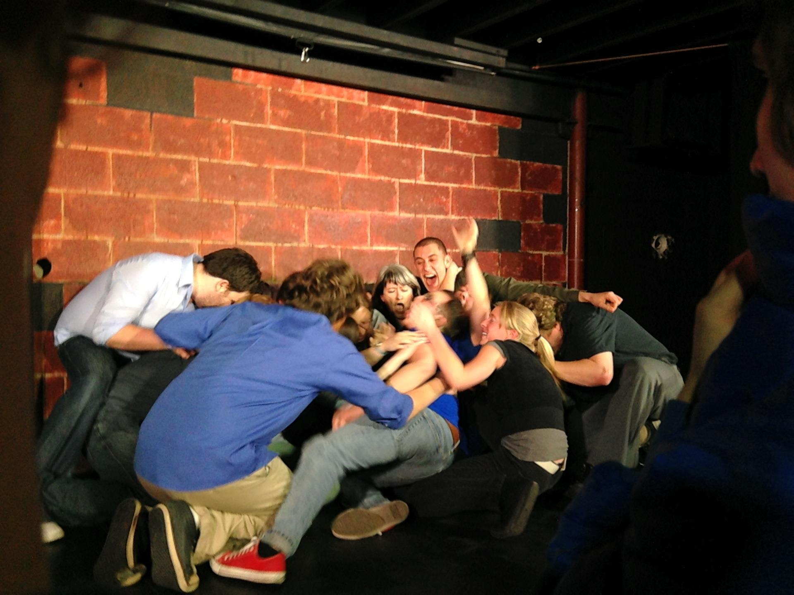

	<table class="infobox infobox-troupe">
		<tr>
			<th class="infobox-header" colspan="2">Array</th>
		</tr>
		<tr class="">
			<td colspan="2" class="infobox-picture">
				
			</td>
		</tr>
		<tr class="">
			<th class="category-header" scope="row">Years Active</th>
			<td class="category">2013-Present</td>
		</tr>
		<tr class="">
			<th class="category-header" scope="row">Cast</th>
			<td class="category">
<ul style=""><!--
  --><li style=""><a class="internal-link" href="Alex Baia">Alex Baia</a></li><!--
  --><li style=""><a class="internal-link" href="Amy Averett">Amy Averett</a></li><!--
  --><li style=""><a class="internal-link" href="Andrew Buck">Andrew Buck</a></li><!--
  --><li style=""><a class="internal-link" href="Arthur Simone">Arthur Simone</a></li><!--
  --><li style=""><a class="internal-link" href="Drew Wesely">Drew Wesely</a></li><!--
  --><li style=""><a class="internal-link" href="Frank Netscher">Frank Netscher</a></li><!--
  --><li style=""><a class="internal-link" href="Jason Finkelman">Jason Finkelman</a></li><!--
  --><li style=""><a class="internal-link" href="John Brewster">John Brewster</a></li><!--
  --><li style="" ><a class="internal-link" href="Matt Needles">Matt Needles</a></li><!--
  --><li style=""><a class="internal-link" href="Michael Jastroch">Michael Jastroch</a></li><!--
  --><li style=""><a class="internal-link" href="Naomi Perryman">Naomi Perryman</a></li><!--
  --><li style=""><a class="internal-link" href="Sarah Marie Curry">Sarah Marie Curry</a></li><!--
  --><li style=""><a class="internal-link" href="Taylor Overstreet">Taylor Overstreet</a></li><!--
  --><!--
  --><!--
  --><!--
  --><!--
  --><!--
  --><!--
  --><!--
  --><!--
  --><!--
  --><!--
  --><!--
  --><!--
  --><!--
  --><!--
  --><!--
  --><!--
  --><!--
  --><!--
  --><!--
  --><!--
  --><!--
  --><!--
  --><!--
  --><!--
  --><!--
  --><!--
  --><!--
  --><!--
  --><!--
  --><!--
  --><!--
  --><!--
  --><!--
  --><!--
  --><!--
  --><!--
  --><!--
--></ul>
</td>
		</tr>

	</table>

**Array** (formerly **Arkay**) is an improv troupe.

## Summary
The troupe performs "The JTS Brown", a free-form, organic montage. 

## History
The troupe was originally named "Arkay" and was formed by [[Joshua Philips]] as a collaborative process between improvisers from multiple theaters to study the JTS Brown format with Craig Cackowski, [[Dave Buckman]], and [[Cody Dearing]].

They had a one-time run of Thursday shows in May 2013 at [[ColdTowne Theater]] with [[Cheap Date]]

[[Joshua Philips]] and [[Ashley Franks]] left to move to Chicago to pursue improv, and Arkay reorganized and renamed itself in order to continue performing in shows. The new team headlined *[[The Threefer]]* at [[The Hideout Theatre]] in July 2013 and was accepted into [[The 2013 Out of Bounds Comedy Festival]], and continues to perform shows in the Austin improv scene.

## Media
### Videos
* [Video of their 6/22/13 show](http://vimeo.com/76498906) in [[The 44-Hour Improv Marathon]].

### Photos
* [Photoset](http://www.facebook.com/claudio.fox.5/media_set?set=a.664214413600057.1073741869.100000345135257&type=3) by [[Claudio Fox]] that includes their performance in [[WaffleFest 2013]].

## More Information
* [The casting call for the workshop](http://forum.austinimprov.com/viewtopic.php?f=3&t=14803) on [[The Austin Improv Forums]]
* [The show-run announcement](http://forum.austinimprov.com/viewtopic.php?t=15249&p=131289) on [[The Austin Improv Forums]]
* [A 2006 interview with Craig Cackowski about the JTS Brown format.](http://www.improvinterviews.com/2006/11/jts-brown-description-by-craig.html)
* [Interview](http://directory.libsyn.com/episode/index/show/thetheftforum/id/2330421) with co-director [[Cody Dearing]] and producer/cast member [[Joshua Phillips]] on *[[The Theft Forum]]*.

[[Category/Troupes|Category:Troupes]]
[[Category/Active|Category:Active]]