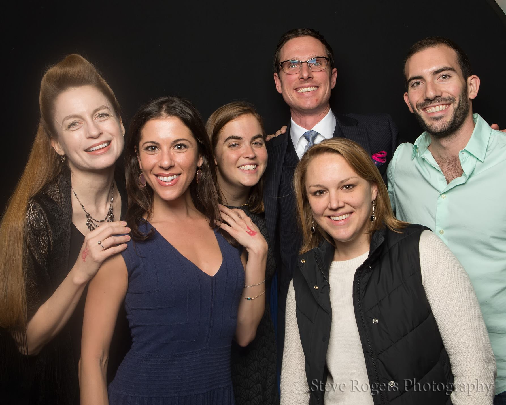

	<table class="infobox infobox-troupe">
		<tr>
			<th class="infobox-header" colspan="2">Boomerang</th>
		</tr>
		<tr class="">
			<td colspan="2" class="infobox-picture">
				
			</td>
		</tr>
		<tr class="">
			<th class="category-header" scope="row">Years Active</th>
			<td class="category">2015-2016</td>
		</tr>
		<tr class="">
			<th class="category-header" scope="row">Cast</th>
			<td class="category">
<ul style=""><!--
  --><li style=""><a class="internal-link" href="Ann Symmonds">Ann Symmonds</a></li><!--
  --><li style=""><a class="internal-link" href="Beth Condra">Beth Condra</a></li><!--
  --><li style=""><a class="internal-link" href="Cagney Ortiz">Cagney Ortiz</a></li><!--
  --><li style=""><a class="internal-link" href="Danielle Saar">Danielle Saar</a></li><!--
  --><li style=""><a class="internal-link" href="Lindsey Marguerite">Lindsey Marguerite</a></li><!--
  --><li style=""><a class="internal-link" href="Phil Morin">Phil Morin</a></li><!--
  --><li style=""><a class="internal-link" href="Suzanne Link">Suzanne Link</a></li><!--
  --><!--
  --><!--
  --><!--
  --><!--
  --><!--
  --><!--
  --><!--
  --><!--
  --><!--
  --><!--
  --><!--
  --><!--
  --><!--
  --><!--
  --><!--
  --><!--
  --><!--
  --><!--
  --><!--
  --><!--
  --><!--
  --><!--
  --><!--
  --><!--
  --><!--
  --><!--
  --><!--
  --><!--
  --><!--
  --><!--
  --><!--
  --><!--
  --><!--
  --><!--
  --><!--
  --><!--
  --><!--
  --><!--
  --><!--
  --><!--
  --><!--
  --><!--
  --><!--
--></ul>
</td>
		</tr>
	</table>

**Boomerang** was an improv troupe comprised of Level Seven Hideout graduates.

[[Category/Troupes|Category:Troupes]]
[[Category/Active|Category:Active]]