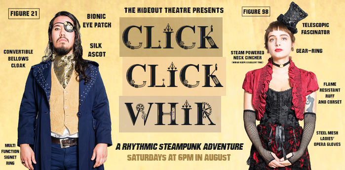

	<table class="infobox infobox-show">
		<tr>
			<th colspan="2" class="infobox-header">Click Click Whir</th>
		</tr>
		<tr class="">
			<td colspan="2" class="infobox-picture">
				
			</td>
		</tr>

		<tr class="">
			<th scope="row" class="category-header">Theater</th>
			<td class="category"><a class="internal-link" href="The Hideout Theatre">The Hideout Theatre</a></td>
		</tr>

		<tr class="">
			<th scope="row" class="category-header">Directed by</th>
			<td class="category"><a class="internal-link" href="Valerie Ward">Valerie Ward</a></td>
		</tr>

		<tr class="">
			<th scope="row" class="category-header">Assistant Director(s)</th>
			<td class="category"><a class="internal-link" href="Luke Wallens">Luke Wallens</a></td>
		</tr>

		<tr class="">
			<th scope="row" class="category-header">Tech Director(s)</th>
			<td class="category"><a class="internal-link" href="Jay Mahavier">Jay Mahavier</a></td>
		</tr>

		<tr class="">
			<th scope="row" class="category-header">Cast</th>
			<td class="category">
<ul style=""><!--
  --><li style=""><a class="internal-link" href="Cindy Brio">Cindy Brio</a></li><!--
  --><li style=""><a class="internal-link" href="Frank Sánchez">Frank Sánchez</a></li><!--
  --><li style=""><a class="internal-link" href="Kendall Raymond">Kendall Raymond</a></li><!--
  --><li style=""><a class="internal-link" href="Marissa Macy">Marissa Macy</a></li><!--
  --><li style=""><a class="internal-link" href="Mary Henderson">Mary Henderson</a></li><!--
  --><li style=""><a class="internal-link" href="Shane Gannaway">Shane Gannaway</a></li><!--
  --><li style=""><a class="internal-link" href="Trent Thomson">Trent Thomson</a></li><!--
  --><li style=""><a class="internal-link" href="Way Spurr-Chen">Way Spurr-Chen</a></li><!--
  --><!--
  --><!--
  --><!--
  --><!--
  --><!--
  --><!--
  --><!--
  --><!--
  --><!--
  --><!--
  --><!--
  --><!--
  --><!--
  --><!--
  --><!--
  --><!--
  --><!--
  --><!--
  --><!--
  --><!--
  --><!--
  --><!--
  --><!--
  --><!--
  --><!--
  --><!--
  --><!--
  --><!--
  --><!--
  --><!--
  --><!--
  --><!--
  --><!--
  --><!--
  --><!--
  --><!--
  --><!--
  --><!--
  --><!--
  --><!--
  --><!--
  --><!--
--></ul>
</td>
		</tr>

		<tr class="">

			<th scope="row" class="category-header">Run</th>

			<td class="category">August 2017</td>
		</tr>

		
	</table>

***Click Click Whir*** (full title: ***Click Click Whir: A Rhythmic Steampunk Adventure***) was a Hideout student mainstage show.  It was a steampunk adventure set in Victorian London which featured a percussive soundtrack improvised by the cast.

## Promotional Blurb
Powered by newfangled inventions and a percussive soundtrack created by the cast on the spot, Click Click Whir brings a steampunk sensibility to never-before-seen completely improvised stories exploring Victorian London. Time, space, class and culture will collide in tales reminiscent of a quaint Dickens story or a cheeky Austen novel with a sci-fi slant – all made up in the moment. From its streets to its manors, our London is loud and rhythmic, its driving pulse cobbled from objects at hand. Wind your clocks up, load your hydraulic revolver and–for goodness sakes–ladies and gentlemen, do not forget your opera glasses.

## Full Crew List
* Props and Costumes Master: [[Cindy Page]]
* Props and Costumes: [[Rachel Collier]]
* Stage Manager: [[Biz Gilmore]]
* Lights: [[Max Kaufmann]]
* Sound Effects: [[Paul Henderson]]

## More Information
* [The show's web page.](http://www.hideouttheatre.com/shows/clickclickwhir)

[[Category/Shows|Category:Shows]]
[[Category/The Hideout Theatre|Category:The Hideout Theatre]]