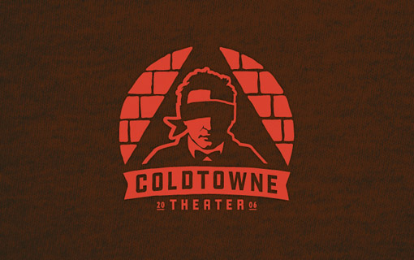

	<table class="infobox infobox-theater">
		<tr>
			<th colspan="2" class="infobox-header">ColdTowne Theater</th>
		</tr>
		<tr class="">
			<td colspan="2" class="infobox-picture">
				
			</td>
		</tr>
		<tr class="">
			<th scope="row" class="category-header">Address</th>
			<td class="category">4803-B Airport Boulevard</td>
		</tr>
		<tr class="">
			<th scope="row" class="category-header">Homepage</th>
			<td class="category">http://www.coldtownetheater.com</td>
		</tr>
		<tr class="">
			<th scope="row" class="category-header">Years of Operation</th>
			<td class="category">2006-Present</td>
		</tr>
	</table>

**ColdTowne Theater** is an Austin improv theater that focuses on Chicago-style improv.

## History
The theater was founded by the improv troupe [[Troupes/ColdTowne (Troupe)|ColdTowne]] after they were displaced from New Orleans by [Hurricane Katrina](http://en.wikipedia.org/wiki/Hurricane_Katrina).

## Shows
### Ongoing Shows
* *[[Shows/The Cagematch|The Cagematch]]*
* *[[Shows/Comedy Bazaar|Comedy Bazaar]]*
* *[[Shows/Movie Riot|Movie Riot]]*
* *[[Nice Astronaut Presents Improv Roulette]]*
* *[[Play By Play]]*
* *[[Shows/All Ages Improv Night|All Ages Improv Night]]*
* *[[Troupes/What's the Story Steve|What's the Story Steve]]*

### Mainstage Productions
In this context, "Mainstage Productions" means weekly themed shows with one- or two-month runs.
#### Sketch Shows
* *[[Shows/After School Special Victims Unit|After School Special Victims Unit]]*
* *[[Shows/Cereal for Adults|Cereal for Adults]]*
* *[[Shows/Eye for an iPhone|Eye for an iPhone]]*
* *[[Shows/Shanty Town Lake|Shanty Town Lake]]*
* *[[Shows/This is (Not) the Gayest Show You'll Ever See|This is (Not) the Gayest Show You'll Ever See]]*
* *[[Shows/Martini Ranch Presents -  Queer & Now|Martini Ranch Presents -  Queer & Now]]*
* *[[Shows/Sidequest|Sidequest]]*
* *[[Shows/Martini Ranch -  Hidden Valley|Martini Ranch -  Hidden Valley]]*
* *[[Shows/Pendulum Presents -  The Ascendant|Pendulum Presents -  The Ascendant]]*
* *[[Shows/The Roast of St. Nick|The Roast of St. Nick]]*
* *[[Shows/Pendulum Presents -  Class War|Pendulum Presents -  Class War]]*
* *[[Shows/Prayer Circle Presents -  Holy Shit|Prayer Circle Presents -  Holy Shit]]*
* *[[Shows/Evening with Chlane|Evening with Chlane]]*
* *[[Shows/Liz Behan -  One Woman at Dusk|Liz Behan -  One Woman at Dusk]]*

#### Improv Shows
* *[[Shows/Beware of Female Spies|Beware of Female Spies]]*
* *[[Shows/Boy Band|Boy Band]]*
* *[[Shows/Braised in Texas|Braised in Texas]]*
* *[[Shows/Family Tides|Family Tides]]*
* *[[Shows/Indy Movies|Indy Movies]]*
* *[[Shows/Late Night Down|Late Night Down]]*
* *[[Shows/The Organ Trail|The Organ Trail]]*
* *[[Shows/Slam Team Six|Slam Team Six]]*
* *[[Shows/Slaughter Your Shorts|Slaughter Your Shorts]]*
* *[[Shows/TGIS|TGIS]]*
* *[[Shows/Sci-Fi Saturdays|Sci-Fi Saturdays]]*
* *[[Shows/Victrola|Victrola]]*
* *[[Shows/Bridgeport Correctional Facility Short Form Impromptu Skit|Bridgeport Correctional Facility Short Form Impromptu Skit]]*
* *[[Shows/America -  Have it Your Way|America -  Have it Your Way]]*
* *[[Shows/Elvis' Rockin' Nativity|Elvis' Rockin' Nativity]]*
* *[[Shows/Damn Gina Night Watch|Damn Gina Night Watch]]*
* *[[Shows/Missed Connections ATX|Missed Connections ATX]]*
* *[[Shows/Rezuranger -  an Improvised Heavy Metal Odyssey|Rezuranger -  an Improvised Heavy Metal Odyssey]]*
* *[[Shows/Latinauts -  La Frontera Final|Latinauts -  La Frontera Final]]*
* *[[Shows/The Last Video Store|The Last Video Store]]*
* *[[Shows/Church Of Man|Church Of Man]]*
* *[[Shows/Deja Noir|Deja Noir]]*
* *[[Shows/What Had Happened Was|What Had Happened Was]]*
* *[[Shows/Y'all, We Asian Presents -  Summer Vacation!|Y'all, We Asian Presents -  Summer Vacation!]]*
* *[[Shows/Hellhole -  Improvised Teen Supernatural Comedy|Hellhole -  Improvised Teen Supernatural Comedy]]*
* *[[Shows/The Rose -  Pleasure Lagoon|The Rose -  Pleasure Lagoon]]*
* *[[Shows/Latinacional -  Live Comedy Telenovela|Latinacional -  Live Comedy Telenovela]]*
* *[[Shows/Documentary Later -  The Doc Web|Documentary Later -  The Doc Web]]*
* *[[Shows/Old Love (an improvised comedy)|Old Love (an improvised comedy)]]*
* *[[Shows/One Hour Til Air|One Hour Til Air]]*
* *[[StarringYallWeAsian]]*
* *[[Shows/The Rose -  Trouble in Paradise|The Rose -  Trouble in Paradise]]*
* *[[Shows/Way Down in the Hole|Way Down in the Hole]]*
* *[[Shows/Angola (a comedy)|Angola (a comedy)]]*
* *[[Shows/Echo Lake Midsommer - A Comedy Cult Ritual|Echo Lake Midsommer - A Comedy Cult Ritual]]*

#### Themed Troupe Shows
Often at ColdTowne, a troupe will do a themed mainstage run.  Typically, these shows are listed with the troupe page.

* [[Troupes/Precious Dads|Precious Dads]] have presented "Dads in Bars" in January 2013 and "Home for the Holidays" in November 2013, and will present "The Barmando" in March 2014.
* [[Troupes/Nice Astronaut|Nice Astronaut]] has presented "Last Call", "It's a Tolerable Existence!", "28 Minutes Later", "Townesville", and "Back in Townesville".
* [[Troupes/Stag Comedy|Stag Comedy]] has presented "Stab Comedy".
* [[Troupes/Wink Planet|Wink Planet]] will present "Pilgrims Are From Mars" in November 2014.

#### Other
* *[[Shows/Festival Festival|Festival Festival]]*
* *[[Shows/Live From ColdTowne It's Saturday Night!|Live From ColdTowne It's Saturday Night!]]*
* *[[Shows/The Mating Game|The Mating Game]]*
* *[[Shows/Rapture The Flag|Rapture The Flag]]*

## Media
### Videos
* [Their 2010-2011 "Best Moment Award" video](http://vimeo.com/31405764), by [[Performers/Kyle Sweeney|Kyle Sweeney]].

## Media
* [Post about the theater](http://yesandrew.com/2014/03/24/austin-improv-theaters-as-modern-american-humorists-day-1-coldtowne/) by [[Performers/Andrew Buck|Andrew Buck]].