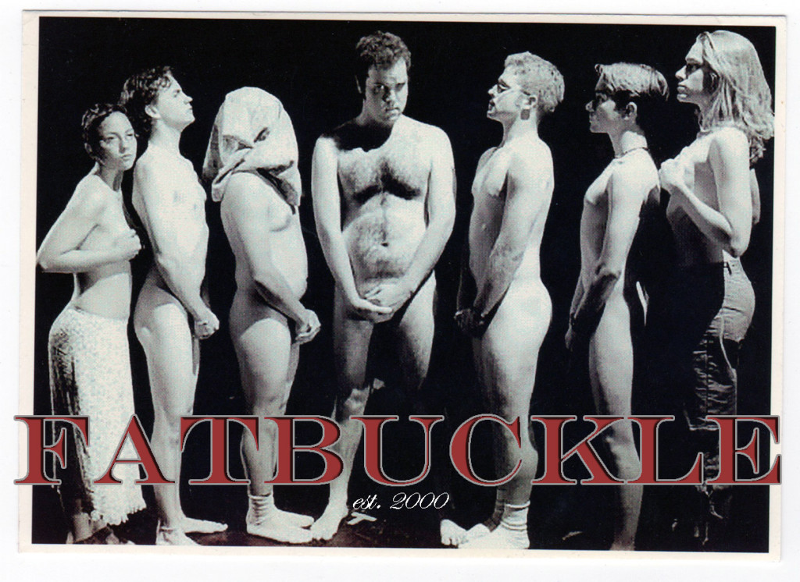

	<table class="infobox infobox-troupe">
		<tr>
			<th class="infobox-header" colspan="2">Fatbuckle</th>
		</tr>
		<tr class="">
			<td colspan="2" class="infobox-picture">
				
			</td>
		</tr>
		<tr class="">
			<th class="category-header" scope="row">Years Active</th>
			<td class="category">1997-2000</td>
		</tr>

		<tr class="">
			<th class="category-header" scope="row">Cast</th>
			<td class="category">
<ul style=""><!--
  --><li style=""><a class="internal-link" href="Alan Metoskie">Alan Metoskie</a></li><!--
  --><li style=""><a class="internal-link" href="Brad Carlin">Brad Carlin</a></li><!--
  --><li style=""><a class="internal-link" href="Cristi Miles">Cristi Miles</a></li><!--
  --><li style=""><a class="internal-link" href="Jarrad Apperson">Jarrad Apperson</a></li><!--
  --><li style=""><a class="internal-link" href="Jeffery Mills">Jeffery Mills</a></li><!--
  --><li style=""><a class="internal-link" href="Lee Eddy">Lee Eddy</a></li><!--
  --><li style=""><a class="internal-link" href="Patrick Daniel">Patrick Daniel</a></li><!--
  --><!--
  --><!--
  --><!--
  --><!--
  --><!--
  --><!--
  --><!--
  --><!--
  --><!--
  --><!--
  --><!--
  --><!--
  --><!--
  --><!--
  --><!--
  --><!--
  --><!--
  --><!--
  --><!--
  --><!--
  --><!--
  --><!--
  --><!--
  --><!--
  --><!--
  --><!--
  --><!--
  --><!--
  --><!--
  --><!--
  --><!--
  --><!--
  --><!--
  --><!--
  --><!--
  --><!--
  --><!--
  --><!--
  --><!--
  --><!--
  --><!--
  --><!--
  --><!--
--></ul>
</td>
		</tr>

	</table>

**Fatbuckle** was a short-form improv troupe comprised of St. Edward's students.

[[Category/Troupes|Category:Troupes]]

*This article is a stub. You can help the Austin Improv Wiki by editing it.*