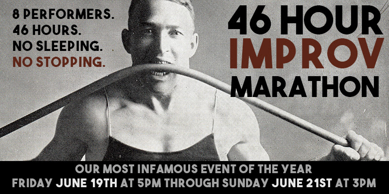

**The 46-Hour Improv Marathon** is the seventh annual [[Festivals/Hideout Improv Marathon|Hideout Improv Marathon]]. It took place from June 19-21, 2015.

## Core Players
* [[Performers/Brett Tribe|Brett Tribe]]
* [[Performers/Cat Drago|Cat Drago]]
* [[Performers/Courtney Hopkin|Courtney Hopkin]]
* [[Performers/Halyn Lee Erickson|Halyn Lee Erickson]]
* [[Performers/Michael Joplin|Michael Joplin]]
* [[Performers/Mike D'Alonzo|Mike D'Alonzo]]
* [[Performers/Quinn Buckner|Quinn Buckner]]
* [[Performers/Sarah Marie Curry|Sarah Marie Curry]]

## Staff
* [[Performers/Roy Janik|Roy Janik]] - Artistic Director
* [[Performers/Ryan Hill|Ryan Hill]] - Co-Producer
* [[Performers/Jessie Pascarelli|Jessie Pascarelli]] - Co-Producer
* [[Performers/Kareem Badr|Kareem Badr]] - Planning
* [[Performers/Andy Crouch|Andy Crouch]] - Planning
* [[Performers/Jessica Arjet|Jessica Arjet]] - Planning
* [[Performers/Kaci Beeler|Kaci Beeler]] - Planning/Design
* [[Performers/Courtney Hopkin|Courtney Hopkin]] - Marketing
* [[Performers/Tim Coyle|Tim Coyle]] - Donations Captain
* [[Performers/Luke Wallens|Luke Wallens]] - Donations Assistant
* [[Performers/Lahari Samineni|Lahari Samineni]] - Sponsorship Captain
* [[Performers/Cagney Ortiz|Cagney Ortiz]] - Sponsorship Assistant
* [[Performers/Joy Parks|Joy Parks]] - Food Captain
* [[Performers/Heidi Rogers|Heidi Rogers]] - Food Assistant
* [[Performers/Thedward Blevins|Thedward Blevins]] - Volunteers Captain
* [[Performers/Cindy Page|Cindy Page]] - Tech Volunteers Coordinator
* [[Performers/Chad Wellington|Chad Wellington]] - Photo Volunteers Coordinator

## Schedule
* Friday 5pm (hour 1): A "teen mixer", where the core cast play with teens from the Hideout's classes.
* Friday 6pm (hour 2): "And They're Off" -- free-form improv with the core cast.
* Friday 7pm (hour 3): *[[Shows/Start Trekkin'|Start Trekkin']]*
* Friday 8pm (hour 4): *[[Shows/The Fancy-Pants Mash-Up|The Fancy-Pants Mash-Up]]*
* Friday 9pm (hour 5): "At Home with Katy and Tony"
  * "Two actual, lovely British people welcome the core 8 into their Living Room for this hour."
* Friday 10pm (hour 6): [[Troupes/Parallelogramophonograph|Parallelogramophonograph]]
* Friday 11pm (hour 7): [[Troupes/The Knuckleball Now|The Knuckleball Now]]
* Saturday 12am (hour 8): [[Troupes/Bad Boys|Bad Boys]]
* Saturday 1am (hour 9): [[Troupes/Squirrel Buddies|Squirrel Buddies]]
* Saturday 2am (hour 10): *[[Shows/The Black Vault|The Black Vault]]*
* Saturday 3am (hour 11): *[[Troupes/Golden|Golden]]*
* Saturday 4am (hour 12): [[Theatres/Coldtowne Theater|Coldtowne Theater]] presents The Bat.
* Saturday 5am (hour 13): [[Troupes/The Amazon and The Milksop|The Amazon and The Milksop]]
* Saturday 6am (hour 14): *[[Shows/Cochise|Cochise]]*
* Saturday 7am (hour 15): "The Marathon Alumni Show"
  * "A blast from the past. Marathon Alumni come to support and advise the 2014 participants."
* Saturday 8am (hour 16): [[Troupes/Empty Promises|Empty Promises]]
* Saturday 9am (hour 17): "Building Connections"
  * "Students from the Building Connections improv classes join the Marathoners."
* Saturday 10am (hour 18): *[[Shows/Dubbed Indemnity|Dubbed Indemnity]]*
* Saturday 11am (hour 19): *[[Shows/Control Issues|Control Issues]]*
* Saturday 12pm (hour 20): *[[Troupes/The Devil and Halyn Erickson|The Devil and Halyn Erickson]]*
* Saturday 1pm (hour 21): *[[Shows/History Under the Influence|History Under the Influence]]*
* Saturday 2pm (hour 22): [[Troupes/What's the Story, Steve|What's the Story, Steve]]
* Saturday 3pm (hour 23): "The Eye of the Storm" (free-form improv from the core cast)
* Saturday 4pm (hour 24): *[[Shows/Charles Dickens Unleashed|Charles Dickens Unleashed]]*
* Saturday 5pm (hour 25): Double Marathon
  * "The Austin Runners Club stops by to talk about marathons during the marathon."
* Saturday 6pm (hour 26): [[Troupes/Girls Girls Girls|Girls Girls Girls]]
* Saturday 7pm (hour 27): [[Troupes/Confidence Men|Confidence Men]]
* Saturday 8pm (hour 28): [[Troupes/The Frank Mills|The Frank Mills]]
* Saturday 9pm (hour 29): *[[Shows/Scene of the Crime|Scene of the Crime]]*
* Saturday 10pm (hours 30 & 31): *[[Shows/Maestro|Maestro]]*
* Sunday 12am (hour 32): [[Puppet Improv Project]]
* Sunday 1am (hour 33): *[[Shows/Happily Ever After|Happily Ever After]]*
* Sunday 2am (hour 34): [[Troupes/Franz & Dave|Franz & Dave]]
* Sunday 3am (hour 35): [[Troupes/MC Harold|MC Harold]]
* Sunday 4am (hour 36): "The Orphan Is Displeased"
  * "An orphan ([[Performers/Bridget Brewer|Bridget Brewer]]) Skypes into the Marathon to control the action."
* Sunday 5am (hour 37): *[[Shows/Tech Nightmare|Tech Nightmare]]*
* Sunday 6am (hour 38): *[[Shows/Care Bear Stare|Care Bear Stare]]*
  * "The Care Bears are here to bring badly-animated joy to your lives."
* Sunday 7am (hour 39): *[[Shows/Buzz Band|Buzz Band]]*
* Sunday 8am (hour 40): [[Troupes/The Escorts|The Escorts]]
* Sunday 9am (hour 41): [[Troupes/Of Mice And Mostly Women|Of Mice And Mostly Women]]
* Sunday 10am (hour 42): "Fury Road"
  * "*Mad Max: Fury Road* was a hell of a movie, and this will be a hell of a show."
* Sunday 11am (hour 43): *[[Shows/Spirited|Spirited]]*
* Sunday 12pm (hour 44): [[Troupes/The Available Cupholders|The Available Cupholders]]
* Sunday 1pm (hour 45): *[[Shows/Fakespeare|Fakespeare]]*
* Sunday 2pm (hour 46): "Final Show"
  * The victory lap of the 8 core Marathoners. They're free to do whatever they like... except sleep.

## Media
### Videos
* [Video](http://vimeo.com/133006812) of hour 10 ([[Shows/The Black Vault|The Black Vault]]).
* [Video](http://vimeo.com/134444206) of hour 21 ([[Shows/History Under the Influence|History Under the Influence]]).
* [Video](http://vimeo.com/134919862) of hour 23 ("The Eye of the Storm").
* [Video](http://vimeo.com/134810540) of hour 29 (*[[Shows/Scene of the Crime|Scene of the Crime]]*).
* [Video](http://vimeo.com/134526479) of hour 46, part 1 ("The Final Countdown").
* [Video](http://vimeo.com/134587604) of hour 46, part 2 ("Final Words").

### Photos
* [Photoset](http://www.facebook.com/michael.yew/media_set?set=a.10204337420658378.1073741950.1315383518&type=3) by [[Michael Yew]] of hours 2 and 3.
* [Photoset](http://www.facebook.com/michael.yew/media_set?set=a.10204338520685878.1073741951.1315383518&type=3) by [[Michael Yew]] of hour 4.
* [Photoset](http://www.facebook.com/michael.yew/media_set?set=a.10204338668289568.1073741952.1315383518&type=3) by [[Michael Yew]] of hours 5 and 6.
* [Photoset](http://www.facebook.com/michael.yew/media_set?set=a.10204338867854557.1073741953.1315383518&type=3) by [[Michael Yew]] of hours 21 and 22.
* [Photoset](http://www.facebook.com/michael.yew/media_set?set=a.10204341364356968.1073741954.1315383518&type=3) by [[Michael Yew]] of hours 28 and 29.
* [Photoset](http://www.facebook.com/michael.yew/media_set?set=a.10204347096420266.1073741955.1315383518&type=3) by [[Michael Yew]] of hours 30 and 43.

## More Information
* [The marathon's web page.](http://www.hideouttheatre.com/shows/improvmarathon)
Category:Festivals