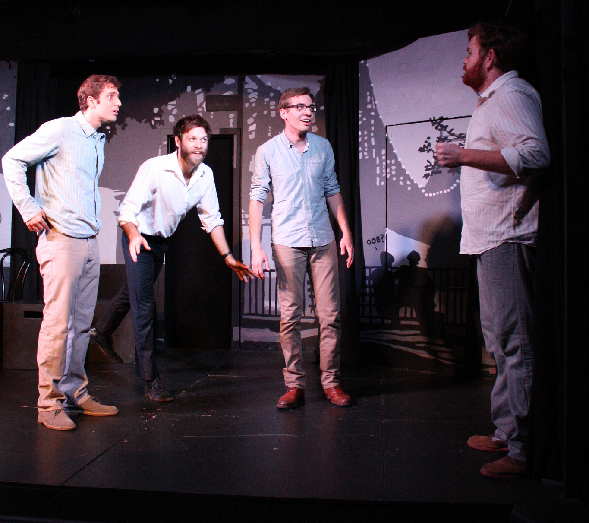

## Summary
(From left) [[Jonathan Euseppi]], [[Hugo Vargas-Zesati]], [[Gary Richardson]], and [[Performers/Mike Sullivan|Mike Sullivan]], performing as [[Troupes/Ctrl-Alt-Delight|Ctrl-Alt-Delight]] in [[The 2012 Out of Bounds Comedy Festival]].

Photo by [[Performers/Sarah Swofford|Sarah Swofford]], taken from [flickr](http://www.flickr.com/photos/oob_pics/7897686022/).
## Licensing
The owner of this file's copyright has given permission to use this file on [[Main Page|the AIC Wiki]].

The owner has **not** offered permission to use the file elsewhere.