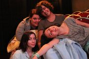

## Summary
The "Hardcore Four" -- (from top-left, clockwise) [[Amy Dietze]], [[Ashley Lowe]], [[Performers/Cat Drago]], and [[Ryan Criswell]] -- four improvisors who stayed for the entirety of [[The 43-Hour Improv Marathon]].

Photo by [[Performers/Claudio Fox]], from [this photoset](http://www.facebook.com/media/set/?set=a.426281400726694.95785.100000345135257&type=3).
## Licensing
The owner of this file's copyright has given permission to use this file on [[Main Page|the AIC Wiki]].

The owner has **not** offered permission to use the file elsewhere.