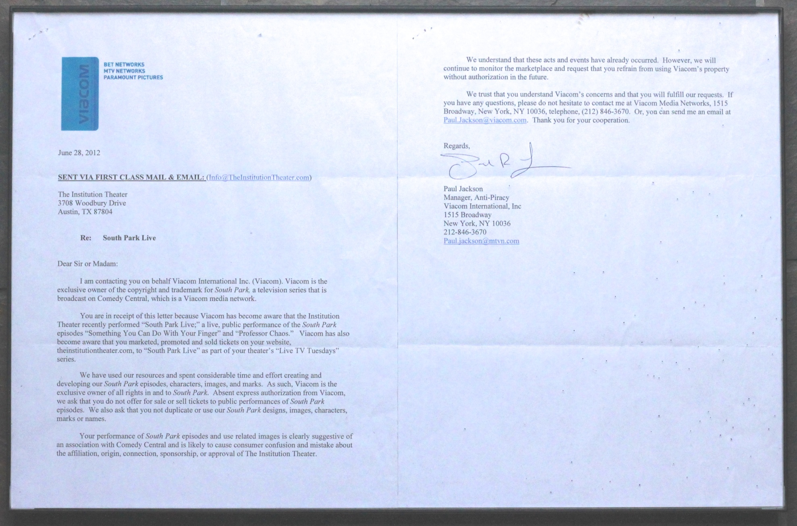

## Summary
Viacom's cease-and-desist letter demanding an end to *[[Shows/Live TV Tuesdays -  South Park|South Park Live]]*.

It was immediately framed and hung in the lobby of [[Theatres/The Institution Theater|The Institution Theater]].

## Licensing
The owner of this file's copyright has given permission to use this file on [[Main Page|the AIC Wiki]].

The owner has **not** offered permission to use the file elsewhere.