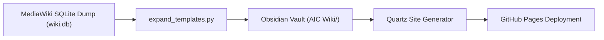

# MediaWiki to Obsidian & Quartz Migration Guide (`GEMINI.md`)

This guide documents the procedures, formatting rules, scripts, and troubleshooting steps developed during the migration and repair of the **Austin Improv Community (AIC) Wiki** from legacy MediaWiki (2007–2016) to an **Obsidian** Markdown vault published via **Quartz**.

---

## 1. Pipeline Overview



- **Source Database**: `wiki.db` (SQLite 3 dump of original MediaWiki database).
- **Vault Directory**: `AIC Wiki/` (Markdown files organized into `Shows/`, `Troupes/`, `Performers/`, `Festivals/`, `Theatres/`, `File/`, etc.).
- **Build & Fix Tooling**: Python scripts (`expand_templates.py`), Node.js link fixers (`fix_quartz_links.cjs`), and custom snippet styles (`wiki-styles.css` / `custom.scss`).

---

## 2. Formatting Rules & Syntax Conversions

### A. Infoboxes & HTML Tables
- **HTML Table Structure**: MediaWiki infoboxes (`{{Infobox Show...}}`, `{{Infobox Troupe...}}`) are converted into HTML table blocks:
  ```html
  <div>
    <table class="infobox infobox-show">
      <tr><th colspan="2" class="infobox-header">Show Title</th></tr>
      <tr class=""><td colspan="2" class="infobox-picture"><a class="internal-link" href="../File/Poster.jpg.md"></a></td></tr>
      <tr class=""><th scope="row" class="category-header">Theater</th><td class="category"><a class="internal-link" href="Theatres/The Hideout Theatre">The Hideout Theatre</a></td></tr>
      <tr class=""><th scope="row" class="category-header">Director</th><td class="category"><a class="internal-link" href="Performers/Tom Booker">Tom Booker</a></td></tr>
    </table>
  </div>
  ```
- **CRITICAL HTML Rule**: **Do NOT use Markdown wikilinks (`[[...]]`) inside HTML table cells (`<td class="category">...</td>`)**. 
  - Standard Markdown parsers (CommonMark/GFM in Obsidian and Quartz) treat Markdown syntax inside raw HTML block elements as unparsed plain text.
  - **Always use HTML anchors** inside tables: `<a class="internal-link" href="Folder/PageName">Display Name</a>`.

### B. Internal Link Resolution & Display Text
- **Folder Scoping**: Internal links in Markdown body text point to their subfolder path, while piping clean display text:
  - `[[Performers/Tom Booker|Tom Booker]]` (NOT `[[Performers/Tom Booker]]` which displays the prefix `Performers/`).
  - `[[Troupes/Girls Girls Girls|Girls Girls Girls]]`
  - `[[Shows/Flying Theater Machine|Flying Theater Machine]]`
- **Unlinking Non-Existent Notes**: Performers or subjects without dedicated `.md` files in the vault MUST be unlinked (left as plain text like `David Razowsky`) to prevent dead links.

### C. Standard Syntax Mapping

| Element | Legacy MediaWiki | Obsidian / Quartz Markdown |
| :--- | :--- | :--- |
| **External Link** | `[http://example.com Link Text]` | `[Link Text](http://example.com)` |
| **Blockquote** | `<blockquote>Text</blockquote>` | `> Text` |
| **Bold** | `'''Bold Text'''` | `**Bold Text**` |
| **Italics** | `''Italic Text''` | `*Italic Text*` |
| **Bold + Italics** | `'''''Bold & Italic'''''` | `***Bold & Italic***` |
| **Category** | `[[Category:Shows]]` | `[[Category/Shows]]` |
| **Heading 2** | `== Summary ==` | `## Summary` |
| **Heading 3** | `=== History ===` | `### History` |

---

## 3. Image Embeds & Clickable Metadata Links

In this wiki, every image has a corresponding info note in `File/<filename>.jpg.md`. To preserve full access to image metadata pages:

1. **Embedded Images**: Wrap `` tags inside a link pointing to the file info note:
   ```html
   <a class="internal-link" href="../File/Poster.jpg.md"></a>
   ```
2. **Quartz Image Routing**: In Quartz SCSS/JS, ensure image paths point to `.quartz/content/File/...` or root-relative `/File/...`.

---

## 4. Infobox CSS & Dark Mode Compatibility

To avoid white background boxes in dark mode and eliminate squeezed text chutes:

### Obsidian CSS (`.obsidian/snippets/wiki-styles.css`)
```css
/* Responsive Infobox Layout */
div:has(> table.infobox),
.table-container:has(> table.infobox) {
  float: right !important;
  clear: right !important;
  margin: 0 0 1.2em 1.5em !important;
  width: auto !important;
  max-width: 310px !important;
}

/* Theme-adaptive infobox background (a hair lighter than dark editor background) */
.markdown-rendered table.infobox {
  background-color: var(--background-secondary) !important;
  border: 1px solid var(--background-modifier-border) !important;
  border-top: 3px solid var(--interactive-accent) !important;
}

/* CodeMirror 6 Live Preview Fix: disable float in editor to prevent line-height overlap */
.markdown-source-view.mod-cm6 div:has(> table.infobox) {
  float: none !important;
  margin: 1em 0 !important;
  max-width: 340px !important;
}
```

### Quartz SCSS (`.quartz/quartz/styles/custom.scss`)
```scss
.table-container:has(> table.infobox) {
  float: right !important;
  clear: right !important;
  margin: 0 0 1.2em 1.5em !important;
  max-width: 310px !important;
}

table.infobox {
  background-color: var(--lightgray) !important;
  border-top: 3px solid var(--secondary) !important;
}
```

---

## 5. Recovering Missing / Vandalized MediaWiki Pages

When pages are lost to redirect loops or past wiki spam:

1. Query `wiki.db` revision history across all revision IDs (`rev_id`):
   ```python
   import sqlite3
   conn = sqlite3.connect('wiki.db')
   cursor = conn.cursor()
   cursor.execute("SELECT slot_content_id FROM slots WHERE slot_revision_id = ?", (rev_id,))
   # Fetch content address (e.g. tt:12345) and extract old_text from text table
   ```
2. Filter out spam revisions (e.g., text containing `#REDIRECT` to self or spam bot URLs).
3. Restore clean wikitext and convert to Markdown using the rules in Section 2.

---

## 6. Windows Git Symlink Management

Git on Windows can drop POSIX symlinks (`mode 120000`) during `git add -A`. To preserve symlinks without Windows Administrator rights:

```bash
# Force stage POSIX symlink for index.md -> Main Page.md
git update-index --add --cacheinfo 120000,e5700bc8f0853d4b574897bdfea010b1da36dd35,index.md

# Force stage POSIX symlink for .quartz/content -> ../
git update-index --add --cacheinfo 120000,b870225aa053ea877524b581926b3536a0bd7314,.quartz/content
```

---

*Document compiled for the Austin Improv Community Wiki repository.*
