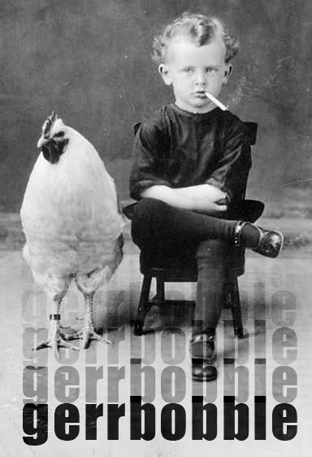

	<table class="infobox infobox-troupe">
		<tr>
			<th class="infobox-header" colspan="2">Gerrbobble</th>
		</tr>
		<tr class="">
			<td colspan="2" class="infobox-picture">
				
			</td>
		</tr>
		<tr class="">
			<th class="category-header" scope="row">Years Active</th>
			<td class="category">2010</td>
		</tr>

		<tr class="">
			<th class="category-header" scope="row">Cast</th>
			<td class="category">
<ul style=""><!--
  --><li style=""><a class="internal-link" href="Ashley Nugent">Ashley Nugent</a></li><!--
  --><li style=""><a class="internal-link" href="Brian Engrevalle">Brian Engrevalle</a></li><!--
  --><li style=""><a class="internal-link" href="Chaz Formichella">Chaz Formichella</a></li><!--
  --><li style=""><a class="internal-link" href="Cortnie Jones">Cortnie Jones</a></li><!--
  --><li style=""><a class="internal-link" href="Matt Derman">Matt Derman</a></li><!--
  --><li style=""><a class="internal-link" href="Steve Donovan">Steve Donovan</a></li><!--
  --><!--
  --><!--
  --><!--
  --><!--
  --><!--
  --><!--
  --><!--
  --><!--
  --><!--
  --><!--
  --><!--
  --><!--
  --><!--
  --><!--
  --><!--
  --><!--
  --><!--
  --><!--
  --><!--
  --><!--
  --><!--
  --><!--
  --><!--
  --><!--
  --><!--
  --><!--
  --><!--
  --><!--
  --><!--
  --><!--
  --><!--
  --><!--
  --><!--
  --><!--
  --><!--
  --><!--
  --><!--
  --><!--
  --><!--
  --><!--
  --><!--
  --><!--
  --><!--
  --><!--
--></ul>
</td>
		</tr>

	</table>

**Gerrbobble** was an improv troupe.

## Summary
### "What's Your Deal?"
Their answer to the "What's Your Deal?" question on a 2010 application to perform at [[The Hideout Theatre]]:<blockquote>We start each scene in gibberish to get to heighten the emotion, then we switch to English</blockquote>

## History
The troupe played in the 2009 "Theater of Cruelty" *[[Cagematch]]*.

## More Information
* [Thread listing the troupe](http://forum.austinimprov.com/viewtopic.php?t=10172) in the *[[Cagematch]]* roster on [[The Austin Improv Forums]].

[[Category/Troupes|Category:Troupes]]
[[Category/Auto-Generated Troupe Pages|Category:Auto-Generated Troupe Pages]]