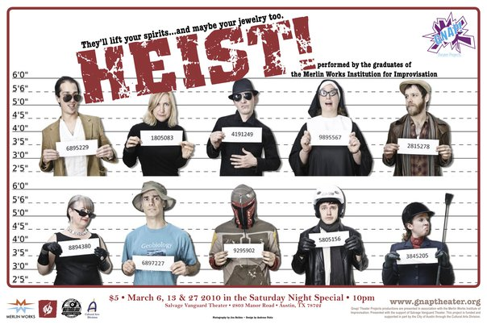

	<table class="infobox infobox-show">
		<tr>
			<th colspan="2" class="infobox-header">Heist!</th>
		</tr>
		<tr class="">
			<td colspan="2" class="infobox-picture">
				
			</td>
		</tr>
		<tr class="">
			<th scope="row" class="category-header">Theater</th>
			<td class="category"><a class="internal-link" href="Salvage Vanguard Theater">Salvage Vanguard Theater</a></td>
		</tr>
		<tr class="">
			<th scope="row" class="category-header">Directed by</th>
			<td class="category">
<ul style=""><!--
  --><li style=""><a class="internal-link" href="Michael Joplin">Michael Joplin</a></li><!--
  --><li style=""><a class="internal-link" href="Shana Merlin">Shana Merlin</a></li><!--
  --><!--
  --><!--
  --><!--
  --><!--
  --><!--
  --><!--
  --><!--
  --><!--
  --><!--
  --><!--
  --><!--
  --><!--
  --><!--
  --><!--
  --><!--
  --><!--
  --><!--
  --><!--
  --><!--
  --><!--
  --><!--
  --><!--
  --><!--
  --><!--
  --><!--
  --><!--
  --><!--
  --><!--
  --><!--
  --><!--
  --><!--
  --><!--
  --><!--
  --><!--
  --><!--
  --><!--
  --><!--
  --><!--
  --><!--
  --><!--
  --><!--
  --><!--
  --><!--
  --><!--
  --><!--
  --><!--
  --><!--
  --><!--
--></ul>
</td>
		</tr>

		<tr class="">
			<th scope="row" class="category-header">Produced by</th>
			<td class="category">[[Gnap! Theater Projects]]</td>
		</tr>

		<tr class="">
			<th scope="row" class="category-header">Cast</th>
			<td class="category">
<ul style=""><!--
  --><li style=""><a class="internal-link" href="Amy Averett">Amy Averett</a></li><!--
  --><li style=""><a class="internal-link" href="Andreas Fabis">Andreas Fabis</a></li><!--
  --><li style=""><a class="internal-link" href="Avimaan Syam">Avimaan Syam</a></li><!--
  --><li style=""><a class="internal-link" href="Howard L Katz">Howard L Katz</a></li><!--
  --><li style=""><a class="internal-link" href="Hugo Vargas-Zesati">Hugo Vargas-Zesati</a></li><!--
  --><li style=""><a class="internal-link" href="Jon Bolden">Jon Bolden</a></li><!--
  --><li style=""><a class="internal-link" href="Kyle Traughber">Kyle Traughber</a></li><!--
  --><li style=""><a class="internal-link" href="Madi Goff">Madi Goff</a></li><!--
  --><li style="" ><a class="internal-link" href="Michael Joplin">Michael Joplin</a></li><!--
  --><li style=""><a class="internal-link" href="Sara Farr">Sara Farr</a></li><!--
  --><li style=""><a class="internal-link" href="Susannah Raulino">Susannah Raulino</a></li><!--
  --><!--
  --><!--
  --><!--
  --><!--
  --><!--
  --><!--
  --><!--
  --><!--
  --><!--
  --><!--
  --><!--
  --><!--
  --><!--
  --><!--
  --><!--
  --><!--
  --><!--
  --><!--
  --><!--
  --><!--
  --><!--
  --><!--
  --><!--
  --><!--
  --><!--
  --><!--
  --><!--
  --><!--
  --><!--
  --><!--
  --><!--
  --><!--
  --><!--
  --><!--
  --><!--
  --><!--
  --><!--
  --><!--
  --><!--
--></ul>
</td>
		</tr>

		<tr class="">

			<th scope="row" class="category-header">Run</th>

			<td class="category">Mar 2010</td>
		</tr>

		
	</table>

***Heist!*** was an improv show based around heist capers.

## Summary
This show ran in [[The Saturday Night Special]] at [[Salvage Vanguard Theater]] in March 2010.

It was made up of graduates of the 601 class offered by [[The Merlin Works Institute for Improvisation]], who also came up with the format.

### Press Blurb
A crack team of improvisers pull off a the crime of a lifetime. Expect elaborate schemes, special skills, desperate men, and double-crossing deals. But be careful, while they lift your spirits, they just might steal your heart.

## Media
### Photos
* [Photoset](http://www.facebook.com/roy.moore/media_set?set=a.1537815417212.2066940.1589679282&type=3) by [[Roy Moore]] that includes their 2/19/11 performance at the 2011 [[Gnap! Homecoming Party]].
** [Photoset](http://www.facebook.com/michael.yew/media_set?set=a.1546183497266.71492.1315383518&type=3) by [[Michael Yew]] that includes the same show.

[[Category/Shows|Heist]]