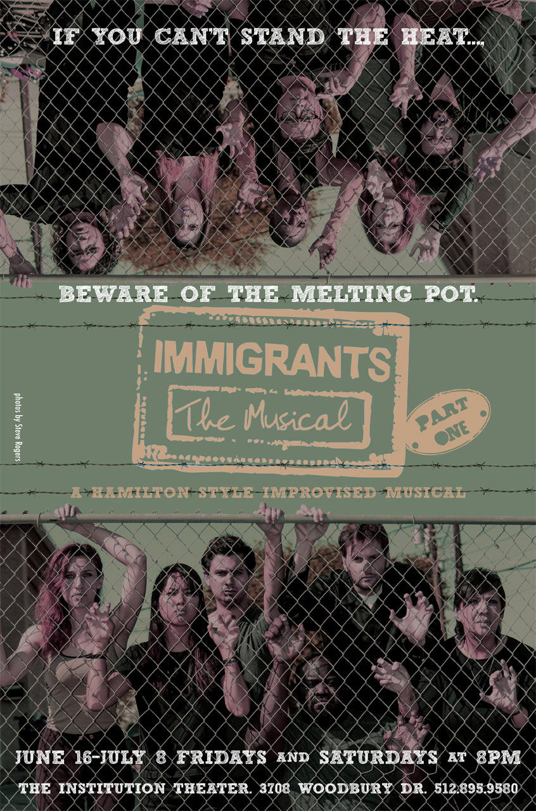

	<table class="infobox infobox-show">
		<tr>
			<th colspan="2" class="infobox-header">Immigrants, The Musical!  (Part One)</th>
		</tr>
		<tr class="">
			<td colspan="2" class="infobox-picture">
				
			</td>
		</tr>
		<tr class="">
			<th scope="row" class="category-header">Theater</th>
			<td class="category">The Institution Theater</td>
		</tr>
		<tr class="">
			<th scope="row" class="category-header">Directed by</th>
			<td class="category">
<ul style=""><!--
  --><li style=""><a class="internal-link" href="Lahari Samineni">Lahari Samineni</a></li><!--
  --><li style=""><a class="internal-link" href="Asaf Ronen">Asaf Ronen</a></li><!--
  --><!--
  --><!--
  --><!--
  --><!--
  --><!--
  --><!--
  --><!--
  --><!--
  --><!--
  --><!--
  --><!--
  --><!--
  --><!--
  --><!--
  --><!--
  --><!--
  --><!--
  --><!--
  --><!--
  --><!--
  --><!--
  --><!--
  --><!--
  --><!--
  --><!--
  --><!--
  --><!--
  --><!--
  --><!--
  --><!--
  --><!--
  --><!--
  --><!--
  --><!--
  --><!--
  --><!--
  --><!--
  --><!--
  --><!--
  --><!--
  --><!--
  --><!--
  --><!--
  --><!--
  --><!--
  --><!--
  --><!--
  --><!--
--></ul>
</td>
		</tr>
		<tr class="">
			<th scope="row" class="category-header">Tech Director(s)</th>
			<td class="category">
<ul style=""><!--
  --><li style="">Mark Shoemaker</li><!--
  --><li style="">Lance Hunter</li><!--
  --><!--
  --><!--
  --><!--
  --><!--
  --><!--
  --><!--
  --><!--
  --><!--
  --><!--
  --><!--
  --><!--
  --><!--
  --><!--
  --><!--
  --><!--
  --><!--
  --><!--
  --><!--
  --><!--
  --><!--
  --><!--
  --><!--
  --><!--
  --><!--
  --><!--
  --><!--
  --><!--
  --><!--
  --><!--
  --><!--
  --><!--
  --><!--
  --><!--
  --><!--
  --><!--
  --><!--
  --><!--
  --><!--
  --><!--
  --><!--
  --><!--
  --><!--
  --><!--
  --><!--
  --><!--
  --><!--
  --><!--
  --><!--
--></ul>
</td>
		</tr>
		<tr class="">
			<th scope="row" class="category-header">Stage Manager(s)</th>
			<td class="category">Sandra Ybarra</td>
		</tr>
		<tr class="">
			<th scope="row" class="category-header">Music Director(s)</th>
			<td class="category">Tosin Awofeso</td>
		</tr>
		<tr class="">
			<th scope="row" class="category-header">Cast</th>
			<td class="category">
<ul style=""><!--
  --><li style="">Allison Day</li><!--
  --><li style="">Amar Dev</li><!--
  --><li style="">Dori Alvarado</li><!--
  --><li style="">Frank Sánchez</li><!--
  --><li style="">Heidi Rogers</li><!--
  --><li style=""><a class="internal-link" href="Kelly Campbell">Kelly Campbell</a></li><!--
  --><li style="">Kim Tran</li><!--
  --><li style=""><a class="internal-link" href="Marc Jalandoon">Marc Jalandoon</a></li><!--
  --><li style="" >Mars Wright</li><!--
  --><li style="">Shannon Dale Stott</li><!--
  --><li style="">Sushant Sethi</li><!--
  --><!--
  --><!--
  --><!--
  --><!--
  --><!--
  --><!--
  --><!--
  --><!--
  --><!--
  --><!--
  --><!--
  --><!--
  --><!--
  --><!--
  --><!--
  --><!--
  --><!--
  --><!--
  --><!--
  --><!--
  --><!--
  --><!--
  --><!--
  --><!--
  --><!--
  --><!--
  --><!--
  --><!--
  --><!--
  --><!--
  --><!--
  --><!--
  --><!--
  --><!--
  --><!--
  --><!--
  --><!--
  --><!--
  --><!--
--></ul>
</td>
		</tr>
		<tr class="">
			<th scope="row" class="category-header">Run</th>
			<td class="category">June - July 2017</td>
		</tr>
	</table>

***Immigrants, The Musical! (Part One)*** was a mainstage show at [[The Institution Theater]]  which explored the stories of immigrants into the United States through the cast.

## Summary
Every immigrant story is different, but similar. The journey here, the confrontations, the communities that get formed, the many ways a name can get mispronounced, the homemade lunches that look different from every other kids school lunch. Every day is a story of their straddling that line between American assimilation and maintaining a cultural identity. It’s a balancing act that gets passed down from generation to generation.

IMMIGRANTS, THE MUSICAL! (PART 1) is a chance for the cast to tell their story (Hamilton-style!) through an improvised musical reaching from their varied backgrounds: Dominican Republic, India, Ireland, Nigeria, the Philippines, Vietnam. Each of them has personal experiences to pull from, guided by the audience, into a unique tapestry of what it truly means to be American, or at least try to blend in.

[[Category/Shows|Category:Shows]]