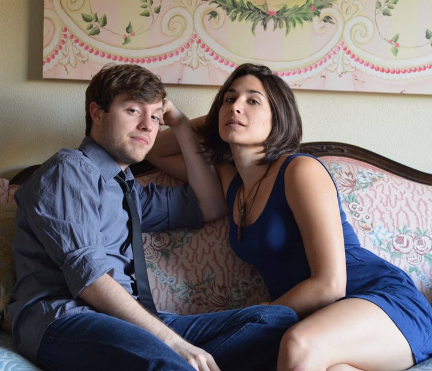

	<table class="infobox infobox-troupe">
		<tr>
			<th class="infobox-header" colspan="2">J/K</th>
		</tr>
		<tr class="">
			<td colspan="2" class="infobox-picture">
				
			</td>
		</tr>
		<tr class="">
			<th class="category-header" scope="row">Years Active</th>
			<td class="category">2011</td>
		</tr>
		<tr class="">
			<th class="category-header" scope="row">Cast</th>
			<td class="category">
<ul style=""><!--
  --><li style=""><a class="internal-link" href="Jon Clinkenbeard">Jon Clinkenbeard</a></li><!--
  --><li style=""><a class="internal-link" href="Kacey Samiee">Kacey Samiee</a></li><!--
  --><!--
  --><!--
  --><!--
  --><!--
  --><!--
  --><!--
  --><!--
  --><!--
  --><!--
  --><!--
  --><!--
  --><!--
  --><!--
  --><!--
  --><!--
  --><!--
  --><!--
  --><!--
  --><!--
  --><!--
  --><!--
  --><!--
  --><!--
  --><!--
  --><!--
  --><!--
  --><!--
  --><!--
  --><!--
  --><!--
  --><!--
  --><!--
  --><!--
  --><!--
  --><!--
  --><!--
  --><!--
  --><!--
  --><!--
  --><!--
  --><!--
  --><!--
  --><!--
  --><!--
  --><!--
  --><!--
  --><!--
  --><!--
--></ul>
</td>
		</tr>
	</table>

:*This page refers to the 2011 Pinter-themed improv duo.  For the 2015-founded high-energy duo, see [[JK]].*

**J/K** was an improv duo that presented improvised plays in the style of [[Wikipedia - Harold Pinter|Harold Pinter]].

## Media
### Photos
* [Publicity photos.](http://www.facebook.com/media/set/?set=a.213931031950717.60617.176837108993443&type=3)
* [A photoset](http://www.facebook.com/michael.yew/photos?collection_token=1315383518%3A2305272732%3A69&set=a.1384780142283.49789.1315383518&type=3) by [[Michael Yew]] that includes their 10/2/11 performance at [[The Hyde Park Theater]].

## More Information
[[Category/Troupes|Category:Troupes]]
[[Category/Duos|Category:Duos]]