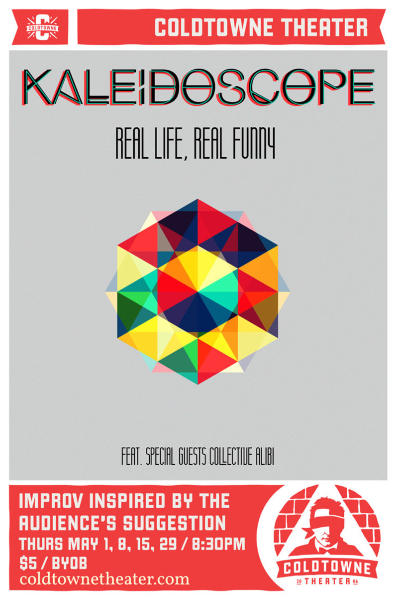

	<table class="infobox infobox-show">
		<tr>
			<th colspan="2" class="infobox-header">Kaleidoscope</th>
		</tr>
		<tr class="">
			<td colspan="2" class="infobox-picture">
				
			</td>
		</tr>
		<tr class="">
			<th scope="row" class="category-header">Theater</th>
			<td class="category"><a class="internal-link" href="ColdTowne Theater">ColdTowne Theater</a></td>
		</tr>
		<tr class="">
			<th scope="row" class="category-header">Directed by</th>
			<td class="category"><a class="internal-link" href="Adam Trabka">Adam Trabka</a></td>
		</tr>
		<tr class="">
			<th scope="row" class="category-header">Cast</th>
			<td class="category">
<ul style=""><!--
  --><li style=""><a class="internal-link" href="Courtney Sevener">Courtney Sevener</a></li><!--
  --><li style=""><a class="internal-link" href="Jeff Whitaker">Jeff Whitaker</a></li><!--
  --><li style=""><a class="internal-link" href="Juliet Prather">Juliet Prather</a></li><!--
  --><li style=""><a class="internal-link" href="Lisa Jackson">Lisa Jackson</a></li><!--
  --><li style=""><a class="internal-link" href="Nathan Sowell">Nathan Sowell</a></li><!--
  --><li style=""><a class="internal-link" href="Sanjay Rao">Sanjay Rao</a></li><!--
  --><!--
  --><!--
  --><!--
  --><!--
  --><!--
  --><!--
  --><!--
  --><!--
  --><!--
  --><!--
  --><!--
  --><!--
  --><!--
  --><!--
  --><!--
  --><!--
  --><!--
  --><!--
  --><!--
  --><!--
  --><!--
  --><!--
  --><!--
  --><!--
  --><!--
  --><!--
  --><!--
  --><!--
  --><!--
  --><!--
  --><!--
  --><!--
  --><!--
  --><!--
  --><!--
  --><!--
  --><!--
  --><!--
  --><!--
  --><!--
  --><!--
  --><!--
  --><!--
  --><!--
--></ul>
</td>
		</tr>
		<tr class="">
			<th scope="row" class="category-header">Run</th>
			<td class="category">May 2014</td>
		</tr>
	</table>

***Kaleidoscope*** was an improv show.

## Summary
The show is inspired by the UCB show *Let's Have a Ball*.  Each show had a four-act structure: three long two-person scenes, followed by a montage based on that information.

Each performance was double-billed with a set from [[Collective Alibi]].

### Press Blurb
A press blurb from their facebook event page: <blockquote>Featuring a cast of six of ColdTowne Theater’s sharpest improvisers, *Kaleidoscope* is an improvised comedy show unlike any other currently playing in Austin. Inspired by a structure originated at the Upright Citizens Brigade Theater, Kaleidoscope blends three unique audience 
suggestions into a single experience developed and executed right before your eyes. This elite team will first build a compelling comedic world in the vein of *[[Wikipedia - Louie (TV series)|Louie]]* before tearing through that world in a series of fast and funny scenes with the energy and sensibility of *[[Wikipedia - 30 Rock|30 Rock]]*. </blockquote>

## History
The show ran on Thursdays at 8:30pm at [[ColdTowne Theater]] in May 2014.

## Media
### Photos
* [Photoset](http://www.facebook.com/media/set/?set=a.735825619814290.1073741998.221927764537414&type=1) by [[Steve Rogers]] that includes their 5/15/14 performance.

## More Information
* [Show announcement](http://forum.austinimprov.com/viewtopic.php?f=2&t=17373) on [[The Austin Improv Forums]].
* [The show's facebook-event page.](http://www.facebook.com/events/1413268428945808/)

[[Category/Shows|Category:Shows]]