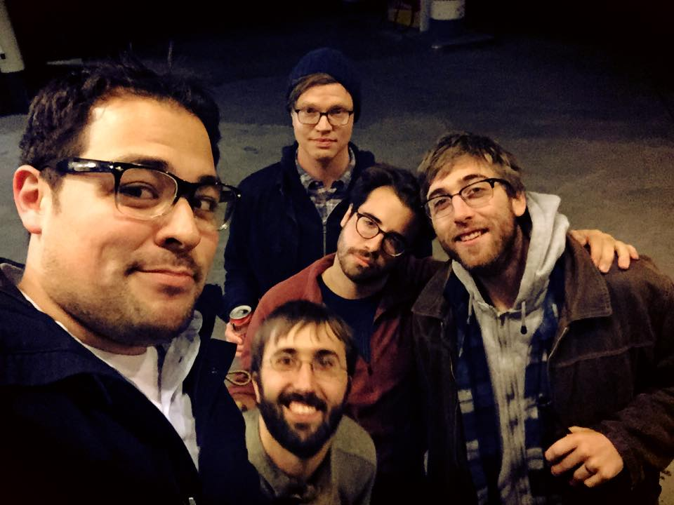

	<table class="infobox infobox-troupe">
		<tr>
			<th class="infobox-header" colspan="2">Kinkade</th>
		</tr>
		<tr class="">
			<td colspan="2" class="infobox-picture">
				
			</td>
		</tr>
		<tr class="">
			<th class="category-header" scope="row">Years Active</th>
			<td class="category">2015-Present</td>
		</tr>
		<tr class="">
			<th class="category-header" scope="row">Cast</th>
			<td class="category">
<ul style=""><!--
  --><li style=""><a class="internal-link" href="Ian Townsend">Ian Townsend</a></li><!--
  --><li style=""><a class="internal-link" href="Jake Millward">Jake Millward</a></li><!--
  --><li style=""><a class="internal-link" href="Jared Robertson">Jared Robertson</a></li><!--
  --><li style=""><a class="internal-link" href="Javier Ungo">Javier Ungo</a></li><!--
  --><li style=""><a class="internal-link" href="Steven H. Moore">Steven H. Moore</a></li><!--
  --><!--
  --><!--
  --><!--
  --><!--
  --><!--
  --><!--
  --><!--
  --><!--
  --><!--
  --><!--
  --><!--
  --><!--
  --><!--
  --><!--
  --><!--
  --><!--
  --><!--
  --><!--
  --><!--
  --><!--
  --><!--
  --><!--
  --><!--
  --><!--
  --><!--
  --><!--
  --><!--
  --><!--
  --><!--
  --><!--
  --><!--
  --><!--
  --><!--
  --><!--
  --><!--
  --><!--
  --><!--
  --><!--
  --><!--
  --><!--
  --><!--
  --><!--
  --><!--
  --><!--
  --><!--
--></ul>
</td>
		</tr>

	</table>

**Kinkade** is an improv troupe.  Take a minute to go read about the mythology of [the phoenix](https://en.wikipedia.org/wiki/Phoenix,_Arizona).  Go ahead.  I can wait.  

Alright, now that you have learned about what is a phoenix, know that the imagery of the phoenix can be applied to Kinkade.  For this metaphor, Kinkade is the new phoenix that comes out of the ashes.  The ashes are made of the burnt-up corpses of the members of [[Collective Alibi]].  When [[Collective Alibi]] was over and ended, all of the bodies of the members began to be on fire.  After they had been finished being on fire, they slowly turned into black powder (the aforementioned ash).  Now this is the ash that somehow got pregnant and made a baby bird through gestation.  This baby bird is the same bird that is Kinkade in this metaphor.

Do you understand?
[[Yes]]    [[No]]

## Summary
### Press Blurb
Their press blurb, taken from a 2015 application to perform at [[The Hideout Theatre]]:<blockquote>Kinkade performs improvised one act plays- comedies in fact. The type of stuff that makes your brain signals swirl, like the seedwinds of a thought-hurricane. Leading meteorological authorities have described the troupe as incendiary and decidedly harmattan-esque. First year meteorology students also have opinions about the troupe, but they are much too sophomoric to be printed here. Give it a few semesters, first year meteorology students.</blockquote>

### "What's Your Deal?"
Their answer to the "What's Your Deal?" question on a 2015 application to perform at [[The Hideout Theatre]]:<blockquote>Kinkade performs something like a comedic one act play. We tend to stay in one general location, but may still see several rooms within that location. Additionally, we tend to limit our selves to playing in real time and to sticking with the same characters throughout the show. We try to play our shows a little more grounded than is typical for ColdTowne troupe, giving ourselves time to explore characters and relationships before jumping onto the crazy train. Although this is a new name for us, the five people in this troupe and have been playing together for almost 18 months and we are all very close to each other. This manifests itself in our shows with deep deep trust and quick group mind.</blockquote>

[[Category/Troupes|Category:Troupes]]
[[Category/Auto-Generated Troupe Pages|Category:Auto-Generated Troupe Pages]]
[[Category/Active|Category:Active]]