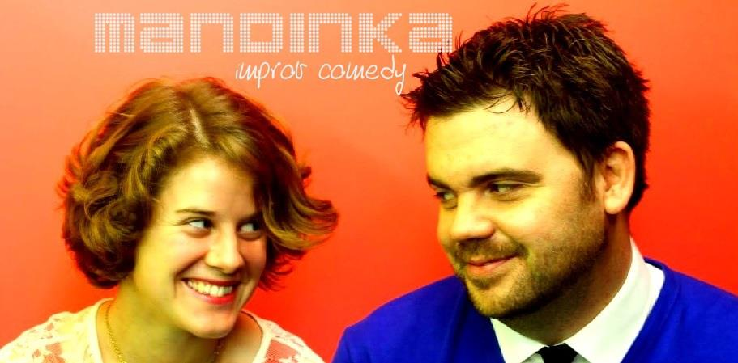

	<table class="infobox infobox-troupe">
		<tr>
			<th class="infobox-header" colspan="2">Mandinka</th>
		</tr>
		<tr class="">
			<td colspan="2" class="infobox-picture">
				
			</td>
		</tr>
		<tr class="">
			<th class="category-header" scope="row">Years Active</th>
			<td class="category">2012-Present</td>
		</tr>
		<tr class="">
			<th class="category-header" scope="row">Cast</th>
			<td class="category">
<ul style=""><!--
  --><li style=""><a class="internal-link" href="Mia Iseman">Mia Iseman</a></li><!--
  --><li style=""><a class="internal-link" href="Andrew Buck">Andrew Buck</a></li><!--
  --><!--
  --><!--
  --><!--
  --><!--
  --><!--
  --><!--
  --><!--
  --><!--
  --><!--
  --><!--
  --><!--
  --><!--
  --><!--
  --><!--
  --><!--
  --><!--
  --><!--
  --><!--
  --><!--
  --><!--
  --><!--
  --><!--
  --><!--
  --><!--
  --><!--
  --><!--
  --><!--
  --><!--
  --><!--
  --><!--
  --><!--
  --><!--
  --><!--
  --><!--
  --><!--
  --><!--
  --><!--
  --><!--
  --><!--
  --><!--
  --><!--
  --><!--
  --><!--
  --><!--
  --><!--
  --><!--
  --><!--
  --><!--
--></ul>
</td>
		</tr>

	</table>

**Mandinka** (often written in all caps: **MANDINKA**) is a duo consisting of [[Mia Iseman]] and [[Andrew Buck]].

## Summary
The pair perform character-driven "mono-pop" shows with a focus on pacing, heightening, and strong character relationships.

## History
After being thrown together as inaugural members of [[The Seven Eight Sevens]], they decided to form their own duo troupe in late 2012. Their debut show was on December 6, 2012, as part of the [[Thursday Threefer]] at [[The Hideout Theater]]. Since then, Mandinka has performed at [[Salvage Vanguard Theater]], [[The Institution Theater]], and at [[ColdTowne Theater]] (as part of the inaugural Duo [[Cagematch]] tournament).

Here is [[Andrew Buck]]'s explanation of the name's origin:<blockquote>Mandinka is named Mandinka because the song "Mandinka" popped up on my Pandora "Simply Red" station while sitting around thinking up potential troupe names. It's a pretty kick-ass representation of early-90s Eurotrash pop music by Ms. Sinead O'Connor. And it kind of contains the names of its two members: "Mia" and "Andy." </blockquote>

## Media
### Videos
* [Their 12/7/12 show](http://vimeo.com/55258511) at *[[The Threefer]]*.
* [Their 5/17/13 show](http://vimeo.com/66537082) in *[[2x4]]*.

### Photos
* [Photoset](http://www.facebook.com/michael.yew/media_set?set=a.10200768887327275.1073741863.1315383518&type=3) by [[Michael Yew]] that includes their 11/1/13 performance in *[[PGraph Presents]]*.
* [Photoset](http://www.facebook.com/chriscurl/media_set?set=a.10152566583992107.1073741841.549002106&type=3) by [[Chris Curl]] of their perfromance at [[The 2014 Out of Bounds Comedy Festival]].
* [Photoset](http://www.facebook.com/michael.yew/media_set?set=a.10203172527696782.1073741921.1315383518&type=3) by [[Michael Yew]] that includes their 12/18/14 performance in *[[The Threefer]]*.

## More Information
* [The troupe's facebook page.](http://www.facebook.com/mandinkaimprov)

[[Category/Duos|Category:Duos]]
[[Category/Active|Category:Active]]
[[Category/Troupes|Category:Troupes]]