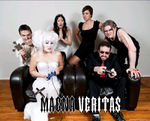

	<table class="infobox infobox-show">
		<tr>
			<th colspan="2" class="infobox-header">Magna Veritas</th>
		</tr>
		<tr class="">
			<td colspan="2" class="infobox-picture">
				
			</td>
		</tr>
		<tr class="">
			<th scope="row" class="category-header">Theater</th>
			<td class="category"><a class="internal-link" href="Salvage Vanguard Theater">Salvage Vanguard Theater</a></td>
		</tr>
		<tr class="">
			<th scope="row" class="category-header">Directed by</th>
			<td class="category"><a class="internal-link" href="Performers/Andreas Fabis">Andreas Fabis</a></td>
		</tr>
		<tr class="">
			<th scope="row" class="category-header">Produced by</th>
			<td class="category"><a class="internal-link" href="Gnap! Theater Projects">Gnap! Theater Projects</a></td>
		</tr>
		<tr class="">
			<th scope="row" class="category-header">Cast</th>
			<td class="category">
<ul style=""><!--
  --><li style=""><a class="internal-link" href="Performers/Andreas Fabis">Andreas Fabis</a></li><!--
  --><li style=""><a class="internal-link" href="Performers/Brad Hawkins">Brad Hawkins</a></li><!--
  --><li style=""><a class="internal-link" href="Performers/Emily Breedlove">Emily Breedlove</a></li><!--
  --><li style=""><a class="internal-link" href="Performers/Justin Davis">Justin Davis</a></li><!--
  --><li style=""><a class="internal-link" href="Katherine Greco">Katherine Greco</a></li><!--
  --><li style=""><a class="internal-link" href="Performers/Kristin Firth">Kristin Firth</a></li><!--
  --><li style=""><a class="internal-link" href="Performers/Leng Wong">Leng Wong</a></li><!--
  --><li style=""><a class="internal-link" href="Performers/Marc Majcher">Marc Majcher</a></li><!--
  --><li style="" ><a class="internal-link" href="Performers/Ruby Willmann">Ruby Willmann</a></li><!--
  --><li style=""><a class="internal-link" href="Sophia Hoang">Sophia Hoang</a></li><!--
  --><li style=""><a class="internal-link" href="Performers/Todd Hart">Todd Hart</a></li><!--
  --><!--
  --><!--
  --><!--
  --><!--
  --><!--
  --><!--
  --><!--
  --><!--
  --><!--
  --><!--
  --><!--
  --><!--
  --><!--
  --><!--
  --><!--
  --><!--
  --><!--
  --><!--
  --><!--
  --><!--
  --><!--
  --><!--
  --><!--
  --><!--
  --><!--
  --><!--
  --><!--
  --><!--
  --><!--
  --><!--
  --><!--
  --><!--
  --><!--
  --><!--
  --><!--
  --><!--
  --><!--
  --><!--
  --><!--
--></ul>
</td>
		</tr>
		<tr class="">
			<th scope="row" class="category-header">Run</th>
			<td class="category">Sep-Dec 2011</td>
		</tr>
	</table>

**Magna Veritas** was an improv show.

## Summary
Magna Veritas was a monthly show put on by [[Gnap! Theater Projects]] that ran for four performances, from September to December 2011. The show, inspired by the French roleplaying game [[Wikipedia - In Nomine Satanis-Magna Veritas|In Nomine Satanis/Magna Veritas]], cast the players as angels and demons battling for the soul of humanity.

## Format
Two "supernatural" characters were pre-selected prior to each show, one angelic, one demonic. The remainder of the cast mainly played humans or minor supernatural figures. The show took the form of a single narrative which pitted the two supernatural forces against each other, usually revolving around tropes found in such religious/apocalyptic fiction as *[[Wikipedia - The Omen|The Omen]]*, *[[Wikipedia - Left Behind|Left Behind]]*, or *[[Wikipedia - Good Omens|Good Omens]]*.

## Scheduling
*Magna Veritas* represented something of an experiment for Gnap! scheduling, intended to build a show by a conventional rehearsal process and then a run spread out over an extended period of time. The show was slotted at 10pm on one Saturday a month, in a 45-minute time slot. The bill was shared with a [[Merlin Works]] troupe or other local troupe.

## Media
### Photos
* [Photoset](http://www.facebook.com/media/set/?set=a.194157847319569.45926.118587218209966&type=3) by [[Roy Moore]] that includes their 9/10/11 show at *[[Shows/The Saturday Night Special|The Saturday Night Special]]*.
	* [Another photoset](http://www.facebook.com/michael.yew/media_set?set=a.1904181927003.93571.1315383518&type=3) by [[Michael Yew]] that includes that performance.
	* [Yet another photoset](http://www.facebook.com/SteveRogers1212/media_set?set=a.172726816141683.45782.100002130980897&type=3) by [[Steve Rogers]] of that same show.
* [Photoset](http://www.facebook.com/media/set/?set=a.212738282128192.50688.118587218209966&type=3) by [[Roy Moore]] that includes their 10/22/11 show at *[[Shows/The Saturday Night Special|The Saturday Night Special]]*.
	* [Another photoset](http://www.facebook.com/michael.yew/media_set?set=a.1904181927003.93571.1315383518&type=3) by [[Michael Yew]] that includes that performance.
* [Photoset](http://www.facebook.com/media/set/?set=a.221915231210497.52761.118587218209966&type=3) by [[Roy Moore]] that includes their 11/12/11 show at *[[Shows/The Saturday Night Special|The Saturday Night Special]]*.
* [Photoset](http://www.facebook.com/media/set/?set=a.238076309589226.62459.221927764537414&type=3) by [[Steve Rogers]] of their 11/12/11 show.