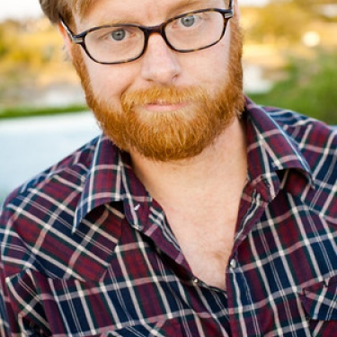

	<table class="infobox infobox-performer">
		<tr>
			<th colspan="2" class="infobox-header">Michael Jastroch</th>
		</tr>
		<tr class="">
			<td colspan="2" class="" class="infobox-picture">
				
			</td>
		</tr>
		<tr class="">
			<th scope="row" class="category-header">Primary Theater</th>
			<td class="category"><a class="internal-link" href="ColdTowne Theater">ColdTowne Theater</a></td>
		</tr>
		<tr class="">
			<th scope="row" class="category-header">Years Active</th>
			<td class="category">2006-Present</td>
		</tr>
	</table>

**Michael Jastroch** ([[Wikipedia - Help - IPA for English#Key|/ˈdʒæstroʊ/]]) is an improv performer, director, and teacher.  He is one of the founders of [[ColdTowne Theater]].

## History
Michael Jastroch writes and performs with [[ColdTowne]], winning several awards for his improv including “Best Comedy Group 2008” in the Austin Chronicle Reader’s poll and the B. Iden Payne award for “Outstanding Improv Ensemble.” His sketch project, [[Lovey and Lovey]], won Best of Fest at the 2005 Lone Star Sketch Festival and the 2008 Frontera Fringe Festival as well as a Critic’s Pick in the 2008 Austin Chronicle Reader’s Poll. Michael is the Executive Director of the [[ColdTowne Theater]] and teaches and directs sketch and improv at the [[ColdTowne Conservatory]]. Michael was nominated for best teacher at the [[Austin Improv Collective]] Awards and the group he directs, [[Midnight Society]], was nominated for a B. Iden Payne Theater Award. Michael has directed a number of comedy improv shows, including *[[Victrola]]*, *[[Rapture the Flag]]* and *[[Cereal for Adults]]*, and can be seen performing with [[Stool Pigeon]], [[Mike and Irene]], and [[Elevator Action]]. Michael has taught improv workshops all over the country, including at the Oberlin College Improv Festival, the Gila Monster Improv Fest in Tuscon, Arizona and at the North Carolina Comedy Arts Festival in Chapel Hill.

## Troupes
* [[ColdTowne (troupe)|ColdTowne]]
* [[Elevator Action]]
* [[Midnight Society]] (director)
* [[Mike and Irene]]
* [[Stool Pigeon]]

## Shows
* *[[Cereal for Adults]]* (director)
* *[[The Cherry Bowl]]*
* *[[Rapture the Flag]]* (director)
* *[[Victrola]]* (director)

## More Information
* [Interview](http://yesandrew.com/2013/05/05/the-sunday-interview-michael-jastroch/) by [[Andrew Buck]].
* [Interview](http://gybpodcast.libsyn.com/got-your-back-ep-1-michael-jastroch) on the *[[Got Your Back]]* podcast.

[[Category/Teachers|Jastroch]]
[[Category/Performers|Jastroch]]
[[Category/Directors|Jastroch]]