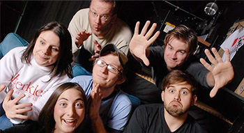

	<table class="infobox infobox-troupe">
		<tr>
			<th class="infobox-header" colspan="2">Murphy</th>
		</tr>
		<tr class="">
			<td colspan="2" class="infobox-picture">
				
			</td>
		</tr>
		<tr class="">
			<th class="category-header" scope="row">Years Active</th>
			<td class="category">2008-2012</td>
		</tr>

		<tr class="">
			<th class="category-header" scope="row">Cast</th>
			<td class="category">
<ul style=""><!--
  --><li style=""><a class="internal-link" href="Brent Foshee">Brent Foshee</a></li><!--
  --><li style=""><a class="internal-link" href="James Sweeney">James Sweeney</a></li><!--
  --><li style=""><a class="internal-link" href="Joshua Krilov">Joshua Krilov</a></li><!--
  --><li style=""><a class="internal-link" href="Kyle Sweeney">Kyle Sweeney</a></li><!--
  --><li style=""><a class="internal-link" href="Lisa Jackson">Lisa Jackson</a></li><!--
  --><li style=""><a class="internal-link" href="Stephanie Russo">Stephanie Russo</a></li><!--
  --><!--
  --><!--
  --><!--
  --><!--
  --><!--
  --><!--
  --><!--
  --><!--
  --><!--
  --><!--
  --><!--
  --><!--
  --><!--
  --><!--
  --><!--
  --><!--
  --><!--
  --><!--
  --><!--
  --><!--
  --><!--
  --><!--
  --><!--
  --><!--
  --><!--
  --><!--
  --><!--
  --><!--
  --><!--
  --><!--
  --><!--
  --><!--
  --><!--
  --><!--
  --><!--
  --><!--
  --><!--
  --><!--
  --><!--
  --><!--
  --><!--
  --><!--
  --><!--
  --><!--
--></ul>
</td>
		</tr>

	</table>

**Murphy** was a [[ColdTowne Student Troupe]].

## Summary
### Press Blurb
Their press blurb, taken from a 2010 application to perform at [[The Hideout Theatre]]:<blockquote>
Comprised of faculty and veteran performers of ColdTowne Theater, Murphy plays with organic physicality, deliberate relationship and game to bring you a side-splitting improv show.
 

Besides watching them at the Hideout Theater and the Lair, you can play with them every Sunday at 8 PM at ColdTowne Theater.
</blockquote>

### "What's Your Deal?"
Their answer to the "What's Your Deal?" question on a 2010 application to perform at [[The Hideout Theatre]]:<blockquote>you know our deal by now, we move around and play fearlessly. </blockquote>

## History
The troupe played [[The Out of Bounds Comedy Festival]] in 2008, 2009, and 2010.

## Media
### Videos
* [Video](http://blip.tv/out-of-bounds-comedy-festival/murphy-wed-8pm-svt-oranges-stage-1266242) of their 8/27/08 show at [[The 2008 Out of Bounds Comedy Festival]].
* [Video](http://vimeo.com/48428583) by [[Kyle Sweeney]] of their "Darts" show (uploaded 8/29/12).
* [Video](http://vimeo.com/49200777) by [[Kyle Sweeney]] of their "Rhubarb Pie" show (uploaded 9/10/12).
* [Video](http://vimeo.com/51454119) by [[Kyle Sweeney]] of their "Banana" show (uploaded 10/15/12).
* [Video](http://vimeo.com/63618693) by [[Kyle Sweeney]] of their 4/8/13 "Fork" show.

## More Information
* [The troupe's facebook page.](http://www.facebook.com/pages/Murphy-Improv-Comedy/372292768064)

[[Category/Troupes|Category:Troupes]]
[[Category/Auto-Generated Troupe Pages|Category:Auto-Generated Troupe Pages]]