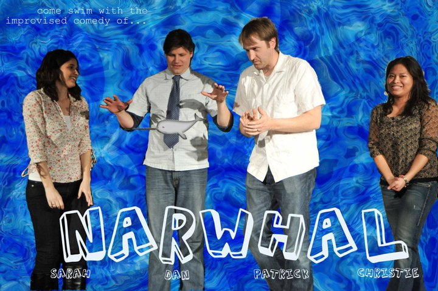

	<table class="infobox infobox-troupe">
		<tr>
			<th class="infobox-header" colspan="2">Narwhal</th>
		</tr>
		<tr class="">
			<td colspan="2" class="infobox-picture">
				
			</td>
		</tr>
		<tr class="">
			<th class="category-header" scope="row">Years Active</th>
			<td class="category">2011-2012</td>
		</tr>
		<tr class="">
			<th class="category-header" scope="row">Cast</th>
			<td class="category">
<ul style=""><!--
  --><li style=""><a class="internal-link" href="Christie Grace">Christie Grace</a></li><!--
  --><li style=""><a class="internal-link" href="Dan Grimm">Dan Grimm</a></li><!--
  --><li style=""><a class="internal-link" href="Patrick Knisely">Patrick Knisely</a></li><!--
  --><li style=""><a class="internal-link" href="Sarah Price">Sarah Price</a></li><!--
  --><!--
  --><!--
  --><!--
  --><!--
  --><!--
  --><!--
  --><!--
  --><!--
  --><!--
  --><!--
  --><!--
  --><!--
  --><!--
  --><!--
  --><!--
  --><!--
  --><!--
  --><!--
  --><!--
  --><!--
  --><!--
  --><!--
  --><!--
  --><!--
  --><!--
  --><!--
  --><!--
  --><!--
  --><!--
  --><!--
  --><!--
  --><!--
  --><!--
  --><!--
  --><!--
  --><!--
  --><!--
  --><!--
  --><!--
  --><!--
  --><!--
  --><!--
  --><!--
  --><!--
  --><!--
  --><!--
--></ul>
</td>
		</tr>
	</table>

**Narwhal** was an improv troupe.

## Summary
### Press Blurb
Their press blurb, taken from a 2011 application to perform at [[The Hideout Theatre]]:<blockquote>
Narwhal, [[Christie Grace]], [[Sarah Price]], [[Dan Grimm]] and [[Patrick Knisely]], formed in early 2011, deciding to make an official troupe after nearly two years worth of playing in various shows and ensembles together.
 

A mixture of fast and slow paced comedy, Narwhal throws out a handful of scenes through their show and brings them all home together weaving the storylines together in the end.
</blockquote>

### "What's Your Deal?"
Their answer to the "What's Your Deal?" question on a 2011 application to perform at [[The Hideout Theatre]]:<blockquote>
We're working on a more unique format, but for the moment we're starting with a general montage that opens with three or four extremely short scenes featuring mirroring and repetition.
 

We hope to close with a fast-paced connection based series of call-backs that tie the threads together.
</blockquote>

## Media
### Videos
* [Performance video.](http://vimeo.com/21101180)

### Photos
* [Photoset](http://www.facebook.com/michael.yew/media_set?set=a.1700834963456.84665.1315383518&type=3) by [[Michael Yew]] that includes their 5/19/11 performance in *[[The Threefer]]*.

## More Information
* [The troupe's facebook page.](https://www.facebook.com/NarwhalImprov)

[[Category/Troupes|Category:Troupes]]
[[Category/Auto-Generated Troupe Pages|Category:Auto-Generated Troupe Pages]]