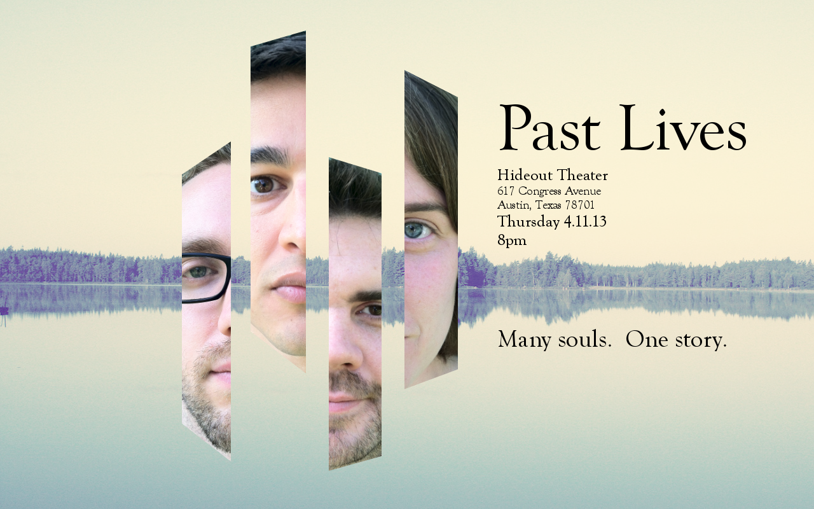

	<table class="infobox infobox-show">
		<tr>
			<th colspan="2" class="infobox-header">Past Lives</th>
		</tr>
		<tr class="">
			<td colspan="2" class="infobox-picture">
				
			</td>
		</tr>
		<tr class="">
			<th scope="row" class="category-header">Theater</th>
			<td class="category"><a class="internal-link" href="The Hideout Theatre">The Hideout Theatre</a></td>
		</tr>
		<tr class="">
			<th scope="row" class="category-header">Directed by</th>
			<td class="category"><a class="internal-link" href="Andrew Buck">Andrew Buck</a></td>
		</tr>
		<tr class="">
			<th scope="row" class="category-header">Cast</th>
			<td class="category">
<ul style=""><!--
  --><li style=""><a class="internal-link" href="Aaron Saenz">Aaron Saenz</a></li><!--
  --><li style=""><a class="internal-link" href="Andrew Buck">Andrew Buck</a></li><!--
  --><li style=""><a class="internal-link" href="Mia Iseman">Mia Iseman</a></li><!--
  --><li style=""><a class="internal-link" href="Ryan Austin">Ryan Austin</a></li><!--
  --><!--
  --><!--
  --><!--
  --><!--
  --><!--
  --><!--
  --><!--
  --><!--
  --><!--
  --><!--
  --><!--
  --><!--
  --><!--
  --><!--
  --><!--
  --><!--
  --><!--
  --><!--
  --><!--
  --><!--
  --><!--
  --><!--
  --><!--
  --><!--
  --><!--
  --><!--
  --><!--
  --><!--
  --><!--
  --><!--
  --><!--
  --><!--
  --><!--
  --><!--
  --><!--
  --><!--
  --><!--
  --><!--
  --><!--
  --><!--
  --><!--
  --><!--
  --><!--
  --><!--
  --><!--
  --><!--
--></ul>
</td>
		</tr>
		<tr class="">
			<th scope="row" class="category-header">Run</th>
			<td class="category">Apr 2013-Apr 2014</td>
		</tr>
	</table>

***Past Lives*** is an improvised play.

## Summary
*Past Lives* was created by [[Andrew Buck]].

The show explores a soul and all of its previous incarnations in reverse chronological order.

The show debuted at [[The 2013 Improvised Play Festival]] at [[The Hideout Theatre]] on 4/11/13 and has since been featured in [[The 44-Hour Improv Marathon]].

They played their last show at [[The 2014 Improvised Play Festival]] at [[The Hideout Theatre]] on 4/10/14.

## Media
### Videos
* [Video of their 4/11/13 debut performance](http://vimeo.com/63959273) in [[The 2013 Improvised Play Festival]].
* [Video of their 5/24/13 performance](http://vimeo.com/67467225) in *[[The Spectacle]]*.
* [Video](http://vimeo.com/91778244) of their show in [[The 2014 Improvised Play Festival]].
* [Video of their 6/22/13 show](http://vimeo.com/75798036) in [[The 44-Hour Improv Marathon]].

### Photos
* [Photoset](http://www.facebook.com/michael.yew/media_set?set=a.10201681256095924.1073741885.1315383518&type=3) by [[Michael Yew]] that includes their 4/11/14 performance in [[The Improvised Play Festival]].

## More Information
* [Post about the show](http://yesandrew.com/2014/04/11/the-death-of-a-show/) by [[Andrew Buck]].

[[Category/Troupes|Category:Troupes]]