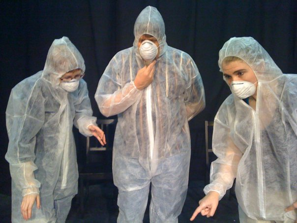

	<table class="infobox infobox-troupe">
		<tr>
			<th class="infobox-header" colspan="2">RedRover</th>
		</tr>
		<tr class="">
			<td colspan="2" class="infobox-picture">
				
			</td>
		</tr>
		<tr class="">
			<th class="category-header" scope="row">Years Active</th>
			<td class="category">2008-2010</td>
		</tr>

		<tr class="">
			<th class="category-header" scope="row">Cast</th>
			<td class="category">
<ul style=""><!--
  --><li style=""><a class="internal-link" href="Topping Haggerty">Topping Haggerty</a></li><!--
  --><li style=""><a class="internal-link" href="David Lampe">David Lampe</a></li><!--
  --><!--
  --><!--
  --><!--
  --><!--
  --><!--
  --><!--
  --><!--
  --><!--
  --><!--
  --><!--
  --><!--
  --><!--
  --><!--
  --><!--
  --><!--
  --><!--
  --><!--
  --><!--
  --><!--
  --><!--
  --><!--
  --><!--
  --><!--
  --><!--
  --><!--
  --><!--
  --><!--
  --><!--
  --><!--
  --><!--
  --><!--
  --><!--
  --><!--
  --><!--
  --><!--
  --><!--
  --><!--
  --><!--
  --><!--
  --><!--
  --><!--
  --><!--
  --><!--
  --><!--
  --><!--
  --><!--
  --><!--
  --><!--
--></ul>
</td>
		</tr>

	</table>

## Summary
**RedRover** was an improv troupe that asked other improviser to join them in shows (i.e., red rover, red rover, send that improvisers on over). With costumes from scrubs, to full yellow fisherman slickers, to protective suits worn by CSIs. Existed from 2008 to 2010.

## History
Guests included [[Kristin Firth]], [[Jessica Arjet]], [[Dav Wallace]], [[Justin Davis]]

[[Category/Troupes|RedRover]]