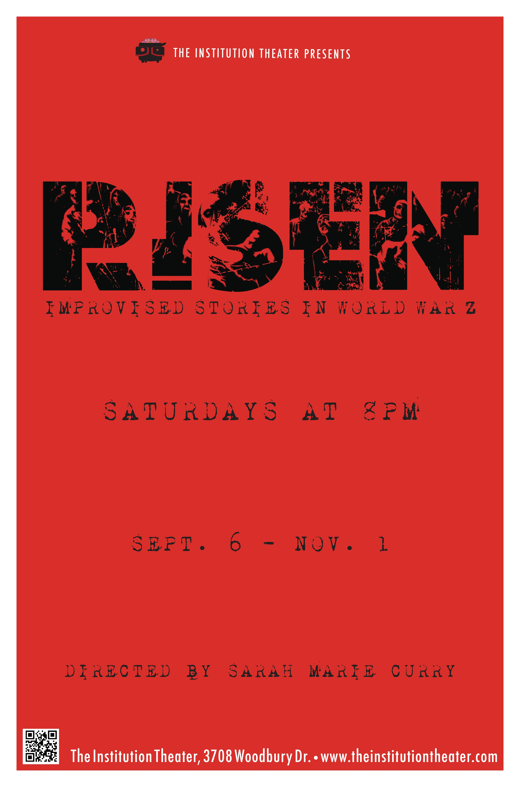

	<table class="infobox infobox-show">
		<tr>
			<th colspan="2" class="infobox-header">Risen</th>
		</tr>
		<tr class="">
			<td colspan="2" class="infobox-picture">
				
			</td>
		</tr>

		<tr class="">
			<th scope="row" class="category-header">Theater</th>
			<td class="category"><a class="internal-link" href="The Institution Theater">The Institution Theater</a></td>
		</tr>

		<tr class="">
			<th scope="row" class="category-header">Directed by</th>
			<td class="category"><a class="internal-link" href="Sarah Marie Curry">Sarah Marie Curry</a></td>
		</tr>

		<tr class="">
			<th scope="row" class="category-header">Cast</th>
			<td class="category">
<ul style=""><!--
  --><li style=""><a class="internal-link" href="Adam Mengesha">Adam Mengesha</a></li><!--
  --><li style=""><a class="internal-link" href="Cat Drago">Cat Drago</a></li><!--
  --><li style=""><a class="internal-link" href="Clifton Highfield">Clifton Highfield</a></li><!--
  --><li style=""><a class="internal-link" href="Heidi Penix">Heidi Penix</a></li><!--
  --><li style=""><a class="internal-link" href="Kareem Badr">Kareem Badr</a></li><!--
  --><li style=""><a class="internal-link" href="Katie Dahm">Katie Dahm</a></li><!--
  --><li style=""><a class="internal-link" href="Kierstin Hettler">Kierstin Hettler</a></li><!--
  --><li style=""><a class="internal-link" href="Leng Wong">Leng Wong</a></li><!--
  --><li style="" ><a class="internal-link" href="Ryan Hill">Ryan Hill</a></li><!--
  --><li style=""><a class="internal-link" href="Trey Stoker">Trey Stoker</a></li><!--
  --><!--
  --><!--
  --><!--
  --><!--
  --><!--
  --><!--
  --><!--
  --><!--
  --><!--
  --><!--
  --><!--
  --><!--
  --><!--
  --><!--
  --><!--
  --><!--
  --><!--
  --><!--
  --><!--
  --><!--
  --><!--
  --><!--
  --><!--
  --><!--
  --><!--
  --><!--
  --><!--
  --><!--
  --><!--
  --><!--
  --><!--
  --><!--
  --><!--
  --><!--
  --><!--
  --><!--
  --><!--
  --><!--
  --><!--
  --><!--
--></ul>
</td>
		</tr>

		<tr class="">
			<th scope="row" class="category-header">Crew</th>
			<td class="category">
<ul style=""><!--
  --><li style=""><a class="internal-link" href="Bryan Curry">Bryan Curry</a></li><!--
  --><li style=""><a class="internal-link" href="Mark Shoemaker">Mark Shoemaker</a></li><!--
  --><li style=""><a class="internal-link" href="Jason Vines">Jason Vines</a></li><!--
  --><!--
  --><!--
  --><!--
  --><!--
  --><!--
  --><!--
  --><!--
  --><!--
  --><!--
  --><!--
  --><!--
  --><!--
  --><!--
  --><!--
  --><!--
  --><!--
  --><!--
  --><!--
  --><!--
  --><!--
  --><!--
  --><!--
  --><!--
  --><!--
  --><!--
  --><!--
  --><!--
  --><!--
  --><!--
  --><!--
  --><!--
  --><!--
  --><!--
  --><!--
  --><!--
  --><!--
  --><!--
  --><!--
  --><!--
  --><!--
  --><!--
  --><!--
  --><!--
  --><!--
  --><!--
  --><!--
  --><!--
--></ul>
</td>
		</tr>

		<tr class="">

			<th scope="row" class="category-header">Run</th>

			<td class="category">Sep/Oct 2014</td>
		</tr>

		
	</table>

***Risen*** was a long-form narrative improv show inspired by *[[Wikipedia - World War Z|World War Z]]* by Max Brooks.

## Summary
Each week, an acclaimed Austin actor performed an edited selection from *[[Wikipedia - World War Z|World War Z]]* by Max Brooks, sharing a their first­hand account of the zombie apocalypse. 

The monologists: 

* Kwang Jing-shu: The Doctor - [[Leng Wong]]
* Jacob Nyathi: The South African - [[Benjamin Scott]]
* Sharon: The Feral Child - [[Sarah Marie Curry]]
* Maria Zhuganova: The Russian - [[Adriane Shown]]
* T. Sean Collins: The Mercinary - [[James Leary]]
* Jesika Hendricks: The All American - [[Courtney Hans]]
* David Allen Forbes: The Englishman - [[Kevin Miller]]
* Andre Renard: Under Paris - [[Jordan T. Maxwell]]
* Darnell Hackworth: The Dog Handler - [[Brently Heilbron]] & Ambrosia

The improv cast then did a full length narrative inspired by the monologue. This could be considered a modified Armando format.

[[Jason Vines]] was designed makeup effects for the show including latex zombie masks and blood effects. [[Bryan Curry]] did scoring and sound effects, and [[Mark Shoemaker]] designed and operated the lighting effects.

## Program Text
What You Are About to Witness:
The scripted performance of a first hand account from a survivor of the Zombie Apocalypse, followed by a fully improvised long form narrative. The improvisors, although familiar with World War Z by Max Brooks, have never heard this piece performed this way at this time. They will not know what is about to happen. They will be discovering the story as we do. They will fight to survive. 

About the War:
It goes by many names: “The Crisis,” “The Dark Years,” “The Walking Plague,” as well as newer and more “hip” titles such as “World War Z” or “The Zombie War,” and while many may protest the scientific accuracy of the word zombie, they will be hard pressed to discover a more globally accepted term for the creatures that almost caused our extinction. Zombie remains a devastating word, unrivaled in its power to conjure up so many memories or emotions. It has been only twelve years since VA Day was declared in the continental United States, and barely a decade since the last major world power celebrated its deliverance on “Victory in China Day.” The coming years will provide hindsight, adding greater wisdom to memories seen through the light of a matured, postwar world. But many of those memories may no longer exist, trapped in bodies and spirits too damaged or infirm to see the fruits of their victory harvested. It is no great secret that global life expectancy is a mere shadow of its former pre war figure. There simply are not enough resources to care for all the physical and psychological casualties of our last, great, total war.

## Awards & Nominations
* [https://ctxlivetheatre.com/reviews/review-risen-by-the-institution-theatre/](https://ctxlivetheatre.com/reviews/review-risen-by-the-institution-theatre/) Review by Michael Meigs from CTX Live Theatre
* [http://bidenpayne.wix.com/bidenpayneawards#!2015-Winners-and-Nominees/cu8q/55f9d43a0cf207897d4aedae](http://bidenpayne.wix.com/bidenpayneawards#!2015-Winners-and-Nominees/cu8q/55f9d43a0cf207897d4aedae) Nominated Outstanding Production 2015 B. Iden Payne Awards
* [http://bidenpayne.wix.com/bidenpayneawards#!2015-Winners-and-Nominees/cu8q/55f9d43a0cf207897d4aedae](http://bidenpayne.wix.com/bidenpayneawards#!2015-Winners-and-Nominees/cu8q/55f9d43a0cf207897d4aedae) Nominated Outstanding Director [[Sarah Marie Curry]] 2015 B. Iden Payne Awards

## Media
### Photos
* [Photoset](http://www.facebook.com/media/set/?set=a.803000993096752.1073742078.221927764537414&type=3) by [[Steve Rogers]] of the 9/13/14 performance.
* [Photoset](http://www.facebook.com/warren.henderson.946/media_set?set=a.900852893278530.1073741885.100000614831752&type=3) by [[Warren Henderson]] of the 9/20/14 performance.
* [Photoset](http://www.facebook.com/michael.yew/media_set?set=a.10202691490231146.1073741909.1315383518&type=3) by [[Michael Yew]] of the 9/27/14 performance.
* [Photoset](http://www.facebook.com/michael.yew/media_set?set=a.10202737544262468.1073741911.1315383518&type=3) by [[Michael Yew]] of the 10/5/14 performance.
* [Photoset](http://www.facebook.com/media/set/?set=a.820573344672850.1073742086.221927764537414&type=3) by [[Steve Rogers]] of the 10/11/14 performance.

### Other
* [Trailer for the show.](http://youtu.be/o1tJwHaGpxU&feature=youtu.be)
*[https://www.youtube.com/watch?v=ZDEbbtcOh_A](https://www.youtube.com/watch?v=ZDEbbtcOh_A) September 6th show featuring Benjamin Scott (first half hour)

## More Information
* [The audition announcement](http://forum.austinimprov.com/viewtopic.php?f=3&t=17545) on [[The Austin Improv Forums]].

[[Category/Shows|Category:Shows]]