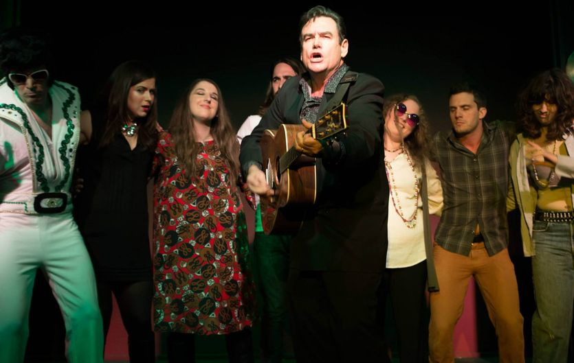

	<table class="infobox infobox-show">
		<tr>
			<th colspan="2" class="infobox-header">Rock N Roll Purgatory</th>
		</tr>
		<tr class="">
			<td colspan="2" class="infobox-picture">
				
			</td>
		</tr>

		<tr class="">
			<th scope="row" class="category-header">Theater</th>
			<td class="category"><a class="internal-link" href="The Institution Theater">The Institution Theater</a></td>
		</tr>

		<tr class="">
			<th scope="row" class="category-header">Directed by</th>
			<td class="category">
<ul style=""><!--
  --><li style=""><a class="internal-link" href="Asaf Ronen">Asaf Ronen</a></li><!--
  --><!--
  --><!--
  --><!--
  --><!--
  --><!--
  --><!--
  --><!--
  --><!--
  --><!--
  --><!--
  --><!--
  --><!--
  --><!--
  --><!--
  --><!--
  --><!--
  --><!--
  --><!--
  --><!--
  --><!--
  --><!--
  --><!--
  --><!--
  --><!--
  --><!--
  --><!--
  --><!--
  --><!--
  --><!--
  --><!--
  --><!--
  --><!--
  --><!--
  --><!--
  --><!--
  --><!--
  --><!--
  --><!--
  --><!--
  --><!--
  --><!--
  --><!--
  --><!--
  --><!--
  --><!--
  --><!--
  --><!--
  --><!--
  --><!--
--></ul>
</td>
		</tr>

		<tr class="">
			<th scope="row" class="category-header">Cast</th>
			<td class="category">
<ul style=""><!--
  --><li style=""><a class="internal-link" href="Justin Davidson">Justin Davidson</a></li><!--
  --><li style=""><a class="internal-link" href="Ann Flynn">Ann Flynn</a></li><!--
  --><li style=""><a class="internal-link" href="Allison Huston">Allison Huston</a></li><!--
  --><li style=""><a class="internal-link" href="Craig Kotfas">Craig Kotfas</a></li><!--
  --><li style=""><a class="internal-link" href="Kristen Kurtis">Kristen Kurtis</a></li><!--
  --><li style=""><a class="internal-link" href="Tyler Lane">Tyler Lane</a></li><!--
  --><li style=""><a class="internal-link" href="Adam Niederpruem">Adam Niederpruem</a></li><!--
  --><li style=""><a class="internal-link" href="Mason Pitluk">Mason Pitluk</a></li><!--
  --><li style="" ><a class="internal-link" href="John Reed">John Reed</a></li><!--
  --><li style=""><a class="internal-link" href="Donna Rice">Donna Rice</a></li><!--
  --><li style=""><a class="internal-link" href="Heidi Rogers">Heidi Rogers</a></li><!--
  --><li style=""><a class="internal-link" href="Callie Sharon">Callie Sharon</a></li><!--
  --><li style=""><a class="internal-link" href="Luke Wallens">Luke Wallens</a></li><!--
  --><!--
  --><!--
  --><!--
  --><!--
  --><!--
  --><!--
  --><!--
  --><!--
  --><!--
  --><!--
  --><!--
  --><!--
  --><!--
  --><!--
  --><!--
  --><!--
  --><!--
  --><!--
  --><!--
  --><!--
  --><!--
  --><!--
  --><!--
  --><!--
  --><!--
  --><!--
  --><!--
  --><!--
  --><!--
  --><!--
  --><!--
  --><!--
  --><!--
  --><!--
  --><!--
  --><!--
  --><!--
--></ul>
</td>
		</tr>

		<tr class="">
			<th scope="row" class="category-header">Crew</th>
			<td class="category">
<ul style=""><!--
  --><li style=""><a class="internal-link" href="Courtney DeAngelo">Courtney DeAngelo</a></li><!--
  --><!--
  --><!--
  --><!--
  --><!--
  --><!--
  --><!--
  --><!--
  --><!--
  --><!--
  --><!--
  --><!--
  --><!--
  --><!--
  --><!--
  --><!--
  --><!--
  --><!--
  --><!--
  --><!--
  --><!--
  --><!--
  --><!--
  --><!--
  --><!--
  --><!--
  --><!--
  --><!--
  --><!--
  --><!--
  --><!--
  --><!--
  --><!--
  --><!--
  --><!--
  --><!--
  --><!--
  --><!--
  --><!--
  --><!--
  --><!--
  --><!--
  --><!--
  --><!--
  --><!--
  --><!--
  --><!--
  --><!--
  --><!--
  --><!--
--></ul>
</td>
		</tr>

		<tr class="">

			<th scope="row" class="category-header">Run</th>

			<td class="category">Jun 2014</td>
		</tr>

		
	</table>

***Rock N Roll Purgatory*** was an original comedy musical mainstage show at [[The Institution Theater]]. It was written by the cast through improvised rehearsals.

## Summary
The Havocs, an up-and-coming rock band, die in a tragic accident and wake up in purgatory where they must confront their fate among dead celebrity musicians and demons. 

The show ran Fridays and Saturdays in June of 2014.