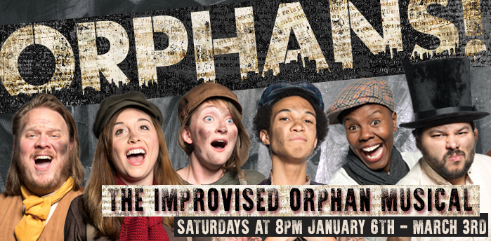

	<table class="infobox infobox-show">
		<tr>
			<th colspan="2" class="infobox-header">Orphans!</th>
		</tr>
		<tr class="">
			<td colspan="2" class="infobox-picture">
				
			</td>
		</tr>
		<tr class="">
			<th scope="row" class="category-header">Theater</th>
			<td class="category"><a class="internal-link" href="Theatres/The Hideout Theatre">The Hideout Theatre</a></td>
		</tr>
		<tr class="">
			<th scope="row" class="category-header">Directed by</th>
			<td class="category">
<ul style=""><!--
  --><li style=""><a class="internal-link" href="Performers/Bridget Brewer">Bridget Brewer</a></li><!--
  --><li style=""><a class="internal-link" href="Performers/Kaci Beeler">Kaci Beeler</a></li><!--
  --><!--
  --><!--
  --><!--
  --><!--
  --><!--
  --><!--
  --><!--
  --><!--
  --><!--
  --><!--
  --><!--
  --><!--
  --><!--
  --><!--
  --><!--
  --><!--
  --><!--
  --><!--
  --><!--
  --><!--
  --><!--
  --><!--
  --><!--
  --><!--
  --><!--
  --><!--
  --><!--
  --><!--
  --><!--
  --><!--
  --><!--
  --><!--
  --><!--
  --><!--
  --><!--
  --><!--
  --><!--
  --><!--
  --><!--
  --><!--
  --><!--
  --><!--
  --><!--
  --><!--
  --><!--
  --><!--
  --><!--
  --><!--
--></ul>
</td>
		</tr>
		<tr class="">
			<th scope="row" class="category-header">Cast</th>
			<td class="category">
<ul style=""><!--
  --><li style=""><a class="internal-link" href="Performers/Bridget Brewer">Bridget Brewer</a></li><!--
  --><li style=""><a class="internal-link" href="Performers/Cat Drago">Cat Drago</a></li><!--
  --><li style=""><a class="internal-link" href="Performers/Courtney Hopkin">Courtney Hopkin</a></li><!--
  --><li style=""><a class="internal-link" href="Performers/Erin Molson">Erin Molson</a></li><!--
  --><li style="">Frank Sánchez</li><!--
  --><li style=""><a class="internal-link" href="Performers/J.R. Zambrano">J.R. Zambrano</a></li><!--
  --><li style=""><a class="internal-link" href="Performers/Jordan T. Maxwell">Jordan T. Maxwell</a></li><!--
  --><li style=""><a class="internal-link" href="Performers/Kaci Beeler">Kaci Beeler</a></li><!--
  --><li style="" ><a class="internal-link" href="Performers/Katie Dahm">Katie Dahm</a></li><!--
  --><li style="">Mallory Schlossberg</li><!--
  --><li style=""><a class="internal-link" href="Performers/Marc Jalandoon">Marc Jalandoon</a></li><!--
  --><li style=""><a class="internal-link" href="Performers/Margaret Rose Hunsicker">Margaret Rose Hunsicker</a></li><!--
  --><li style="">Rachel Elaine Creason</li><!--
  --><li style=""><a class="internal-link" href="Performers/Rob Yoho">Rob Yoho</a></li><!--
  --><li style=""><a class="internal-link" href="Performers/Shannon Dale Stott">Shannon Dale Stott</a></li><!--
  --><li style="">Tyler Groce</li><!--
  --><!--
  --><!--
  --><!--
  --><!--
  --><!--
  --><!--
  --><!--
  --><!--
  --><!--
  --><!--
  --><!--
  --><!--
  --><!--
  --><!--
  --><!--
  --><!--
  --><!--
  --><!--
  --><!--
  --><!--
  --><!--
  --><!--
  --><!--
  --><!--
  --><!--
  --><!--
  --><!--
  --><!--
  --><!--
  --><!--
  --><!--
  --><!--
  --><!--
  --><!--
--></ul>
</td>
		</tr>
		<tr class="">
			<th scope="row" class="category-header">Run</th>
			<td class="category">January-February 2018</td>
		</tr>
	</table>

***Orphans!*** was a Hideout mainstage improvised musicals about plucky orphans at the turn of the twentieth century.  It was inspired by works like *Annie*, *Oliver!*, and *Newsies*.

## Crew Roles
* Technical Director – [[Performers/Lindsey McGowen|Lindsey McGowen]]
* Light Design – [[Performers/Jay Mahavier|Jay Mahavier]] (Lead), [[Performers/Greg Blank|Greg Blank]]
* Sound Design – [[Michael Yew]] (Lead), Andre K. Buchanan
* Costume Design – [[Performers/Carolyn Gjertsen|Carolyn Gjertsen]]
* Costume Builders – [[Performers/Cindy Page|Cindy Page]], Danielle DaVerona
* Stage Managers – Shay Millheiser, Joey Neugart
* Graphic & Scenic Design – [[Performers/Kaci Beeler|Kaci Beeler]]

## More Information
* [The show's web page.](http://www.hideouttheatre.com/shows/orphans)

Category:Shows
Category:The Hideout Theatre