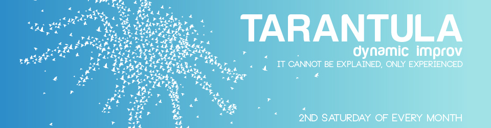

	<table class="infobox infobox-show">
		<tr>
			<th colspan="2" class="infobox-header">Tarantula</th>
		</tr>
		<tr class="">
			<td colspan="2" class="infobox-picture">
				
			</td>
		</tr>
		<tr class="">
			<th scope="row" class="category-header">Theater</th>
			<td class="category"><a class="internal-link" href="Theatres/The Institution Theater">The Institution Theater</a></td>
		</tr>
		<tr class="">
			<th scope="row" class="category-header">Directed by</th>
			<td class="category"><a class="internal-link" href="Performers/Sarah Marie Curry">Sarah Marie Curry</a></td>
		</tr>
		<tr class="">
			<th scope="row" class="category-header">Cast</th>
			<td class="category">Varies</td>
		</tr>
		<tr class="">
			<th scope="row" class="category-header">Crew</th>
			<td class="category">Varies</td>
		</tr>
		<tr class="">
			<th scope="row" class="category-header">Run</th>
			<td class="category">2015-Present</td>
		</tr>
	</table>

***Tarantula*** was [[Theatres/The Institution Theater|The Institution Theater]]'s quarterly 10pm show, playing every 5th Saturday at 10pm as part of The Staple Shows.

## Summary
Tarantula is a "formless-form" show, in a similar vein as Todd Stashwick's *Mayfly*, or Chicago's *JTS Brown* format. An eight-legged cast of improvisors and musical guests arrive on the night of, in preparation to discover the show they are in as they are finishing it. *Tarantula* has been called "dreamlike" "dynamic" and "what was THAT?" (but in a good way).

### Art Tie-ins
#### Dystheatre Art Installation
On September 12 of 2015, [[Performers/Michael Ferstenfeld|Michael Ferstenfeld]] and performance scientists Paul Wainright, [[Performers/Jeff Britt|Jeff Britt]], and David Moses Fruchter of [[Troupes/Happiness is a Choice|Happiness is a Choice]] held the first iteration of Experiment #22: METACARTOGRAPHY, otherwise known as The Mind Map. Subsequent calibrations of the installation experiment are planned as monthly one-night installations before and often after Tarantula.

#### Artist Series Poster Commission
As part of the loose, experiential nature of the show, an artist series of posters were commissioned from the pool of [[Austin Improv Community]] designers, of which there are many members, contributing designs for productions in many and varied ways across the improv marketing scene in Austin. Please see photo archive for in series work. Ryan Austin was the only artist to participate but he did it REAL GOOD.

### Press Blurb
Tarantula is a combination of improv and live music melding together in the most unique ways.  The improvisers will use the stage and their own bodies like a canvas, a tapestry of emotions and perceptions.  Unlike most improvised shows that tell a story in a narrative fashion, Tarantula will tell a story that is fragmentary and organic.  You will relate to the weird and twisty rhythms of the show because you are HUMAN and it connects with you soul.  Improvisers will move as one, create without structure and follows the beats and tempo that the musicians lay down for them in the moment.

## History
The show is produced and/or curated (depending on your loose definition in a formless form thingy whats-it) by [[Performers/Sarah Marie Curry|Sarah Marie Curry]], who originated the idea after a production meeting for The Staple Shows at The Institution Theater, wherein she was asked to create a long running show to reduce the strain of turning over multiple new productions at once. She was asked what she thought would be marketable, enduring and inspiring. She came up with TARANTULA instead. The name came from thinking of insects (*Mayfly*) and that the cast is often made of eight improvisors, and the work they do endeavors to be beautiful and scary. 

In April of 2016, Artistic Director [[Performers/Tom Booker|Tom Booker]] decided to make TARANTULA a quarterly show, occurring on the 5th Saturday of the month in an effort to reduce production fatigue and create more potent attraction and attendance. 

In December of 2016 it was decided to cancel TARANTULA. Sarah Marie Curry got all burned out in the producer role and Happiness is a Choice (Michael Ferstenfeld's beautiful improv baby) decided to take over the time slot, as they serve the same wimbly wombly improv master. It makes sense. 

### Casts
#### October 29th, 2016
* Alex Walker
* [[Performers/Asaf Ronen|Asaf Ronen]]
* [[Performers/Heidi Penix|Heidi Penix]]
* [[Performers/Jon Bolden|Jon Bolden]]
* [[Performers/Marc Jalandoon|Marc Jalandoon]]
* [[Performers/Shannon McCormick|Shannon McCormick]]
* [[Performers/Shannon Dale Stott|Shannon Dale Stott]]
* Musician: Josh Ronsen
* Lord of Light: [[Performers/Mark Shoemaker|Mark Shoemaker]]

#### July 30th, 2016
* Lisa Friedrich
* Megan Mowry
* [[Performers/Sarah Marie Curry|Sarah Marie Curry]]
* Amanda Smith
* [[Performers/Jon Bolden|Jon Bolden]]
* [[Performers/Michael Ferstenfeld|Michael Ferstenfeld]]
* [[Performers/Clifton Highfield|Clifton Highfield]]
* AJ Reyes
* Musician: Andrew Schwartz
* Lord of Light: [[Performers/Mark Shoemaker|Mark Shoemaker]]

#### April 30th, 2016
* Kierstin Cecelia
* Megan Mowry
* [[Performers/Sarah Marie Curry|Sarah Marie Curry]]
* Heidi Noelle
* [[Performers/Wyatt Tall|Wyatt Tall]]
* [[Performers/Kenny Madison|Kenny Madison]]
* Nicholaus Weindel
* AJ Reyes
* Musician: Mathilde Legrand
* Lord of Light: [[Performers/Mark Shoemaker|Mark Shoemaker]]

#### March 12th, 2016
* [[Performers/Asaf Ronen|Asaf Ronen]]
* Megan Mowry
* Kierstin Hettler
* [[Performers/Aspen Webster|Aspen Webster]]
* [[Performers/Adam Mengesha|Adam Mengesha]]
* Michael Ferstendfeld
* [[Performers/Luke Wallens|Luke Wallens]]

* Light: [[Performers/Mark Shoemaker|Mark Shoemaker]]

#### February 13th, 2016
* Sam Schack
* [[Performers/Sarah Marie Curry|Sarah Marie Curry]]
* Megan Mowry
* [[Performers/Tom Booker|Tom Booker]]
* [[Performers/Jeremy Moran|Jeremy Moran]]
* [[Performers/Michael Ferstenfeld|Michael Ferstenfeld]]
* [[Performers/Luke Wallens|Luke Wallens]]
* [[Performers/Adam Mengesha|Adam Mengesha]]
* Musician: Ben Laussade
* Light: [[Performers/Mark Shoemaker|Mark Shoemaker]]

#### January 9th, 2016
* Amanda Smith
* [[Performers/Courtney Hopkin|Courtney Hopkin]]
* [[Performers/Sarah Marie Curry|Sarah Marie Curry]]
* Megan Mowry
* Cody Herring
* [[Performers/Michael Ferstenfeld|Michael Ferstenfeld]]
* [[Performers/Jon Bolden|Jon Bolden]]
* [[Performers/Adam Mengesha|Adam Mengesha]]
* [[Performers/Shannon McCormick|Shannon McCormick]]
* Musician: Chris Petkus
* Light: [[Performers/Mark Shoemaker|Mark Shoemaker]]

#### December 12th, 2015
* [[Performers/Kacey Samiee|Kacey Samiee]]
* [[Performers/Courtney Hopkin|Courtney Hopkin]]
* [[Performers/Sarah Marie Curry|Sarah Marie Curry]]
* [[Performers/Erica Lies|Erica Lies]]
* [[Performers/Asaf Ronen|Asaf Ronen]]
* [[Performers/Michael Ferstenfeld|Michael Ferstenfeld]]
* [[Performers/Jason Vines|Jason Vines]]
* [[Performers/Adam Mengesha|Adam Mengesha]]
* [[Performers/Shannon McCormick|Shannon McCormick]]
* Musician: Josh Ronsen
* Light: [[Performers/Mark Shoemaker|Mark Shoemaker]]

#### November 14th, 2015
* [[Performers/Adam Mengesha|Adam Mengesha]]
* [[Performers/Cene Hale|Cene Hale]]
* Clifton Highfied
* [[Performers/Heidi Rogers|Heidi Rogers]]
* [[Performers/Rachel Austin|Rachel Austin]]
* [[Performers/Sarah Marie Curry|Sarah Marie Curry]]
* [[Performers/Shannon McCormick|Shannon McCormick]]
* [[Performers/Jeremy Moran|Jeremy Moran]]
* Musician: Peter Stopschinki
* Light: [[Performers/Mark Shoemaker|Mark Shoemaker]]

#### October 10th, 2015
* [[Performers/Adam Mengesha|Adam Mengesha]]
* [[Performers/Aspen Webster|Aspen Webster]]
* Brad Silman
* [[Performers/Heidi Rogers|Heidi Rogers]]
* [[Performers/Michael Ferstenfeld|Michael Ferstenfeld]]
* [[Performers/Sarah Marie Curry|Sarah Marie Curry]]
* [[Performers/Wyatt Tall|Wyatt Tall]]
* Musician: Brent Baldwin
* Light: [[Performers/Mark Shoemaker|Mark Shoemaker]]

#### September 12th, 2015
* [[Performers/Adam Mengesha|Adam Mengesha]]
* [[Performers/Asaf Ronen|Asaf Ronen]]
* David Moses Fruchter
* Kierstin Hettler
* [[Performers/Kristen Kurtis|Kristen Kurtis]]
* [[Performers/Michael Ferstenfeld|Michael Ferstenfeld]]
* Paul Wainwright
* [[Performers/Sarah Marie Curry|Sarah Marie Curry]]
* [[Performers/Shannon McCormick|Shannon McCormick]]
* Musician: Southpaw Jones
* Light: [[Performers/Mark Shoemaker|Mark Shoemaker]]

#### August 8th, 2015
* Ashlee Medlin
* [[Performers/Aspen Webster|Aspen Webster]]
* [[Performers/Courtney Hopkin|Courtney Hopkin]]
* [[Performers/Craig Kotfas|Craig Kotfas]]
* [[Performers/Jon Bolden|Jon Bolden]]
* Kierstin Hettler
* [[Performers/Michael Ferstenfeld|Michael Ferstenfeld]]
* [[Performers/Shannon McCormick|Shannon McCormick]]
* Musician: Lindsay McKenna
* Light: [[Performers/Mark Shoemaker|Mark Shoemaker]]

#### July 11th, 2015
* [[Performers/Brently Heilbron|Brently Heilbron]]
* [[Performers/Brett Tribe|Brett Tribe]]
* [[Performers/Courtney Hopkin|Courtney Hopkin]]
* [[Performers/Jordan Maxwell|Jordan Maxwell]]
* [[Performers/Kenny Madison|Kenny Madison]]
* Kierstin Hettler
* [[Performers/Michael Ferstenfeld|Michael Ferstenfeld]]
* [[Performers/Sam Schak|Sam Schak]]
* [[Performers/Sarah Marie Curry|Sarah Marie Curry]]
* Musicians: *[[Shows/The Source|The Source]]* Band
* Light: [[Performers/Mark Shoemaker|Mark Shoemaker]]

#### June 13th, 2015
* [[Performers/Adam Mengesha|Adam Mengesha]]
* [[Performers/Asaf Ronen|Asaf Ronen]]
* Kierstin Cecelia
* [[Performers/Michael Joplin|Michael Joplin]]
* [[Performers/Quinn Buckner|Quinn Buckner]]
* [[Performers/Ruby Willmann|Ruby Willmann]]
* Sam Freckles Schak
* [[Performers/Sarah Marie Curry|Sarah Marie Curry]]
* Musician: [[Performers/David Ronn|David Ronn]]
* Light: [[Performers/Mark Shoemaker|Mark Shoemaker]]

#### May 16th, 2015
* [[Performers/Adam Mengesha|Adam Mengesha]]
* [[Performers/Cat Drago|Cat Drago]]
* [[Performers/Courtney Hopkin|Courtney Hopkin]]
* [[Performers/Jon Bolden|Jon Bolden]]
* [[Performers/Kareem Badr|Kareem Badr]]
* [[Performers/Matt Needles|Matt Needles]]
* Michael Ferstendfeld
* [[Performers/Sarah Marie Curry|Sarah Marie Curry]]
* Musician: Content Knowles
* Light: [[Performers/Mark Shoemaker|Mark Shoemaker]]

#### April 18th, 2015
* [[Performers/Ashley Nugent|Ashley Nugent]]
* [[Performers/Frank Netscher|Frank Netscher]]
* [[Performers/Kareem Badr|Kareem Badr]]
* Kiersten Hettler
* [[Performers/Sarah Marie Curry|Sarah Marie Curry]]
* [[Performers/Tom Booker|Tom Booker]]
* Musician: [[Performers/Ammon Taylor|Ammon Taylor]]
* Light: [[Performers/Mark Shoemaker|Mark Shoemaker]]

#### March 21st, 2015
* [[Performers/Adam Mengesha|Adam Mengesha]]
* [[Performers/Courtney Hopkin|Courtney Hopkin]]
* [[Performers/Kareem Badr|Kareem Badr]]
* [[Performers/Lisa Jackson|Lisa Jackson]]
* [[Performers/Michael Ferstenfeld|Michael Ferstenfeld]]
* [[Performers/Sam Schak|Sam Schak]]
* [[Performers/Sarah Marie Curry|Sarah Marie Curry]]
* Musician: Content Knowles
* Light: [[Performers/Mark Shoemaker|Mark Shoemaker]]

#### February 21st, 2015
* [[Performers/Ashley Nugent|Ashley Nugent]]
* [[Performers/Clifton Highfield|Clifton Highfield]]
* [[Performers/Heidi Penix|Heidi Penix]]
* [[Performers/John Ratliff|John Ratliff]]
* [[Performers/Kareem Badr|Kareem Badr]]
* [[Performers/Sam Schak|Sam Schak]]
* [[Performers/Sarah Marie Curry|Sarah Marie Curry]]
* Musician: [[Performers/Brently Heilbron|Brently Heilbron]]
* Light: [[Performers/Mark Shoemaker|Mark Shoemaker]]

#### January 24th, 2015
* [[Performers/Arthur Simone|Arthur Simone]]
* [[Performers/Asaf Ronen|Asaf Ronen]]
* [[Performers/Halyn Erickson|Halyn Erickson]]
* [[Performers/Heidi Penix|Heidi Penix]]
* [[Performers/Kareem Badr|Kareem Badr]]
* [[Performers/Sam Schak|Sam Schak]]
* [[Performers/Sarah Marie Curry|Sarah Marie Curry]]
* [[Performers/Tom Booker|Tom Booker]]
* Musicians: [[Performers/Ryan Hill|Ryan Hill]], [[Performers/Lindsey McGowen|Lindsey McGowen]]
* Light: [[Performers/Mark Shoemaker|Mark Shoemaker]]

## Media
### Photos
* [Photoset](http://www.facebook.com/media/set/?set=a.10153128910947265.1073741865.588952264&type=3) by [[Performers/Peter Rogers|Peter Rogers]] of the January 2015 performance.
  * [Photoset](http://www.facebook.com/media/set/?set=a.764372576972589.1073741851.473177099425473&type=3) by [[Performers/Chad Wellington|Chad Wellington]] of the same show.
* [Photoset](http://www.facebook.com/media/set/?set=a.908052572591593.1073742156.221927764537414&type=3) by [[Steve Rogers]] of the February 2015 performance.
* [Photoset](http://www.facebook.com/Heidi.N.Rogers/media_set?set=a.10105999442206600.7909117&type=3) by [[Performers/Heidi Rogers|Heidi Rogers]] of the March 2015 performance.
* [Photoset](http://www.facebook.com/michael.yew/media_set?set=a.10203959461209628.1073741942.1315383518&type=3) by [[Michael Yew]] of the April 2015 performance.
* [Photoset](http://www.facebook.com/Heidi.N.Rogers/media_set?set=a.10106234076956680.1073741884.7909117&type=3) by [[Performers/Heidi Rogers|Heidi Rogers]] of the May 2015 performance.

Category:Shows
Category:The Institution Theater