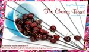

	<table class="infobox infobox-show">
		<tr>
			<th colspan="2" class="infobox-header">The Cherry Bowl</th>
		</tr>
		<tr class="">
			<td colspan="2" class="infobox-picture">
				
			</td>
		</tr>
		<tr class="">
			<th scope="row" class="category-header">Theater</th>
			<td class="category"><a class="internal-link" href="Theatres/Salvage Vanguard Theater">Salvage Vanguard Theater</a></td>
		</tr>
		<tr class="">
			<th scope="row" class="category-header">Directed by</th>
			<td class="category">Ben Schave</td>
		</tr>
		<tr class="">
			<th scope="row" class="category-header">Cast</th>
			<td class="category">
<ul style=""><!--
  --><li style=""><a class="internal-link" href="Performers/Aaron Walther">Aaron Walther</a></li><!--
  --><li style=""><a class="internal-link" href="Performers/Adriane Shown">Adriane Shown</a></li><!--
  --><li style="">Austin Alexander</li><!--
  --><li style="">Ben Schave</li><!--
  --><li style="">Bob Galligan</li><!--
  --><li style=""><a class="internal-link" href="Performers/Brad Hawkins">Brad Hawkins</a></li><!--
  --><li style=""><a class="internal-link" href="Performers/Dave alley">Dave alley</a></li><!--
  --><li style=""><a class="internal-link" href="Performers/Emily Breedlove">Emily Breedlove</a></li><!--
  --><li style="" >Frank Nappi</li><!--
  --><li style=""><a class="internal-link" href="Performers/Jayme Ramsay">Jayme Ramsay</a></li><!--
  --><li style=""><a class="internal-link" href="Performers/Jessica Arjet">Jessica Arjet</a></li><!--
  --><li style="">Joel Osborne</li><!--
  --><li style="">Joey Hood</li><!--
  --><li style="">Jon Cook</li><!--
  --><li style="">Kelly Hasandr</li><!--
  --><li style="">Kerri Lendo</li><!--
  --><li style=""><a class="internal-link" href="Performers/Kristin Firth">Kristin Firth</a></li><!--
  --><li style="">Meghan Morongova</li><!--
  --><li style=""><a class="internal-link" href="Performers/Michael Jastroch">Michael Jastroch</a></li><!--
  --><li style="">Nate Dunaway</li><!--
  --><li style="">Niki Jacobsen-Torres</li><!--
  --><li style="">Zac Carr</li><!--
  --><!--
  --><!--
  --><!--
  --><!--
  --><!--
  --><!--
  --><!--
  --><!--
  --><!--
  --><!--
  --><!--
  --><!--
  --><!--
  --><!--
  --><!--
  --><!--
  --><!--
  --><!--
  --><!--
  --><!--
  --><!--
  --><!--
  --><!--
  --><!--
  --><!--
  --><!--
  --><!--
  --><!--
--></ul>
</td>
		</tr>
		<tr class="">
			<th scope="row" class="category-header">Initial Run</th>
			<td class="category">Feb/Mar 2012</td>
		</tr>
		<tr class="">
			<th scope="row" class="category-header">Subsequent Run(s)</th>
			<td class="category">Nov 2013</td>
		</tr>
	</table>

***The Cherry Bowl*** was a show produced by [[Theatres/Gnap! Theater Projects|Gnap! Theater Projects]] in 2012 and 2013. While not an improvised show, improv was used to create bits of clowning to construct a dialogue-free, *commedia dell'arte*-inspired adaptation of Anton Chekhov's *[The Cherry Orchard](http://en.wikipedia.org/wiki/The_Cherry_Orchard)*. Gnap! member Ben Schave directed the production.

## Cast
### 2012 Run
* [[Performers/Emily Breedlove|Emily Breedlove]] as Lyubov
* [[Performers/Kristin Firth|Kristin Firth]] as Varya
* [[Performers/Jayme Ramsay|Jayme Ramsay]] as Anya
* Frank Nappi as Lopakhin
* [[Performers/Brad Hawkins|Brad Hawkins]] as Gayev
* Bob Galligan as Trofimov
* [[Performers/Jessica Arjet|Jessica Arjet]] as Charlotta
* Niki Jacobsen-Torres as Dunyasha
* [[Performers/Aaron Walther|Aaron Walther]] as Yasha
* [[Performers/Michael Jastroch|Michael Jastroch]] as Yepikhodov
* Joel Osborne as Firs
* Ben Schave as Pishchik
  * Mr. Schave stepped in for Brady James, who had to bow out of the production just before opening night.

### 2013 Run
* Austin Alexander as Trofimov
* [[Performers/Dave alley|Dave alley]] as Firs
* [[Performers/Jessica Arjet|Jessica Arjet]] as Charlotta
* Zac Carr as Lopakhin
* Jon Cook as Pishchik
* Nate Dunaway as Gayev
* Kelly Hasandras as Dunyasha
* Joey Hood as Yasha
* [[Performers/Michael Jastroch|Michael Jastroch]] as Yepikhodov
* Kerri Lendo as Varya
* Meghan Morongova as Anya
* [[Performers/Adriane Shown|Adriane Shown]] as Lyubov

## Crew
### 2013 Run
* Stage Manager: Keith Sechrest
* Set: Leslie Turner
* Sound: [[Performers/Michael Joplin|Michael Joplin]]
* Costumes: [[Performers/Courtney Hopkin|Courtney Hopkin]]
* Lights: Zac Crofford

## Media
### Photos
* [Photoset](http://www.facebook.com/media/set/?set=a.284125794989440.64544.118587218209966&type=3) by [[Roy Moore]] of the 2/25/12 performance.
* [Photoset](http://www.facebook.com/Heidi.N.Rogers/media_set?set=a.10103380530371910.1073741835.7909117&type=3) by [[Performers/Heidi Rogers|Heidi Rogers]] that includes a 2013 show.

## More Information
* [Facebook event for the 2013 run.](http://www.facebook.com/events/635980636452470/)

Cherry