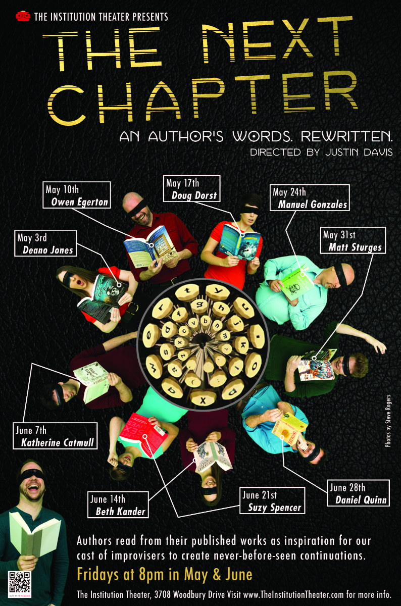

	<table class="infobox infobox-show">
		<tr>
			<th colspan="2" class="infobox-header">The Next Chapter</th>
		</tr>
		<tr class="">
			<td colspan="2" class="infobox-picture">
				
			</td>
		</tr>
		<tr class="">
			<th scope="row" class="category-header">Theater</th>
			<td class="category"><a class="internal-link" href="Theatres/The Institution Theater">The Institution Theater</a></td>
		</tr>
		<tr class="">
			<th scope="row" class="category-header">Directed by</th>
			<td class="category"><a class="internal-link" href="Performers/Justin Bozied">Justin Bozied</a></td>
		</tr>
		<tr class="">
			<th scope="row" class="category-header">Assistant Director(s)</th>
			<td class="category"><a class="internal-link" href="Performers/Jessie Pascarelli">Jessie Pascarelli</a></td>
		</tr>
		<tr class="">
			<th scope="row" class="category-header">Cast</th>
			<td class="category">
<ul style=""><!--
  --><li style=""><a class="internal-link" href="Performers/Justin Bozied">Justin Bozied</a></li><!--
  --><li style=""><a class="internal-link" href="Performers/Jessie Pascarelli">Jessie Pascarelli</a></li><!--
  --><li style=""><a class="internal-link" href="Performers/Brad Hawkins">Brad Hawkins</a></li><!--
  --><li style=""><a class="internal-link" href="Performers/Ryan Hill">Ryan Hill</a></li><!--
  --><li style=""><a class="internal-link" href="Performers/Ben Masten">Ben Masten</a></li><!--
  --><li style=""><a class="internal-link" href="Performers/Paul Normandin">Paul Normandin</a></li><!--
  --><li style="">Jessie Pitluk</li><!--
  --><li style=""><a class="internal-link" href="Performers/Heidi Rogers">Heidi Rogers</a></li><!--
  --><li style="" ><a class="internal-link" href="Performers/Megan Venable">Megan Venable</a></li><!--
  --><li style=""><a class="internal-link" href="Performers/Luke Wallens">Luke Wallens</a></li><!--
  --><!--
  --><!--
  --><!--
  --><!--
  --><!--
  --><!--
  --><!--
  --><!--
  --><!--
  --><!--
  --><!--
  --><!--
  --><!--
  --><!--
  --><!--
  --><!--
  --><!--
  --><!--
  --><!--
  --><!--
  --><!--
  --><!--
  --><!--
  --><!--
  --><!--
  --><!--
  --><!--
  --><!--
  --><!--
  --><!--
  --><!--
  --><!--
  --><!--
  --><!--
  --><!--
  --><!--
  --><!--
  --><!--
  --><!--
  --><!--
--></ul>
</td>
		</tr>
		<tr class="">
			<th scope="row" class="category-header">Crew</th>
			<td class="category"><a class="internal-link" href="Performers/Jeanette Jones">Jeanette Jones</a></td>
		</tr>
		<tr class="">
			<th scope="row" class="category-header">Run</th>
			<td class="category">May/Jun 2013</td>
		</tr>
	</table>

***The Next Chapter*** was a mainstage show at [[Theatres/The Institution Theater|The Institution Theater]] that performed improvised continuations of the works of a published author.

## Summary
Each night of the show had a different guest author. An author was interviewed, usually by [[Performers/Justin Bozied|Justin Bozied]], for a short period at the top of the show, usually lasting five to ten minutes. Then, the author read anywhere from 500 to 750 words of his or her choosing from a published work. The cast listened and at the conclusion of the reading, performed a deconstruction of the piece by stepping forward to recite different details, themes, or concepts they heard for about a minute. They then improvised from where the excerpt left off to create a story that lasted for just over an hour. On short-story author nights, two stories were performed, with the author reading shorter excerpts from two different stories. The first story lasted for 25 minutes and the second for 35 minutes.

## Guest Authors and Works
* 5/3: [[Performers/Deano Jones|Deano Jones]] — *[Rise of the Cafe Racer](http://www.riseofthecaferacer.com)*
* 5/10: [[Performers/Owen Egerton|Owen Egerton]] — *[Everyone Says That at the End of the World](http://amzn.com/1593765185)*
* 5/17: Doug Dorst — Two stories from *[The Surf Guru](http://amzn.com/B008W3T50S)*
* 5/24: Manuel Gonzales — Two stories from *[The Miniature Wife and Other Stories](http://amzn.com/1594486042)*
* 5/31: Matt Sturges — *[Masked](http://www.amazon.com/Masked-Lou-Anders/dp/1439168822)*
* 6/7: Katherine Catmull — *[Summer and Bird](http://amzn.com/0525953469)*
* 6/14: Beth Kander — *[Was](http://www.amazon.com/Was-ebook/dp/B00BDR0MNE)*
* 6/21: Suzy Spencer — *[Secret Sex Lives: A Year on the Fringes of American Sexuality](http://amzn.com/0425219364)*
* 6/28: Daniel Quinn — Two stories from *[At Woomeroo](http://www.ishmael.org/Origins/woomeroo/)*

## Media
### Videos
* [Video](http://vimeo.com/65489776) by [[Performers/Paul Normandin|Paul Normandin]] of the 5/3/13 show.
* [Video](http://vimeo.com/66931611) by [[Performers/Paul Normandin|Paul Normandin]] of the 5/17/13 show.
* [Video](http://vimeo.com/66971311) by [[Performers/Paul Normandin|Paul Normandin]] of the 5/24/13 show, featuring Manuel Gonzales..
* [Video](http://vimeo.com/68670936) by [[Performers/Paul Normandin|Paul Normandin]] of the 6/14/13 show.
* [Video](http://vimeo.com/68929008) by [[Performers/Paul Normandin|Paul Normandin]] of the 6/21/13 show.
* The show's festival-submission reel: [take 1](http://vimeo.com/68695329), [take 2](http://vimeo.com/68725364).

### Photos
* [Photoset](http://www.facebook.com/michael.yew/media_set?set=a.4730364379798.1073741833.1315383518&type=3) by [[Michael Yew]] of the 5/10/13 show.
* [Photoset](http://cwcreations.smugmug.com/Improv-2013/The-Next-Chapter/2013-05-25-NextChapter/) by [[Performers/Chad Wellington|Chad Wellington]] of the 5/25/13 show.
* [Photoset](http://cwcreations.smugmug.com/Improv-2013/The-Next-Chapter/2013-06-01-Next-Chapter/) by [[Performers/Chad Wellington|Chad Wellington]] of the 6/1/13 show.
* [Photoset](http://cwcreations.smugmug.com/Improv-2013/The-Next-Chapter/2013-06-08-Next-Chapter/) by [[Performers/Chad Wellington|Chad Wellington]] of the 6/8/13 show.
* [Photoset](http://cwcreations.smugmug.com/Improv-2013/The-Next-Chapter/2013-06-22-Next-Chapter/) by [[Performers/Chad Wellington|Chad Wellington]] of the 6/22/13 show.
* [Photoset](http://cwcreations.smugmug.com/Improv-2013/The-Next-Chapter/2013-06-29-The-Next-Chapter/) by [[Performers/Chad Wellington|Chad Wellington]] of the 6/29/13 show.
* [Photoset](http://www.facebook.com/media/set/?set=a.715439391852913.1073741988.221927764537414&type=3) by [[Steve Rogers]] of the 4/12/14 show at [[Festivals/The 2014 Improvised Play Festival|The 2014 Improvised Play Festival]].

## More Information
* [An *Austin Chronicle* interview](http://www.austinchronicle.com/blogs/books/2013-06-11/who-dares-try-to-out-author-the-authors-onstage-and-off-the-cuff/) with director [[Performers/Justin Bozied|Justin Bozied]] by Wayne Allen Brenner.
* [Interview](http://directory.libsyn.com/episode/index/show/thetheftforum/id/2344367) with director [[Performers/Justin Bozied|Justin Bozied]] and cast members [[Performers/Brad Hawkins|Brad Hawkins]], Jessie Pitluck, and [[Performers/Megan Venable|Megan Venable]] on *[[Troupes/The Theft Forum|The Theft Forum]]*.

Next