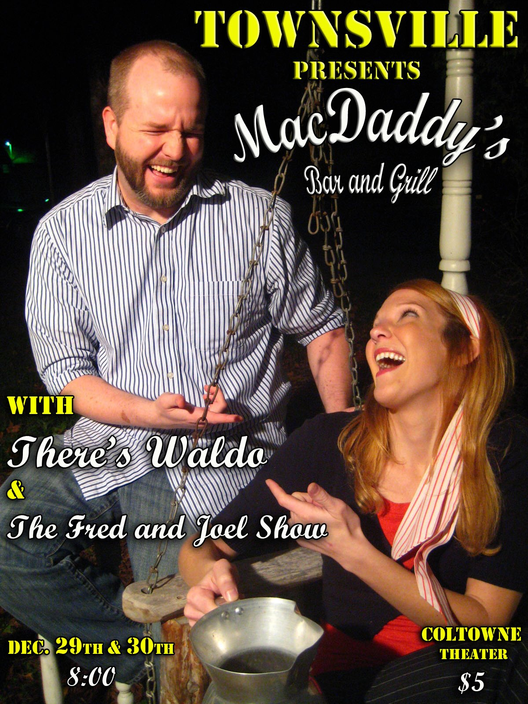
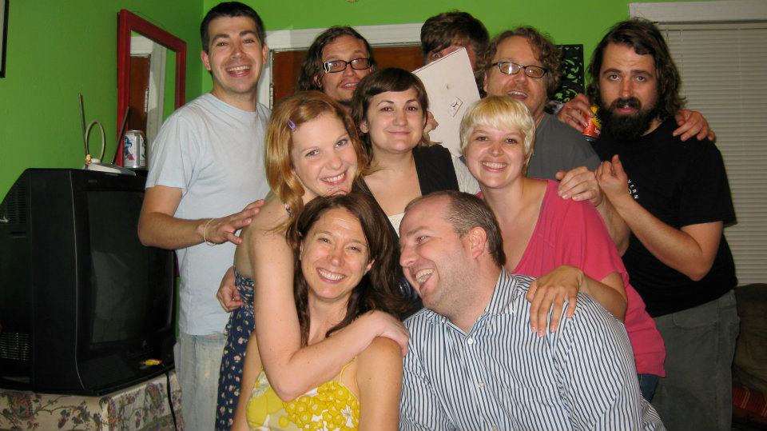
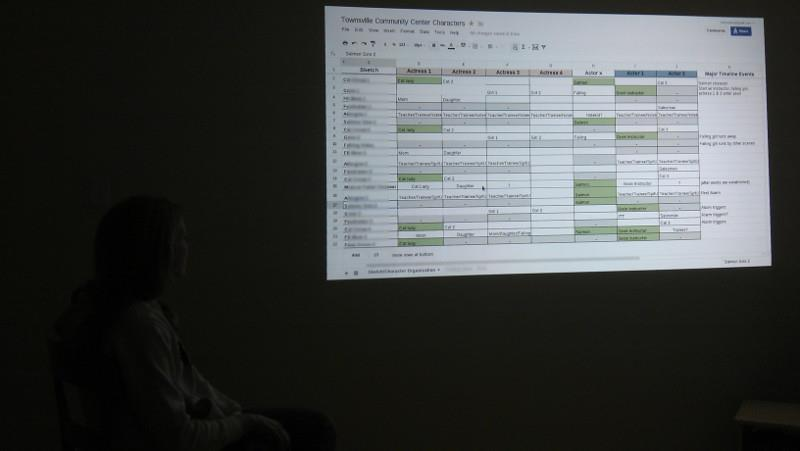

	<table class="infobox infobox-show">
		<tr>
			<th colspan="2" class="infobox-header">Townsville</th>
		</tr>
		<tr class="">
			<td colspan="2" class="infobox-picture">
				
			</td>
		</tr>
		<tr class="">
			<th scope="row" class="category-header">Theater</th>
			<td class="category"><a class="internal-link" href="Theatres/Coldtowne Theater">Coldtowne Theater</a></td>
		</tr>
		<tr class="">
			<th scope="row" class="category-header">Directed by</th>
			<td class="category">
<ul style=""><!--
  --><li style="">Tim</li><!--
  --><li style=""><a class="internal-link" href="Performers/Nicole McCracken">Nicole McCracken</a></li><!--
  --><!--
  --><!--
  --><!--
  --><!--
  --><!--
  --><!--
  --><!--
  --><!--
  --><!--
  --><!--
  --><!--
  --><!--
  --><!--
  --><!--
  --><!--
  --><!--
  --><!--
  --><!--
  --><!--
  --><!--
  --><!--
  --><!--
  --><!--
  --><!--
  --><!--
  --><!--
  --><!--
  --><!--
  --><!--
  --><!--
  --><!--
  --><!--
  --><!--
  --><!--
  --><!--
  --><!--
  --><!--
  --><!--
  --><!--
  --><!--
  --><!--
  --><!--
  --><!--
  --><!--
  --><!--
  --><!--
  --><!--
  --><!--
--></ul>
</td>
		</tr>
		<tr class="">
			<th scope="row" class="category-header">Cast</th>
			<td class="category">Varies</td>
		</tr>
		<tr class="">
			<th scope="row" class="category-header">Initial Run</th>
			<td class="category">Dec 2011</td>
		</tr>
		<tr class="">
			<th scope="row" class="category-header">Subsequent Run(s)</th>
			<td class="category">
<ul style=""><!--
  --><li style="">Feb 2012</li><!--
  --><li style="">Mar 2012</li><!--
  --><!--
  --><!--
  --><!--
  --><!--
  --><!--
  --><!--
  --><!--
  --><!--
  --><!--
  --><!--
  --><!--
  --><!--
  --><!--
  --><!--
  --><!--
  --><!--
  --><!--
  --><!--
  --><!--
  --><!--
  --><!--
  --><!--
  --><!--
  --><!--
  --><!--
  --><!--
  --><!--
  --><!--
  --><!--
  --><!--
  --><!--
  --><!--
  --><!--
  --><!--
  --><!--
  --><!--
  --><!--
  --><!--
  --><!--
  --><!--
  --><!--
  --><!--
  --><!--
  --><!--
  --><!--
  --><!--
  --><!--
  --><!--
--></ul>
</td>
		</tr>
	</table>

**Townsville** is a [Close Quarters](http://wiki.improvresourcecenter.com/index.php?title=Close_Quarters) sketch comedy show created by Tim and [[Performers/Nicole McCracken|Nicole McCracken]].  Tim & Nicole write, produce and act in the shows and cast additional roles and crew as needed for each script.

## Format
Townsville is a scripted version of the improv format Close Quarters.  Each Townsville script takes place in a single location (typically a building or business) over a short period of time (typically under an hour) in the fictional Austin suburb of Townsville, Texas.  Each script is titled after the location where the show takes place.

## History
Tim & Nicole met in their improv troupe [[Troupes/Nice Astronaut|Nice Astronaut]] when she joined in late 2009.  They both wanted to write a Close Quarters based improv show, but the rest of the improv troupe wasn't interested at the time, so they formed a separate group.

## Etymology
The name is intended to invoke a generic town that could be anywhere.  **Townsville, Texas** is intended to be an amalgamation of Pflugerville and Budda, Texas.  The usage of "town" in the name was accidental and is not intended to invoke the spelling of [[Theatres/Coldtowne Theater|Coldtowne Theater]] or an association like Tim's former sketch group [[Troupes/UpTowne|UpTowne]].

## Shows/Episodes
### MacDaddy's Bar & Grill

Townsville's first script took place at a fictional sleazy small-town bar named "MacDaddy's" and was composed of 5 core sketches with 3 beats each and 3 transition sketches with 3 beats each (similar to what would be an 8x3 Harold). 

The show debuted at ColdTowne Theater in late December 2011 when Tim & Nicole paid to rent out ColdTowne Theater for 2 nights while the theater was dark for the holidays.  "MacDaddy's" was then performed at the Frontera Short Fringe Festival in February 2012.  Tim & Nicole had directed the show up to this point, but once they were given a March 2012 run at ColdTowne Theater on Saturday nights, they got [[Performers/Clifton Highfield|Clifton Highfield]] to direct the show.  The MacDaddy's script was performed a total of 7 times.

#### MacDaddy's Cast & Crew
* Nicole McCracken - writer/co-director/producer, lead actress
* Tim - writer/co-director/producer/actor
* [[Performers/Clifton Highfield|Clifton Highfield]] - Director/Tech
* Sam Van Metre - Assistant Director/Tech
* Annette Cantu - Assistant Director/Tech
* Joel Keith - lead actor
* Kristen Henn - actor
* Tre Fuentes - actor
* [[Performers/Drew Wesely|Drew Wesely]] - actor
* [[Performers/Frank Netscher|Frank Netscher]] - actor
* [[Performers/Emma Holder|Emma Holder]] - actor
* Caitlin Bumgartner - actor
* Max Krumke - video sketch camera operator, actor, editor
* A.J. Holler - actor
* Michael Pedacano - actor

### Community Center

Community Center will be the second installment of Townsville.

## Festivals
Townsville presents MacDaddy's Bar & Grill performed as part of the Hyde Park Theater Short Fringe Festival in February 2012.

## Awards
Townsville was nominated for Best Sketch Show at the ColdTowne Theater Awards 2012.

## See Also
* [[Troupes/Nice Astronaut|Nice Astronaut]]
* Close Quarters

Category:Active
Category:Shows