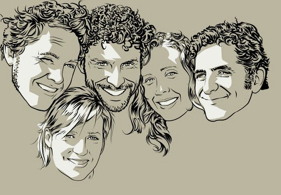

	<table class="infobox infobox-troupe">
		<tr>
			<th class="infobox-header" colspan="2">Snackers</th>
		</tr>
		<tr class="">
			<td colspan="2" class="infobox-picture">
				
			</td>
		</tr>
		<tr class="">
			<th class="category-header" scope="row">Years Active</th>
			<td class="category">2007-2011</td>
		</tr>
		<tr class="">
			<th class="category-header" scope="row">Cast</th>
			<td class="category">
<ul style=""><!--
  --><li style=""><a class="internal-link" href="Albert Im">Albert Im</a> (2007-2008)</li><!--
  --><li style=""><a class="internal-link" href="Courtney Hopkin">Courtney Hopkin</a></li><!--
  --><li style=""><a class="internal-link" href="Eric Heiberg">Eric Heiberg</a></li><!--
  --><li style=""><a class="internal-link" href="James Roberts">James Roberts</a></li><!--
  --><li style=""><a class="internal-link" href="Katie Thornton">Katie Thornton</a></li><!--
  --><li style=""><a class="internal-link" href="Mark Carpenter">Mark Carpenter</a></li><!--
  --><!--
  --><!--
  --><!--
  --><!--
  --><!--
  --><!--
  --><!--
  --><!--
  --><!--
  --><!--
  --><!--
  --><!--
  --><!--
  --><!--
  --><!--
  --><!--
  --><!--
  --><!--
  --><!--
  --><!--
  --><!--
  --><!--
  --><!--
  --><!--
  --><!--
  --><!--
  --><!--
  --><!--
  --><!--
  --><!--
  --><!--
  --><!--
  --><!--
  --><!--
  --><!--
  --><!--
  --><!--
  --><!--
  --><!--
  --><!--
  --><!--
  --><!--
  --><!--
  --><!--
--></ul>
</td>
		</tr>

	</table>

**Snackers** was an improv troupe. 

## History
The troupe's members met in [[Shana Merlin]]'s improv classes at [[The State Theater]] in 2006 and 2007.  The troupe began in September 2007.  In 2008, they founded *[[The Monday Night Mash]]*, which [[Albert Im]] has arranged for them to host at [[Kick Butt Coffee]].  In 2010, they played the Black Box Comedy Festival in Atlanta, Georgia.

In 2015 they had a one-off reunion show at [[The 2015 Out of Bounds Comedy Festival]], sans [[Mark Carpenter]]. 

### Formats
After an initial run that performed the Living Room format, the troupe performed a series of formats that drew inspiration from television, movies, and books:
* "Snackers Club" was improv inspired by the works of [[Wikipedia - John Hughes|John Hughes]].  This was their most successful run of shows.  In an unfortunate coincidence, John Hughes passed away the same day they premiered their first run of the format.
* "Snackers Mystery Van" was a mystery format from the cartoon *[[Wikipedia - Scooby Doo|Scooby Doo]]*.
* "Switcheroo" was a show based on "[[Wikipedia - Body swap|body-swap]]" movies like *[[Wikipedia - Freaky Friday|Freaky Friday]]*.
* "Roommates" was a format inspired by *[[Wikipedia - The Young Ones|The Young Ones]]*.
* "Snacksucker Proxy" drew from the writing of [[Wikipedia - Horatio Alger|Horatio Alger]] and the movie *[[Wikipedia - The Hudsucker Proxy|The Hudsucker Proxy]]*.  (This was their last format before they disbanded.)

## Media
![[SnackersLogo.gif|The Snackers logo.]]
### Videos
* [Video](http://blip.tv/out-of-bounds-comedy-festival/snackers-wed-8pm-svt-oranges-stage-1266327) of their 8/27/08 show at [[The 2008 Out of Bounds Comedy Festival]].
* [Video](http://vimeo.com/10114708) of their 4/9/09 show at [[The Hideout Theatre]].
* [Video](http://vimeo.com/10116013) of an August 2009 "The Snackers Club" show.
* [Video](http://blip.tv/out-of-bounds-comedy-festival/snackers-wed-8pm-svt-oranges-stage-1266327) of Snackers' show at [[The 2009 Out of Bounds Comedy Festival]].
* [Video](http://vimeo.com/10979117) of their 4/12/10 show at *[[The Monday Night Mash]]*.
* [Video](http://vimeo.com/12660638) of their 6/14/10 "Roommates" show.
* [Video](http://vimeo.com/16599368) of their 7/5/10 "Roommates" show.
* [Video](http://vimeo.com/16606007) of their 10/18/10 show at [[ColdTowne Theater]]. ("Cup of Tea")
* [Video](http://vimeo.com/18914324) of their 1/3/11 show at [[ColdTowne Theater]]. ("Waffle Iron")
* [Video](http://vimeo.com/19067439) of their 1/9/11 show at [[The Hideout Theatre]]. ("Eye of the Tiger")

### Photos
* [Photoset](http://www.facebook.com/hujhax/media_set?set=a.164960802264.141040.588952264&type=3) by [[Peter Rogers]] of their 8/27/09 performance of "The Snackers Club" at [[The Hideout Theatre]].
* [Photoset](http://www.facebook.com/michael.yew/media_set?set=a.1150515485813.21655.1315383518&type=3) by [[Michael Yew]] that includes their 5/7/10 show in *[[The Spectacle]]*.
* [Photoset](http://www.facebook.com/roy.moore/media_set?set=a.1342686139102.2041082.1589679282&type=3) by [[Roy Moore]] that includes their 8/28/10 performance at [[Salvage Vanguard Theater]].
** [Another photoset](http://www.facebook.com/hujhax/media_set?set=a.482835317264.261188.588952264&type=3) by [[Peter Rogers]] of the same show.
* [Photoset](http://www.facebook.com/roy.moore/media_set?set=a.1346859923444.2043492.1589679282&type=3) by [[Roy Moore]] of their 9/1/10 performance in [[The 2010 Out of Bounds Comedy Festival]].
** [Another photoset](http://www.facebook.com/hujhax/media_set?set=a.481887097264.251803.588952264&type=3) by [[Peter Rogers]] of the same show.
* [Photoset](http://www.facebook.com/michael.yew/media_set?set=a.1364756881714.46801.1315383518&type=3) by [[Michael Yew]] that includes their 11/19/10 performance at [[WaffleFest]].
* [Photoset](http://www.facebook.com/michael.yew/media_set?set=a.1546183497266.71492.1315383518&type=3) by [[Michael Yew]] that includes their 2/11/11 performance at [[Salvage Vanguard Theater]].
* [Photoset](http://www.facebook.com/media/set/?set=a.1035268833203299.1073742249.221927764537414&type=3) by [[Steve Rogers]] of their 9/4/15 reunion show at [[The 2015 Out of Bounds Comedy Festival]].

## Promos
* Promo for ["The Snackers Club"](http://vimeo.com/9898672).
** [Slightly revamped promo](http://vimeo.com/14061609) for their 8/28/10 show.

## More Information
* [The troupe's web site.](http://www.snackersimprov.com/)

[[Category/Troupes|Category:Troupes]]