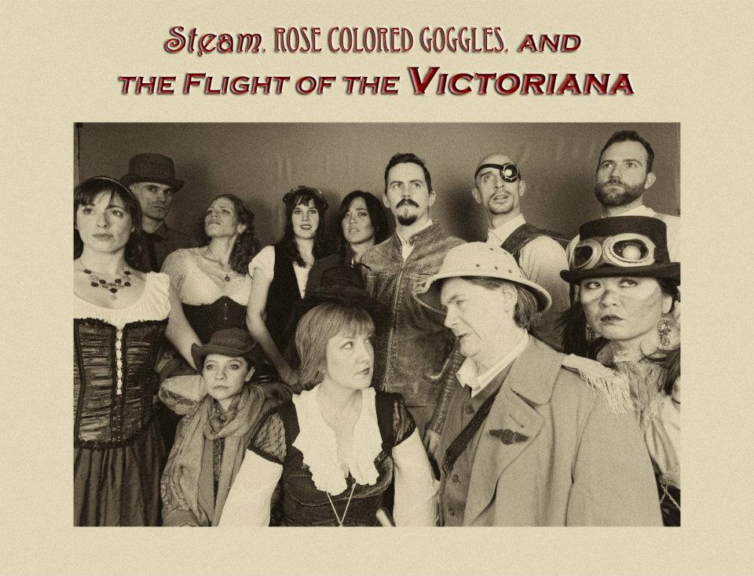

	<table class="infobox infobox-show">
		<tr>
			<th colspan="2" class="infobox-header">Steam</th>
		</tr>
		<tr class="">
			<td colspan="2" class="infobox-picture">
				
			</td>
		</tr>
		<tr class="">
			<th scope="row" class="category-header">Theater</th>
			<td class="category"><a class="internal-link" href="Salvage Vanguard Theater">Salvage Vanguard Theater</a></td>
		</tr>
		<tr class="">
			<th scope="row" class="category-header">Directed by</th>
			<td class="category"><a class="internal-link" href="Audrey Rachel Sansom">Audrey Rachel Sansom</a></td>
		</tr>
		<tr class="">
			<th scope="row" class="category-header">Produced by</th>
			<td class="category"><a class="internal-link" href="Gnap! Theater Projects">Gnap! Theater Projects</a></td>
		</tr>
		<tr class="">
			<th scope="row" class="category-header">Cast</th>
			<td class="category">
<ul style=""><!--
  --><li style=""><a class="internal-link" href="Aaron Walther">Aaron Walther</a></li><!--
  --><li style=""><a class="internal-link" href="Audrey Rachel Sansom">Audrey Rachel Sansom</a></li><!--
  --><li style=""><a class="internal-link" href="Brady James">Brady James</a></li><!--
  --><li style=""><a class="internal-link" href="Elizabeth Brammer">Elizabeth Brammer</a></li><!--
  --><li style=""><a class="internal-link" href="Emily Breedlove">Emily Breedlove</a></li><!--
  --><li style=""><a class="internal-link" href="Gricelda Silva">Gricelda Silva</a></li><!--
  --><li style=""><a class="internal-link" href="Howard Katz">Howard Katz</a></li><!--
  --><li style=""><a class="internal-link" href="Jayme Ramsay">Jayme Ramsay</a></li><!--
  --><li style="" ><a class="internal-link" href="Jeff Mills">Jeff Mills</a></li><!--
  --><li style=""><a class="internal-link" href="Joel Osborne">Joel Osborne</a></li><!--
  --><li style=""><a class="internal-link" href="Julie Gillis">Julie Gillis</a></li><!--
  --><li style=""><a class="internal-link" href="Kevin Miller">Kevin Miller</a></li><!--
  --><li style=""><a class="internal-link" href="Leng Wong">Leng Wong</a></li><!--
  --><li style=""><a class="internal-link" href="Marc Majcher">Marc Majcher</a></li><!--
  --><!--
  --><!--
  --><!--
  --><!--
  --><!--
  --><!--
  --><!--
  --><!--
  --><!--
  --><!--
  --><!--
  --><!--
  --><!--
  --><!--
  --><!--
  --><!--
  --><!--
  --><!--
  --><!--
  --><!--
  --><!--
  --><!--
  --><!--
  --><!--
  --><!--
  --><!--
  --><!--
  --><!--
  --><!--
  --><!--
  --><!--
  --><!--
  --><!--
  --><!--
  --><!--
  --><!--
--></ul>
</td>
		</tr>

		<tr class="">

			<th scope="row" class="category-header">Run</th>

			<td class="category">Jan/Feb 2012</td>
		</tr>

		
	</table>

***Steam*** (full title: ***Steam, Rose-Colored Goggles, and the Flight of the Victoriana***) was a serialized narrative longform show that had set characters from week to week and took place in a steampunk-inspired universe.  Several cast members in *Steam* specialized in sceneography, scene-painting, and the use of abstract props to fill out the world of the Victoriana.

Like *[[Showdown]]*, *Steam* was a serialized narrative, with ten "episodes" telling a complete ten-part story. The primary cast members maintained the same characters throughout the run, 

## Cast
*[[Audrey Rachel Sansom]] as "The Wild Heart," Wilhemina Wyldeheart 
*[[Julie Gillis]] as "The Duchess," Lady Electra Spencer
*[[Emily Breedlove]] as "The Amazon," Yvette Cloud
*[[Elizabeth Brammer]] as "The Ingenue," Adelaide McKenna
*[[Gricelda Silva]] as "The Pixie," Leto
*[[Aaron Walther]] as "The Rogue," Captain Hamwich Leon
*[[Brady James]] as "The Young Adventurer," Benjamin Cumberbatch
*[[Marc Majcher]] as "The Veteran," Colonel Solomon Fitzgerald
*[[Jeff Mills]] as "The Reluctant Hero," Barnaby Jones
*[[Kevin Miller]] as "The Engineer," Joshua Mew

### "The Machine" (supporting cast)
*[[Ashlee Medlin]] as Bolt
*[[Howard Katz]] as Gear Shift
*[[Joel Osborne]] as Leather Strap
*[[Jayme Ramsay]] as Crank
*[[Leng Wong]] as Alloysia
*[[Ashley Lowe]] as Lily Sabine

## Episode Summaries
* [[Steam – First Night]]
* [[Steam – Second Night]]
* [[Steam – Third Night]]
* [[Steam – Fourth Night]]
* [[Steam – Fifth Night]]
* [[Steam – Sixth Night]]
* [[Steam – Seventh Night]]
* [[Steam – Eighth Night]]
* [[Steam – Ninth Night]]
* [[Steam – Tenth Night]]

## Media
### Videos
* [Their performance](http://vimeo.com/40642493) in [[The 2012 Improvised Play Festival]].

### Photos
* Night 1 (1/6/12)
** [Photoset](http://www.facebook.com/media/set/?set=a.250787974989889.58149.118587218209966&type=3) by [[Roy Moore]].
** [Photoset](http://www.facebook.com/media/set/?set=a.270663862997137.68666.221927764537414&type=3) by [[Steve Rogers]].
* Night 2 (1/7/12)
** [Photoset](http://www.facebook.com/media/set/?set=a.251392551596098.58303.118587218209966&type=1) by [[Roy Moore]].
** Photosets by [[Steve Rogers]]: [1](http://www.facebook.com/media/set/?set=a.271281489602041.68812.221927764537414&type=3), [2](http://www.facebook.com/media/set/?set=a.271690159561174.68910.221927764537414&type=3), [3](http://www.facebook.com/media/set/?set=a.271726299557560.68916.221927764537414&type=3).
* Night 3 (1/13/12)
** [Photoset](http://www.facebook.com/media/set/?set=a.254834544585232.59040.118587218209966&type=3) by [[Roy Moore]].
** [Photoset](http://www.facebook.com/media/set/?set=a.275207809209409.69637.221927764537414&type=3) by [[Steve Rogers]].
* Night 4 (1/14/12)
** [Photoset](http://www.facebook.com/media/set/?set=a.255962171139136.59278.118587218209966&type=3) by [[Roy Moore]].
* Night 5 (1/20/12)
** Photosets by Steve Rogers: [1](http://www.facebook.com/media/set/?set=a.280001812063342.70633.221927764537414&type=3), [2](http://www.facebook.com/media/set/?set=a.284270068303183.71564.221927764537414&type=3).
** [Photoset of the 1/20/12 show](http://www.facebook.com/media/set/?set=a.259084494160237.59888.118587218209966&type=3) by [[Roy Moore]].
** [Photoset](http://www.facebook.com/michael.yew/media_set?set=a.2498819352567.108485.1315383518&type=3) by [[Michael Yew]] that includes the show.
* Night 6 (1/21/12)
** [Photoset](http://www.facebook.com/media/set/?set=a.259795757422444.60075.118587218209966&type=3) by [[Roy Moore]].
** [Photoset](http://www.facebook.com/media/set/?set=a.280686221994901.70792.221927764537414&type=3) by [[Steve Rogers]].
* Night 7 (1/27/12)
** [Photoset](http://www.facebook.com/media/set/?set=a.263712960364057.60825.118587218209966&type=3) by [[Roy Moore]].
* Night 8 (1/28/12)
** [Photoset](http://www.facebook.com/media/set/?set=a.265911776810842.61218.118587218209966&type=3) by [[Roy Moore]].
* Night 9 (2/3/12)
** [Photoset](http://www.facebook.com/media/set/?set=a.268279006574119.61635.118587218209966&type=3) by [[Roy Moore]].
** [Photoset](http://www.facebook.com/media/set/?set=a.290146614382195.72625.221927764537414&type=3) by [[Steve Rogers]].
* Night 10 (2/4/12)
** [Photoset](http://www.facebook.com/media/set/?set=a.269124603156226.61798.118587218209966&type=3) by [[Roy Moore]].
** [Photoset](http://www.facebook.com/michael.yew/media_set?set=a.2498819352567.108485.1315383518&type=3) by [[Michael Yew]] that includes the show.
* [Photoset](http://www.facebook.com/michael.yew/media_set?set=a.2939584451419.117496.1315383518&type=3) by [[Michael Yew]] that includes their 4/12/12 performance in [[The 2012 Improvised Play Festival]].

### Publicity
* [Character photoset](http://www.facebook.com/media/set/?set=a.273249729405217.69252.221927764537414&type=3) by [[Steve Rogers]].

[[Category/Shows|Steam]]