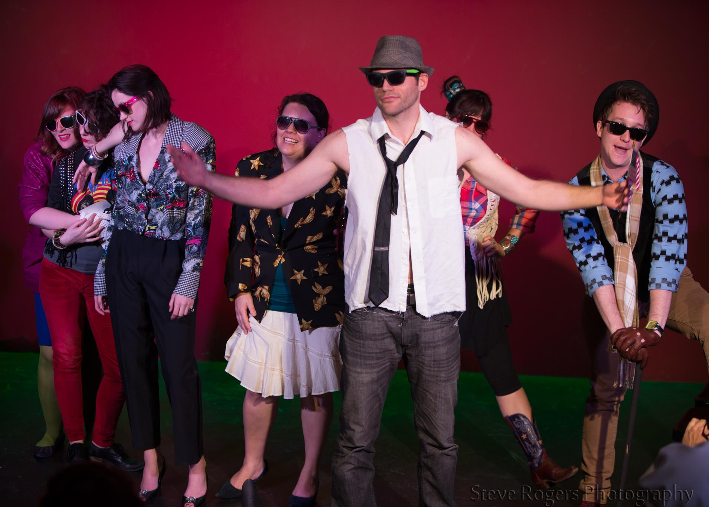

**The 2013 Institution Theater Awards** were the first annual [[Institution Theater Awards]].

## Summary
The awards ceremony was held on 1/27/13.

## Nominees and Winners
Winners are listed in **bold text**.

### Favorite [[Shows/Live TV Tuesdays|Live TV Tuesdays]] Show
* ***[[Shows/Live TV Tuesdays -  Doctor Horrible's Sing-Along Blog|Live TV Tuesdays -  Doctor Horrible's Sing-Along Blog]]***
* *[[Shows/Live TV Tuesdays -  Firefly|Live TV Tuesdays -  Firefly]]*
* *[[Shows/Live TV Tuesdays -  Freaks and Geeks|Live TV Tuesdays -  Freaks and Geeks]]*
* *[[Shows/Live TV Tuesdays -  Scrubs|Live TV Tuesdays -  Scrubs]]*

### Favorite Improvised "Something" Show
* *[[Shows/Danger!|Danger!]]*
* *Only 3 Will Survive* 
* ***[[Shows/Thinning The Herd|Thinning The Herd]]***
* *[[Shows/The Triple Scoop|The Triple Scoop]]*

### Favorite Scripted, Sketch, or Variety Show
* ***Human Santapede 2***
* *[[Shows/Manson -  The Musical|Manson -  The Musical]]*
* *The Moral Compass Rumpas*
* *[[Shows/This American Live|This American Live]]*

### Favorite Director of a Scripted Show
* [[Performers/Asaf Ronen|Asaf Ronen]], for *[[Shows/Live TV Tuesdays -  Firefly|Live TV Tuesdays -  Firefly]]*
* **[[Performers/Heidi Caldwell|Heidi Caldwell]], for *[[Shows/Live TV Tuesdays -  Doctor Horrible's Sing-Along Blog|Live TV Tuesdays -  Doctor Horrible's Sing-Along Blog]]***
* [[Performers/Madeline Jo Chauvin|Madeline Jo Chauvin]] & [[Performers/Kevin Machate|Kevin Machate]], for *[[Shows/Live TV Tuesdays -  Scrubs|Live TV Tuesdays -  Scrubs]]*
* [[Performers/Ted Meredith|Ted Meredith]], for *[[Shows/Live TV Tuesdays -  Freaks and Geeks|Live TV Tuesdays -  Freaks and Geeks]]*

### Favorite Director of an Improvised Show
* Amy Dietz, for *[[Shows/Danger!|Danger!]]*
* [[Performers/Asaf Ronen|Asaf Ronen]] & [[Performers/Mike Ferstenfeld|Mike Ferstenfeld]], for *[[Shows/This American Live|This American Live]]*
* [[Performers/Sarah Marie Curry|Sarah Marie Curry]], for *Racket!*
* **[[Performers/Tom Booker|Tom Booker]], for *[[Shows/Pulp Friction|Pulp Friction]]***

### Favorite Male Performer
* [[Performers/Adam Mengesha|Adam Mengesha]]
* Andrew Robinson
* [[Performers/Heath Allyn|Heath Allyn]]
* [[Performers/Jason Vines|Jason Vines]]
* [[Performers/John Buseman|John Buseman]]
* Lucas Reilly
* Marvin Pratt
* [[Performers/Peter Rogers|Peter Rogers]]
* **Tyler Reece Booker**
* [[Performers/Wyatt Tall|Wyatt Tall]]

### Favorite Female Performer
* Beth Shea
* Christine Giordano
* [[Performers/Erica Lies|Erica Lies]]
* [[Performers/Heidi Caldwell|Heidi Caldwell]]
* [[Performers/Madeline Jo Chauvin|Madeline Jo Chauvin]]
* Regina Soto
* Roxy Castillo
* [[Performers/Sarah Marie Curry|Sarah Marie Curry]]
* **[[Performers/Taylor Overstreet|Taylor Overstreet]]**
* [[Troupes/Topping Haggerty|Topping Haggerty]]

### Favorite Original Video
* **"A Brand New Day" from *[[Shows/Live TV Tuesdays -  Doctor Horrible's Sing-Along Blog|Live TV Tuesdays -  Doctor Horrible's Sing-Along Blog]]***
* "Good Morning" from *The Moral Compass Rumpas*
* "It Gets Fatter" from *[[Shows/Thinning The Herd|Thinning The Herd]]*
* "SXSW Hot Spots" from *The Moral Compass Rumpas*
* "Treats and Eats" from [[Troupes/There's Waldo|There's Waldo]]

### Favorite Improvised Line of Dialog
* "Be less King Kong, be more Godzilla" -- [[Performers/Asaf Ronen|Asaf Ronen]] in class
* **"Do you know how many fat people have already sat in that chair tonight!" -- [[Performers/Heidi Caldwell|Heidi Caldwell]] to [[Performers/Tyler Bryce|Tyler Bryce]] after he sat in a chair on stage and it collapsed, in [[Shows/Thinning The Herd|Thinning The Herd]]**
* "I hope somebody makes it rain" -- [[Performers/Sarah Swofford|Sarah Swofford]] as a stripper who has just learned that the strip club she is in, is currently on fire, performing in The Birthday Clusterfunk 8/9/12
* "I need a Fluffer!" [[Performers/Heath Allyn|Heath Allyn]] as Angel the puppet after getting the stuffing ripped out of him by Nina the werewolf in *[[Shows/Live TV Tuesdays -  Angel|Live TV Tuesdays -  Angel]]*
* "My rainstick is raw" -- [[Performers/Jason Vines|Jason Vines]] in *[[Shows/Live TV Tuesdays -  Firefly|Live TV Tuesdays -  Firefly]]*
* "She doesn't have a bad attitude, she has a fucking devil in her" -- [[Performers/Troy Miller|Troy Miller]] in [[Troupes/Confidence Men|Confidence Men]]'s "Mamet Goes to the Movies" treatment of  *The Exorcist*
* "Space Herpes" (an improvised song) -- [[Performers/Heath Allyn|Heath Allyn]] in *[[Shows/Live TV Tuesdays -  Firefly|Live TV Tuesdays -  Firefly]]*
* "Unfortunately, balls aren't thrown by nuns" -- Regina Soto as a soon to be nun being driven to the nunnery by her husband, daughter and the family dog, when the dog asks "You're still gonna throw the ball right?" performing with [[Troupes/IScream Sandwich|IScream Sandwich]] in [[Shows/The Triple Scoop|The Triple Scoop]] 12/8/12
* "We ran out of Space Ice" -- [[Performers/Michael Thomas|Michael Thomas]] in *[[Shows/Live TV Tuesdays -  Firefly|Live TV Tuesdays -  Firefly]]*
* "When you've left the city limits, where are you?" -- [[Performers/Brandon Martin|Brandon Martin]] in *[[Shows/This American Live|This American Live]]*
* "You know when you cry, I lose respect for you as a pilot, and respect is like half of what being a pilot is" -- Marcus Hysmith in [[Troupes/Dumbasses|Dumbasses]] performing in The Birthday Clusterfunk 3/25/12
* "You need the healing power of the U-KU-LE-LE" -- [[Performers/Heath Allyn|Heath Allyn]] as Manson to Tex Watson before singing his solo in *[[Shows/Manson -  The Musical|Manson -  The Musical]]*

### Favorite Institution Theater Instructor
* [[Performers/Asaf Ronen|Asaf Ronen]]
* [[Performers/Clifton Highfield|Clifton Highfield]]
* [[Performers/John Ratliff|John Ratliff]]
* [[Performers/Justin Davis|Justin Davis]]
* [[Performers/Sarah Marie Curry|Sarah Marie Curry]]
* [[Performers/Ted Meredith|Ted Meredith]]
* **[[Performers/Tom Booker|Tom Booker]]**

### Favorite New Male Improvisor
* [[Performers/Adam Mengesha|Adam Mengesha]]
* Andrew Maniaci
* Andrew Robinson
* [[Performers/Heath Allyn|Heath Allyn]]
* [[Performers/Kevin Machate|Kevin Machate]]
* Mars Wright
* Steve Glazier
* **[[Performers/Wyatt Tall|Wyatt Tall]]**

### Favorite New Female Improvisor
* [[Performers/Adriane Shown|Adriane Shown]]
* [[Performers/Carissa McAtee|Carissa McAtee]]
* [[Performers/Celena Diamond|Celena Diamond]]
* [[Performers/Heidi Rogers|Heidi Rogers]]
* [[Performers/Jeanette Jones|Jeanette Jones]]
* Megan Moten
* **[[Performers/Sam Schak|Sam Schak]]**
* [[Performers/Sarah Swofford|Sarah Swofford]]

### Favorite Tech Performer
* [[Performers/Chelley Pyatt|Chelley Pyatt]]
* **[[Performers/Cindy Page|Cindy Page]]**
* [[Performers/David Zimmerman|David Zimmerman]]
* [[Performers/Wyatt Tall|Wyatt Tall]]

### The Audience Award
* [[Performers/Adriane Shown|Adriane Shown]]
* [[Performers/Celena Diamond|Celena Diamond]]
* [[Performers/Chelley Pyatt|Chelley Pyatt]]
* **[[Performers/Heidi Caldwell|Heidi Caldwell]]**
* [[Performers/Madeline Jo Chauvin|Madeline Jo Chauvin]]
* [[Performers/Luis Salinas|Luis]] and Jessica Salinas
* Regina Soto
* [[Performers/Sam Schak|Sam Schak]]
* Valerie Nies
* [[Performers/Wyatt Tall|Wyatt Tall]]

### The Tom Booker Appreciation Awards
* **[[Performers/Carissa McAtee|Carissa McAtee]]**
* **[[Performers/Chelley Pyatt|Chelley Pyatt]]**

### The Heidi Caldwell Award
* **[[Performers/Asaf Ronen|Asaf Ronen]]**

## Media
### Videos
* [The 2013 nominated videos.](http://thetitievids.tumblr.com/)
### Photos
* [Photoset of the event](http://www.facebook.com/media/set/?set=a.480786615318193.115392.221927764537414&type=1) by [[Steve Rogers]].
* [Photoset of the event](http://www.facebook.com/michael.yew/media_set?set=a.4170764470150.142613.1315383518&type=3) by [[Michael Yew]].

## More Information
* [Facebook event for the awards ceremony.](http://www.facebook.com/events/274500962675435/?ref=3)