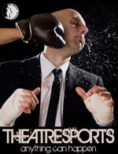

	<table class="infobox infobox-show">
		<tr>
			<th colspan="2" class="infobox-header">Theatresports</th>
		</tr>
		<tr class="">
			<td colspan="2" class="infobox-picture">
				
			</td>
		</tr>
		<tr class="">
			<th scope="row" class="category-header">Theater</th>
			<td class="category"><a class="internal-link" href="The Hideout Theatre">The Hideout Theatre</a></td>
		</tr>
		<tr class="">
			<th scope="row" class="category-header">Directed by</th>
			<td class="category">
<ul style=""><!--
  --><li style=""><a class="internal-link" href="Dav Wallace">Dav Wallace</a> and <a class="internal-link" href="Sean Hill">Sean Hill</a> (2007)</li><!--
  --><li style=""><a class="internal-link" href="Andy Crouch">Andy Crouch</a> and <a class="internal-link" href="Kareem Badr">Kareem Badr</a> (2010)</li><!--
  --><li style=""><a class="internal-link" href="Roy Janik">Roy Janik</a> (2013)</li><!--
  --><li style=""><a class="internal-link" href="Lacy Shawn">Lacy Shawn</a> and <a class="internal-link" href="Ryan Austin">Ryan Austin</a> (2014)</li><!--
  --><!--
  --><!--
  --><!--
  --><!--
  --><!--
  --><!--
  --><!--
  --><!--
  --><!--
  --><!--
  --><!--
  --><!--
  --><!--
  --><!--
  --><!--
  --><!--
  --><!--
  --><!--
  --><!--
  --><!--
  --><!--
  --><!--
  --><!--
  --><!--
  --><!--
  --><!--
  --><!--
  --><!--
  --><!--
  --><!--
  --><!--
  --><!--
  --><!--
  --><!--
  --><!--
  --><!--
  --><!--
  --><!--
  --><!--
  --><!--
  --><!--
  --><!--
  --><!--
  --><!--
  --><!--
  --><!--
--></ul>
</td>
		</tr>

		<tr class="">
			<th scope="row" class="category-header">Assistant Director(s)</th>
			<td class="category">[[Ryan Austin]] (2013)</td>
		</tr>

		<tr class="">
			<th scope="row" class="category-header">Cast</th>
			<td class="category">
<ul style=""><!--
  --><li style=""><a class="internal-link" href="Ace Manning">Ace Manning</a></li><!--
  --><li style=""><a class="internal-link" href="Aden Kirschner">Aden Kirschner</a></li><!--
  --><li style=""><a class="internal-link" href="Amira Wizig">Amira Wizig</a></li><!--
  --><li style=""><a class="internal-link" href="Andrew Buck">Andrew Buck</a></li><!--
  --><li style=""><a class="internal-link" href="Andrew Robinson">Andrew Robinson</a></li><!--
  --><li style=""><a class="internal-link" href="Andy Crouch">Andy Crouch</a></li><!--
  --><li style=""><a class="internal-link" href="Asaf Ronen">Asaf Ronen</a></li><!--
  --><li style=""><a class="internal-link" href="Brad Temple">Brad Temple</a></li><!--
  --><li style="" ><a class="internal-link" href="Bridget Brewer">Bridget Brewer</a></li><!--
  --><li style=""><a class="internal-link" href="Ceej Allen">Ceej Allen</a></li><!--
  --><li style=""><a class="internal-link" href="David Lampe">David Lampe</a></li><!--
  --><li style=""><a class="internal-link" href="Emily Breedlove">Emily Breedlove</a></li><!--
  --><li style=""><a class="internal-link" href="Eric Heiberg">Eric Heiberg</a></li><!--
  --><li style=""><a class="internal-link" href="Halyn Lee Erickson">Halyn Lee Erickson</a></li><!--
  --><li style=""><a class="internal-link" href="Jason Vines">Jason Vines</a></li><!--
  --><li style=""><a class="internal-link" href="Jay Michael">Jay Michael</a></li><!--
  --><li style=""><a class="internal-link" href="Jessica Arjet">Jessica Arjet</a></li><!--
  --><li style=""><a class="internal-link" href="Joe Fraser">Joe Fraser</a></li><!--
  --><li style=""><a class="internal-link" href="Jon Bolden">Jon Bolden</a></li><!--
  --><li style=""><a class="internal-link" href="Kacey Samiee">Kacey Samiee</a></li><!--
  --><li style=""><a class="internal-link" href="Kaci Beeler">Kaci Beeler</a></li><!--
  --><li style=""><a class="internal-link" href="Kareem Badr">Kareem Badr</a></li><!--
  --><li style=""><a class="internal-link" href="Katie Dahm">Katie Dahm</a></li><!--
  --><li style=""><a class="internal-link" href="Keegan Hines">Keegan Hines</a></li><!--
  --><li style=""><a class="internal-link" href="Kristin Firth">Kristin Firth</a></li><!--
  --><li style=""><a class="internal-link" href="Kyle Traughber">Kyle Traughber</a></li><!--
  --><li style=""><a class="internal-link" href="Lacy Shawn">Lacy Shawn</a></li><!--
  --><li style=""><a class="internal-link" href="Lauren Buck">Lauren Buck</a></li><!--
  --><li style=""><a class="internal-link" href="Marc Majcher">Marc Majcher</a></li><!--
  --><li style=""><a class="internal-link" href="Matt Pollock">Matt Pollock</a></li><!--
  --><li style=""><a class="internal-link" href="Mia Iseman">Mia Iseman</a></li><!--
  --><li style=""><a class="internal-link" href="Monique Daviau">Monique Daviau</a></li><!--
  --><li style=""><a class="internal-link" href="Nicole Oliver">Nicole Oliver</a></li><!--
  --><li style=""><a class="internal-link" href="Patrick Daniel">Patrick Daniel</a></li><!--
  --><li style=""><a class="internal-link" href="Peter Rogers">Peter Rogers</a></li><!--
  --><li style=""><a class="internal-link" href="Quinn Buckner">Quinn Buckner</a></li><!--
  --><li style=""><a class="internal-link" href="Roy Janik">Roy Janik</a></li><!--
  --><li style=""><a class="internal-link" href="Sarah Marie Curry">Sarah Marie Curry</a></li><!--
  --><li style=""><a class="internal-link" href="Sean Hill">Sean Hill</a></li><!--
  --><li style=""><a class="internal-link" href="Shana Merlin">Shana Merlin</a></li><!--
  --><li style=""><a class="internal-link" href="Shannon McCormick">Shannon McCormick</a></li><!--
  --><li style=""><a class="internal-link" href="Stacy Kaplowitz">Stacy Kaplowitz</a></li><!--
  --><li style=""><a class="internal-link" href="Ted Rutherford">Ted Rutherford</a></li><!--
  --><li style=""><a class="internal-link" href="Teresa Troxel">Teresa Troxel</a></li><!--
  --><li style=""><a class="internal-link" href="Troy Miller">Troy Miller</a></li><!--
  --><!--
  --><!--
  --><!--
  --><!--
  --><!--
--></ul>
</td>
		</tr>

		<tr class="">

			<th scope="row" class="category-header">Initial Run</th>

			<td class="category">Apr-Jun 2007</td>
		</tr>

		<tr class="">
			<th scope="row" class="category-header">Subsequent Run(s)</th>
			<td class="category">
<ul style=""><!--
  --><li style="">Sep/Oct 2010</li><!--
  --><li style="">May/Jun 2013</li><!--
  --><li style="">May/Jun 2014</li><!--
  --><!--
  --><!--
  --><!--
  --><!--
  --><!--
  --><!--
  --><!--
  --><!--
  --><!--
  --><!--
  --><!--
  --><!--
  --><!--
  --><!--
  --><!--
  --><!--
  --><!--
  --><!--
  --><!--
  --><!--
  --><!--
  --><!--
  --><!--
  --><!--
  --><!--
  --><!--
  --><!--
  --><!--
  --><!--
  --><!--
  --><!--
  --><!--
  --><!--
  --><!--
  --><!--
  --><!--
  --><!--
  --><!--
  --><!--
  --><!--
  --><!--
  --><!--
  --><!--
  --><!--
  --><!--
  --><!--
  --><!--
--></ul>
</td>
		</tr>

		
	</table>

: *This page refers to the competitive short-form improv show that's had several runs as a [[Hideout]] mainstage show.  For the sports-themed short-form improv show that ran in a number of theaters from 1986 to 2012, see [[ComedySportz]].*

***Theatresports*** is an improv-contest format from [[Wikipedia - Keith Johnstone|Keith Johnstone]] that has run repeatedly as a mainstage show at [[The Hideout Theatre]].

## Summary
Theatresports is an improv show in which two teams of improvisors challenge each other to a series of improv games, improvised scenes, and other, less classifiable feats.

A group of judges award points, set special 'judges' challenges', and cut short scenes that are boring.

## 2007 Run
The initial run of the show started 4/14/07 and ran through the end of June of that year.  It was directed by [[Dav Wallace]] and [[Sean Hill]].

## 2010 Run
The show was brought back as the Sep/Oct 2010 mainstage show, this time directed by [[Andy Crouch]] and [[Kareem Badr]].  This run initiated the show's practice of having local businesses sponsor individual teams.

For this one, teams were set at the start of the run, and those teams played together for the duration of the run.

### Second Run Cast
* Team Cathedral of Junk
** [[Kaci Beeler]]
** [[Mo Daviau]]
** [[Patrick Daniel]]
** [[Peter Rogers]]
** [[Roy Janik]]
* Team ?????
** [[Amira Wizig]]
** [[Jay Michael]]
** [[Jessica Arjet]]
** [[Matt Pollock]]
* Team Alamo Drafthouse
** [[Brad Temple]]
** [[David Lampe]]
** [[Lauren Buck]]
** [[Ted Rutherford]]
** [[Troy Miller]]
* Team Katz's Deli ("The Chosen Ones")
** [[Aden Kirschner]]
** [[Asaf Ronen]]
** [[Shana Merlin]]
** [[Stacy Kaplowitz]]
* Team Taco Deli ("Holy Molés")
** [[Emily Breedlove]]
** [[Eric Heiberg]]
** [[Sean Hill]]
** [[Shannon McCormick]]
* Team Dragon's Lair
** [[Chris Allen]]
** [[Jon Bolden]]
** [[Kristin Firth]]
** [[Marc Majcher]]
* Team Bennu
** [[Andy Crouch]]
** [[Jason Vines]]
** [[Joe Fraser]]
** [[Sarah Marie Curry]]
* Team Hey Cupcake!
** [[Ace Manning]]
** [[Kacey Samiee]]
** [[Teresa Troxel]]

## 2013 Run
The third run was directed by [[Roy Janik]], with assistance from [[Ryan Austin]].

In the 2013 run, the show opened with a 15-minute student bout, featuring two student teams captained by a member of the core cast. This was followed by an "exhibition match", featuring teams organized around some kind of theme.  After an intermission, there was a "main event" bout, involving teams sponsored by local businesses and drawn from the show's cast.  Each performance had a designated "snogger", or scenographer, who handled props, costumes, and scene-painting throughout the show.

The show runs in the downstairs theater.

### Third Run Cast
* [[Bridget Brewer]]
* [[Jon Bolden]]
* [[Kareem Badr]]
* [[Keegan Hines]]
* [[Lacy Shawn]]
* [[Marc Majcher]]
* [[Mia Iseman]]
* [[Nicole Oliver]]
* [[Quinn Buckner]]
* [[Sean Hill]]

### List of Third Run Shows
Every week, *Theatresports* includes two guest stars, as well as a themed "exhibition match".

The schedule is as follows:

* May 4th
** Exhibition match: [[Girls Girls Girls]] versus "Orphans Orphans Orphans", a trio of [[Charles Dickens Unleashed|Dickensian]] orphans
** Guests:
*** [[Caitlin Sweetlamb]]
*** [[Jeremy Sweetlamb]]
** Snogger: [[Quinn Buckner]]
* May 11th
** Exhibition match: [[Puppet Improv Project|Puppets]] VS [[The Known Wizards]]
** Guests:
*** [[Courtney Hopkin]]
*** [[Lauren Buck]]
* May 18th
** Exhibition match: *[[Fandom]]* presents: *Star Wars* ([[Peter Rogers]], [[Courtney Hopkin]], [[Marc Majcher]], and [[Jordan T. Maxwell]]) versus *The Lord of the Rings* ([[Quinn Buckner]], [[Mia Iseman]], and [[Bridget Brewer]]).
** Guests:
*** [[Kaci Beeler]]
*** [[Ace Manning]]
** Snogger: [[Marc Majcher]]
* May 25th
** Exhibition match: [[Blood, Sweat, and Cheers|Cheerleaders]] vs. *[[Pulp Friction]]*.
** Guests:
*** [[Craig Kotfas]]
*** [[Jay Michael]]
* June 1st
** Exhibition match: unknown.
** Guests:
*** [[Andy Crouch]]
*** [[Ben Masten]]
* June 8th
** Exhibition match: unknown.
** Guests:
*** [[Ruby Willmann]]
*** [[Troy Miller]]
* June 15th
** Exhibition match: unknown.
** Guests:
*** [[Dave Buckman]]
*** [[Peter Rogers]]
* June 29th
** Exhibition match: unknown.
** Guests:
*** [[Andrew Buck]]
*** [[Kaci Beeler]]

## 2014 Run
*Theatresports* came back as a Hideout mainstage show in May and June of 2014.

### Fourth Run Cast
* [[Andrew Buck]]
* [[Andrew Robinson]]
* [[Bridget Brewer]]
* [[Halyn Lee Erickson]]
* [[Katie Dahm]]
* [[Kyle Traughber]]
* [[Marc Majcher]]
* [[Mia Iseman]]
* [[Quinn Buckner]]

## 2017 Run
### Cast of Theatresports 2017
* [[Ryan Austin]]
* [[Chelsea Bunn]]
* [[Patrick Creamer]]
* [[Rachel Elaine Creason]]
* [[Allison Day]]
* [[Zac Grantham]]
* [[Ace Manning]]
* [[Nicholas Marino]]
* [[Erin Molson]]
* [[Hemant Sharma]]
* [[Shannon Dale Stott]]
* [[Alex Walker]]

### Crew of Theatresports 2017
* [[Jenn Hamm]]
* [[Jason Hoppenworth]]
* [[R Lance Hunter]]
* [[Davey Wreden]]

## Media
### Videos
* Video of the 10/30/10 performance by [[Peter Rogers]]: [part 1](http://vimeo.com/16402965), [part 2](http://vimeo.com/16403547).
* [Video of the 5/4/13 performance](http://vimeo.com/66174442) by [[Ryan Austin]].
** [A second video](http://vimeo.com/67173123) of the same show.
* [Video of the 5/11/13 performance](http://vimeo.com/67173124) by [[Ryan Austin]].
* [Video of the 5/18/13 performance](http://vimeo.com/67725617) by [[Ryan Austin]].
* [Video of the 5/25/13 performance](http://vimeo.com/69837645) by [[Ryan Austin]].
* [Video of the 6/1/13 performance](http://vimeo.com/69837644) by [[Ryan Austin]].
* [Video of the 6/8/13 performance](http://vimeo.com/70243827) by [[Ryan Austin]].
* [Video](http://vimeo.com/108864355) of the 6/14/13 show.
* [Video of a 2014 show](http://vimeo.com/101990260).
* [Video](http://vimeo.com/95740478) of the 5/10/14 show.
* [Video](http://vimeo.com/97182583) of the 5/24/14 show.
* [Video](http://vimeo.com/97182584) of the 5/31/14 show.

### Photos
* [Photoset](http://www.facebook.com/hujhax/media_set?set=a.498466617264.290143.588952264&type=3) by [[Peter Rogers]] of the 9/25/10 performance.
* [Photoset](http://www.facebook.com/media/set/?set=a.1363932870257.2051207.1589679282&type=1) by [[Roy Moore]] of the 9/18/2010 match between Team Cathedral of Junk and Team H8 Cupcake.
** [Photoset](http://www.facebook.com/michael.yew/media_set?set=a.1384780142283.49789.1315383518&type=3) by [[Michael Yew]] that includes the same show.
* [Photoset](http://www.facebook.com/michael.yew/media_set?set=a.1384780142283.49789.1315383518&type=3) by [[Michael Yew]] that includes the 10/1/2010 match between Team Katz's Deli and Team Taco Deli.
* [Photoset](http://www.facebook.com/media/set/?set=a.1379182571490.2052519.1589679282&type=3) by [[Roy Moore]] of the 10/2/10 performance.
* [Photoset](http://www.facebook.com/hujhax/media_set?set=a.10150095526752265.295870.588952264&type=3) by [[Peter Rogers]] of the 10/30/10 final match.
** [Photoset](http://www.facebook.com/michael.yew/media_set?set=a.1384780142283.49789.1315383518&type=3) by [[Michael Yew]] that includes the same match.
* [Photoset](http://www.facebook.com/michael.yew/media_set?set=a.1602508305351.75968.1315383518&type=3) by [[Michael Yew]] that includes their 6/3/11 show in [[The 42-Hour Improv Marathon]].
* [Photoset](http://www.facebook.com/hujhax/media_set?set=a.19102197264.15341.588952264&type=3) by [[Peter Rogers]] of the 12/14/12 performance.
* [Photoset](http://www.facebook.com/hujhax/media_set?set=a.19102282264.15342.588952264&type=3) by [[Peter Rogers]] of the 12/21/12 performance.
* [Photoset](http://www.facebook.com/media/set/?set=a.573730392657450.1073741828.100000614831752&type=3) by [[Warren Henderson]] of the 5/4/13 premiere.
* [Photoset](http://www.facebook.com/warren.henderson.946/media_set?set=a.578612318835924.1073741830.100000614831752&type=3) by [[Warren Henderson]] that includes the 5/25/13 show.
** [Photoset](http://www.facebook.com/Heidi.N.Rogers/media_set?set=a.10102677866984970.3513134.7909117&type=3) by [[Heidi Rogers]] that includes the same show.
* [Photoset](http://cwcreations.smugmug.com/Improv-2013/Hideout/2013-06-15-Theatresports/) by [[Chad Wellington]] of the 6/15/13 show.
* [Photoset](http://www.facebook.com/warren.henderson.946/media_set?set=a.603982086298947.1073741834.100000614831752&type=3) by [[Warren Henderson]] of the 6/28/13 finale.
* [Photoset](http://www.facebook.com/warren.henderson.946/media_set?set=a.831365263560627.1073741872.100000614831752&type=3) by [[Warren Henderson]] of a 2014 show.
* [Photoset](http://www.facebook.com/media/set/?set=a.731734633556722.1073741997.221927764537414&type=3) by [[Steve Rogers]] of the 5/10/14 show.
* [Photoset](http://www.facebook.com/michael.yew/media_set?set=a.10201938403444447.1073741889.1315383518&type=3) by [[Michael Yew]] of the 5/24/14 show.

### Other
* Photos of [[Kaci Beeler]]'s set design for the 2013 run: [1](http://kacibeeler.com/Kaci_Beeler/Artwork/Pages/Set_Design_files/Media/theatresports-set/theatresports-set.jpg?disposition=download), [2](http://kacibeeler.com/Kaci_Beeler/Artwork/Pages/Set_Design_files/Media/theatersports-orphans/theatersports-orphans.jpg?disposition=download).

## More Information
* [The show's web page.](http://www.hideouttheatre.com/shows/TheatresportsTournament)

[[Category/Shows|Category:Shows]]
[[Category/The Hideout Theatre|Category:The Hideout Theatre]]
[[Category/Active|Category:Active]]