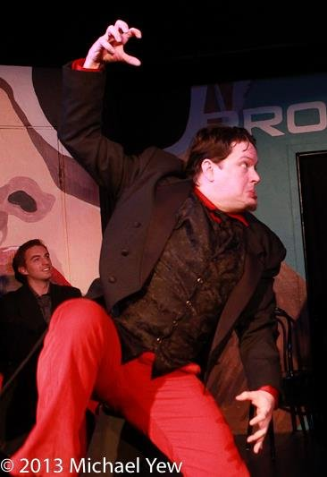

	<table class="infobox infobox-performer">
		<tr>
			<th colspan="2" class="infobox-header">Thedward Blevins</th>
		</tr>
		<tr class="">
			<td colspan="2" class="" class="infobox-picture">
				
			</td>
		</tr>
		<tr class="">
			<th scope="row" class="category-header">Primary Theater</th>
			<td class="category"><a class="internal-link" href="The Hideout Theatre">The Hideout Theatre</a></td>
		</tr>
		<tr class="">
			<th scope="row" class="category-header">Years Active</th>
			<td class="category">2010-{{CURRENTYEAR}}</td>
		</tr>

	</table>

**Thedward Blevins** is an improv performer and technical improviser.

He has studied improvised theatre at [[The Hideout Theatre|The Hideout]], [[The Merlin Works Institute for Improvisation|Merlin Works]], and [[The Institution Theater|The Institution]].

Thedward has performed at [[The Hideout Theatre]], [[Salvage Vanguard Theater]], [[The Institution Theater]], [[ColdTowne Theater]],[Station Theater](http://www.stationtheater.com/) (Houston, TX), [Dive Bar](http://www.diveaustin.com/), [[The New Movement Theater]], [[The Blind Tiger Comedy Club]] (San Antonio, TX), [[The Out of Bounds Comedy Festival]], The [Houson Improv Festival](http://houstonimprovfestival.com/), The [Austin Scottish Rite Theater](http://scottishritetheater.org/), and the [Umlauf Sculpture Garden](http://en.wikipedia.org/wiki/Umlauf_Sculpture_Garden_and_Museum).

Performing regularly since 2010, he was a regular cast member of *[[Flying Theater Machine]]* from 2012 until 2017 when it was rebranded as *[[Hideout Kids]]* and transitioned to a rotating cast per production.

He has been a regular performer in a number of ongoing shows, including
*[[Maestro]]*,
*[[The Derby]]*,
*[[The Austin Improv Monologue Jam]]*,
*[[The Free Fringe]]*,
and *[[The Fancy-Pants Mashup]]*.

He has been teaching assistant for both adult and children's improv classes, and regularly leads the [[Wednesday Jams at Hideout Studios]].

## Shows
* *[[Wild Friends]]* (2024)
* *[[Doctor When]]* (2024) (Technical Improviser — Sound Effects)
* *[[Spooky Halloween Journey]]* (2024)
* *[[Weird Frontier]]* (2024) (Stage Manager)
* *[[Excellent Adventure]]* (2024)
* *[[Those Meddling Kids]]* (2024)
* *[[Wonky Wishes]]* (2023)
* *[[Outrageous Holiday Tales]]* (2019)
* *[[Once Upon A Wha!!]]* (2019)
* *[[The Pirates of Hideout Cove]]* (2018)
* *[[Start Trekkin']]* (Season 8 — 2017) (Technical Improviser)
* *[[The Fourth Wall is Behind You]]* (2017) (Sketch show with [[Inner Picnic]] at the Frontera Fest Short Fringe)
* *[[Fiasco]]* (2016) (Technical Improviser — Multimedia)
* *[[It Came From Your Brain!]]* (2016) (Stage Manager/ Monster Crew)
* *[[Adventure PhD]]* (2016)
* *[[Camp Madeupponthaspotta]]* (2014)
* *[[Mister Morbid’s Moonlight Movie Mayhem Madness Massacre]]* (2013–2015) (cohost)
* *[[Lord Wensleydale’s Last High Tea]]* (2013)
* *[[The ReSet Project]]* (2013) (Technical Improviser)
* *[[Flying Theater Machine]]* (2012-2017)
* *[[Pick Your Own Path]]* (2012-2014)
* *[[The Tribunal]]* (2012)
* *[[The Sword of Merlin Works]]* (2012)

## Troupes
* [[Happy Butter]] (2011) (defunct)
* [[Candy Vampires]] (2014) (former member)
* [[Northward]] (2014-2016)
* [[History Under the Influence]] (2014-2017)

## More Information
* ["In Praise Of..." post](https://web.archive.org/web/20160617202953/http://yesandrew.com/in-praise-of-thedward-blevins/) by [[Ryan Austin]].

[[Category/Performers|Blevins]]
[[Category/Techs|Blevins]]