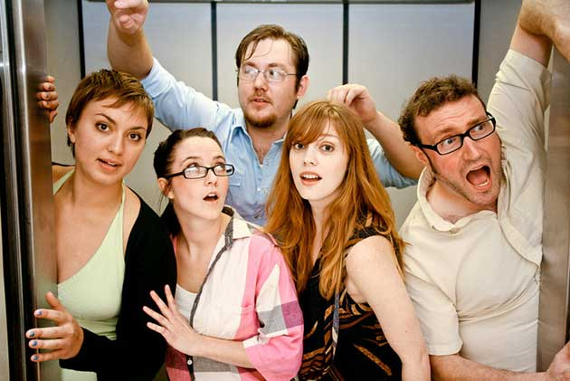

	<table class="infobox infobox-troupe">
		<tr>
			<th class="infobox-header" colspan="2">Three Hot Chicks</th>
		</tr>
		<tr class="">
			<td colspan="2" class="infobox-picture">
				
			</td>
		</tr>
		<tr class="">
			<th class="category-header" scope="row">Years Active</th>
			<td class="category">2011</td>
		</tr>
		<tr class="">
			<th class="category-header" scope="row">Cast</th>
			<td class="category">
<ul style=""><!--
  --><li style=""><a class="internal-link" href="Joel Ausanka Reese">Joel Ausanka Reese</a></li><!--
  --><li style=""><a class="internal-link" href="Ruby Willmann">Ruby Willmann</a></li><!--
  --><li style=""><a class="internal-link" href="Brad Hawkins">Brad Hawkins</a></li><!--
  --><li style=""><a class="internal-link" href="Kacy Todd">Kacy Todd</a></li><!--
  --><li style=""><a class="internal-link" href="Ruby Leigh Young">Ruby Leigh Young</a></li><!--
  --><!--
  --><!--
  --><!--
  --><!--
  --><!--
  --><!--
  --><!--
  --><!--
  --><!--
  --><!--
  --><!--
  --><!--
  --><!--
  --><!--
  --><!--
  --><!--
  --><!--
  --><!--
  --><!--
  --><!--
  --><!--
  --><!--
  --><!--
  --><!--
  --><!--
  --><!--
  --><!--
  --><!--
  --><!--
  --><!--
  --><!--
  --><!--
  --><!--
  --><!--
  --><!--
  --><!--
  --><!--
  --><!--
  --><!--
  --><!--
  --><!--
  --><!--
  --><!--
  --><!--
  --><!--
--></ul>
</td>
		</tr>
	</table>

**Three Hot Chicks** was an improv troupe active in Austin in 2011. They performed an improvised sitcom, with pre-established characters.

## History
Three Hot Chicks was founded by [[Joel Ausanka Reese]] after he attended the [[Out of Bounds Comedy Festival]] in 2010. A sitcom-based format was decided upon during rehearsals, and the troupe had their first show at the [[Hideout Theatre]] on February 3, 2011.

Three Hot Chicks appeared in [[The 42-Hour Improv Marathon]].

## Format
"Three Hot Chicks" referred to both the troupe and the name of the fictional sitcom the troupe created. Set in New York City, the show followed the misadventures of Mark Rabinowitz ([[Brad Hawkins]]), his brother Vinnie ([[Joel Ausanka Reese]]), and three of Mark's ex-girlfriends: Morgan ([[Ruby Leigh Young]]), Brooke ([[Kacy Todd]]), and Jill ([[Ruby Willmann]]). Standard sitcom tropes such as misunderstood intentions, the completion of absurd tasks, and even a laugh track were employed. At first, no continuity was observed between shows, but in the last handful of shows, characters were allowed to develop deeper relationships.

## Media
### Videos
* [Three Hot Chicks' debut show](http://vimeo.com/19634320) on Vimeo, courtesy of [[Peter Rogers]]
* [Three Hot Chicks' appearance](http://vimeo.com/25332777) in [[The 42-Hour Improv Marathon]]
* [Video](http://vimeo.com/26109575) by [[Brad Hawkins]] of their 7/6/11 show at [[ColdTowne Theater]].

### Photos
* [Photoset](http://www.facebook.com/hujhax/media_set?set=a.10150150642222265.328170.588952264&type=3) by [[Peter Rogers]] of their 2/3/11 performance in *[[The Threefer]]*.
* [Photoset](http://www.flickr.com/photos/menelaosprokos/sets/72157626290918877) by [[Menelaos Prokos]] of their 3/27/11 performance in *[[The Weekender]]*.

## More Information
* [The Three Hot Chicks website](http://threehotchicksimprov.com) (moribund)

[[Category/Troupes|Category:Troupes]]