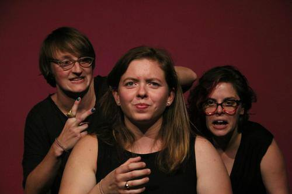

	<table class="infobox infobox-troupe">
		<tr>
			<th class="infobox-header" colspan="2">BeauMoMa</th>
		</tr>
		<tr class="">
			<td colspan="2" class="infobox-picture">
				
			</td>
		</tr>
		<tr class="">
			<th class="category-header" scope="row">Years Active</th>
			<td class="category">2013-2014</td>
		</tr>
		<tr class="">
			<th class="category-header" scope="row">Cast</th>
			<td class="category">
<ul style=""><!--
  --><li style=""><a class="internal-link" href="Performers/Bridget Brewer">Bridget Brewer</a></li><!--
  --><li style="">Maitland Lederer</li><!--
  --><li style=""><a class="internal-link" href="Performers/Melissa Patterson">Melissa Patterson</a></li><!--
  --><!--
  --><!--
  --><!--
  --><!--
  --><!--
  --><!--
  --><!--
  --><!--
  --><!--
  --><!--
  --><!--
  --><!--
  --><!--
  --><!--
  --><!--
  --><!--
  --><!--
  --><!--
  --><!--
  --><!--
  --><!--
  --><!--
  --><!--
  --><!--
  --><!--
  --><!--
  --><!--
  --><!--
  --><!--
  --><!--
  --><!--
  --><!--
  --><!--
  --><!--
  --><!--
  --><!--
  --><!--
  --><!--
  --><!--
  --><!--
  --><!--
  --><!--
  --><!--
  --><!--
  --><!--
  --><!--
  --><!--
--></ul>
</td>
		</tr>
	</table>

## Summary
**BeauMoMa** was an improv troupe that just wants to have fun.

## History
BeauMoMa was formed after Bridget, Maitland, and Melissa completed levels 1-6 at [[Theatres/The Hideout Theatre|The Hideout Theatre]]. 

The name BeauMoMa is a combination of their nicknames.  Bridget "Beau" short for Beauregard, Melissa "Mo" short for MoPatt, and Maitland "Ma" short for Maglight.

The troupe broke up when Bridget moved away to Rhode Island.

## Media
### Videos
* [Video](http://vimeo.com/68827080) by [[Performers/Melissa Patterson|Melissa Patterson]] of show #1.
* [Video](http://vimeo.com/69155213) by [[Performers/Melissa Patterson|Melissa Patterson]] of show #2.
* [Video](http://vimeo.com/74918469) by [[Performers/Melissa Patterson|Melissa Patterson]] of show #4 (7/18/13).
* [Video](http://vimeo.com/71316579) by [[Performers/Paul Normandin|Paul Normandin]] of the 7/27/13 performance at [[Theatres/The Institution Theater|The Institution Theater]].
* [Video](http://vimeo.com/75015384) by [[Performers/Melissa Patterson|Melissa Patterson]] of show #5 (9/15/13).
* [Video](http://vimeo.com/83402149) by [[Performers/Melissa Patterson|Melissa Patterson]] of show #6 (10/7/13).
* [Video](http://vimeo.com/83384759) by [[Performers/Melissa Patterson|Melissa Patterson]] of show #7 (*[[Shows/The Threefer|The Threefer]]*, 1/2/14).
* [Video](http://vimeo.com/84854572) by [[Performers/Melissa Patterson|Melissa Patterson]] of show #8 (*[[Shows/The Threefer|The Threefer]]*, 1/9/14).
* [Video](http://vimeo.com/85531546) by [[Performers/Melissa Patterson|Melissa Patterson]] of show #11.
* [Video](http://vimeo.com/85588221) by [[Performers/Melissa Patterson|Melissa Patterson]] of show #12 (*[[Shows/The Threefer|The Threefer]]*, 1/23/14). 
* [Video](http://vimeo.com/90823926) by [[Performers/Melissa Patterson|Melissa Patterson]] of show #13.
* [Video](http://vimeo.com/90436637) by [[Performers/Melissa Patterson|Melissa Patterson]] of show #14.

### Photos
* [Photoset](http://www.facebook.com/claudio.fox.5/media_set?set=a.608175565870609.1073741848.100000345135257&type=3) by [[Performers/Claudio Fox|Claudio Fox]] that includes their 6/27/13 performance in *[[Shows/The Triple Scoop|The Triple Scoop]]*.
* [Photoset](http://cwcreations.smugmug.com/Improv-2014/Improvised-Play-Festival/BeauMoMa/) by [[Performers/Chad Wellington|Chad Wellington]] of their show in [[Festivals/The 2014 Improvised Play Festival|The 2014 Improvised Play Festival]].
* [Photoset](http://www.facebook.com/media/set/?set=a.880052028724981.1073742139.221927764537414&type=3) by [[Steve Rogers]] that includes their 1/8/15 reunion show in *[[Shows/The Threefer|The Threefer]]*.

## More Information
* [The troupe's Facebook page.](http://www.facebook.com/BeauMoMa)
* [The troupe's Tumblr page.](http://beaumoma.tumblr.com)

[[Category/Troupes|Category:Troupes]]
[[Category/All-Female Troupes|Category:All-Female Troupes]]