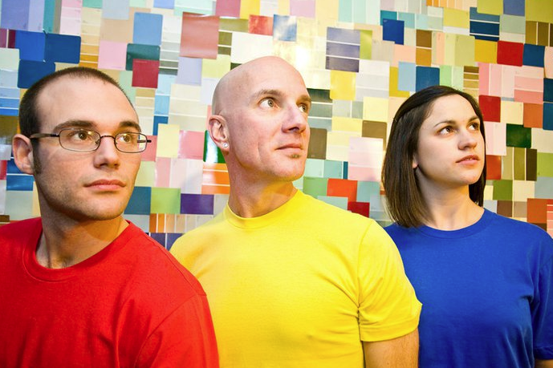

	<table class="infobox infobox-troupe">
		<tr><th colspan="2" class="infobox-header">ColorWheel</th></tr>
		<tr class=""><td colspan="2" class="infobox-picture"></td></tr>
		<tr class=""><th scope="row" class="category-header">Cast</th><td class="category">
<ul><li>Christine Giordano.</li><li><a class="internal-link" href="Performers/Jay Byrd">Jay Byrd</a></li><li><a class="internal-link" href="Performers/John Buseman">John Buseman</a></li></ul>
</td></tr>
		<tr class=""><th scope="row" class="category-header">Years</th><td class="category">2010</td></tr>
	</table>

**ColorWheel** (also written **Colorwheel**) was an improv troupe.

## Summary
### Press Blurb
Their press blurb, taken from a 2010 application to perform at [[Theatres/The Hideout Theatre|The Hideout Theatre]]:> 
ColorWheel is a lusty trio made of:
 
> 
> 
Jay Byrd, John Buseman, and Christine Giordano.
 
> 
> 
They harmonize and match energies that drive high-power scenes.
 
> 
> 
Weird and wonderful characters emerge to take audiences on a journey through their world with a high sense of play.

### "What's Your Deal?"
Their answer to the "What's Your Deal?" question on a 2010 application to perform at [[Theatres/The Hideout Theatre|The Hideout Theatre]]:> We utilize matching energies for scene starts and organic transformations for our edits.

## Media
### Photos
* [Photoset](http://www.flickr.com/photos/ahpook667/sets/72157626150627986) by [[Roy Moore]] that includes their 2/25/11 show at [[Theatres/Salvage Vanguard Theater|Salvage Vanguard Theater]].

[[Category/Troupes]]
[[Category/Auto-Generated Troupe Pages]]