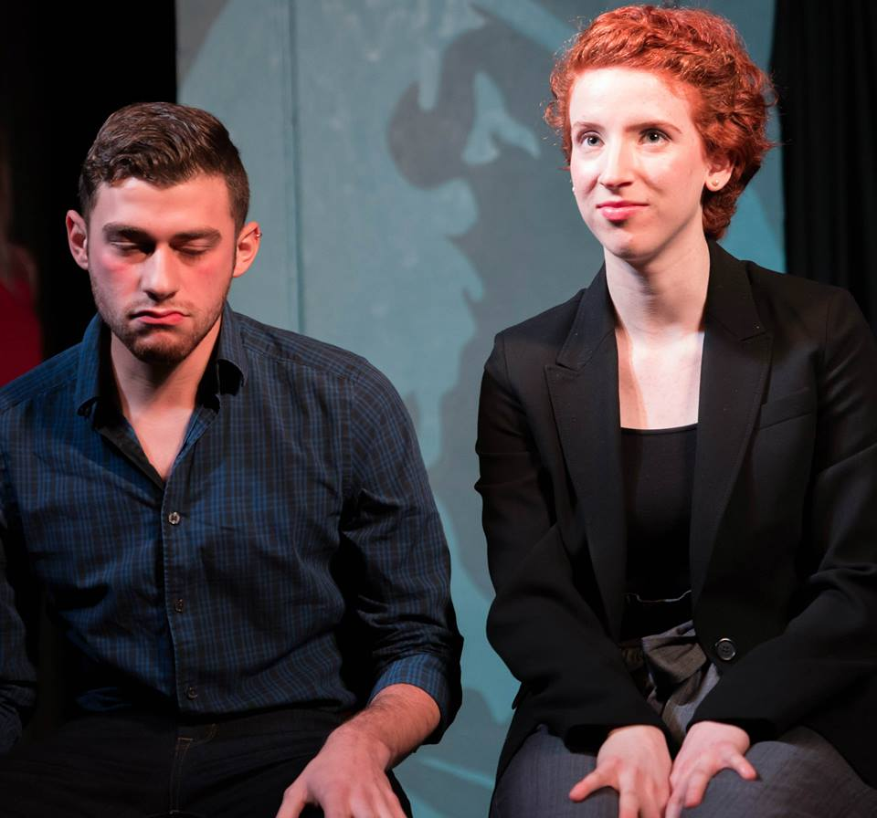

	<table class="infobox infobox-troupe">
		<tr>
			<th class="infobox-header" colspan="2">Dudith</th>
		</tr>
		<tr class="">
			<td colspan="2" class="infobox-picture">
				
			</td>
		</tr>
		<tr class="">
			<th class="category-header" scope="row">Years Active</th>
			<td class="category">2014-Present</td>
		</tr>
		<tr class="">
			<th class="category-header" scope="row">Cast</th>
			<td class="category">
<ul style=""><!--
  --><li style=""><a class="internal-link" href="Performers/David Schwartz">David Schwartz</a></li><!--
  --><li style="">Judith Schomp</li><!--
  --><!--
  --><!--
  --><!--
  --><!--
  --><!--
  --><!--
  --><!--
  --><!--
  --><!--
  --><!--
  --><!--
  --><!--
  --><!--
  --><!--
  --><!--
  --><!--
  --><!--
  --><!--
  --><!--
  --><!--
  --><!--
  --><!--
  --><!--
  --><!--
  --><!--
  --><!--
  --><!--
  --><!--
  --><!--
  --><!--
  --><!--
  --><!--
  --><!--
  --><!--
  --><!--
  --><!--
  --><!--
  --><!--
  --><!--
  --><!--
  --><!--
  --><!--
  --><!--
  --><!--
  --><!--
  --><!--
  --><!--
  --><!--
--></ul>
</td>
		</tr>
	</table>

**Dudith** is an improv duo.

## Summary
### Press Blurb
Their press blurb, taken from a 2014 application to perform at [[Theatres/The Hideout Theatre|The Hideout Theatre]]:
> Judith and David came together after realizing their mutual appreciation and playfulness in improv. The two enjoy the thrill of surprising the other on stage, and diving into nuanced character work. "Dudith will have you on the edge of your seat, and laughing the whole time!", the pair says.

[[Category/Troupes|Category:Troupes]]
[[Category/Auto-Generated Troupe Pages|Category:Auto-Generated Troupe Pages]]
Category:Active
[[Category/Duos|Category:Duos]]