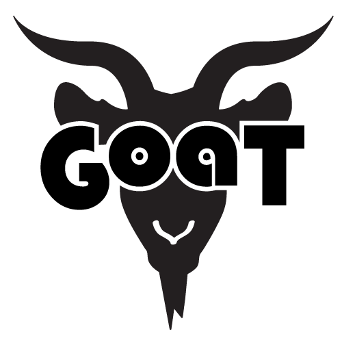

	<table class="infobox infobox-troupe">
		<tr>
			<th class="infobox-header" colspan="2">Goat</th>
		</tr>
		<tr class="">
			<td colspan="2" class="infobox-picture">
				
			</td>
		</tr>
		<tr class="">
			<th class="category-header" scope="row">Years Active</th>
			<td class="category">2012-2013</td>
		</tr>
		<tr class="">
			<th class="category-header" scope="row">Cast</th>
			<td class="category">
<ul style=""><!--
  --><li style=""><a class="internal-link" href="Performers/Brad Hawkins">Brad Hawkins</a></li><!--
  --><li style=""><a class="internal-link" href="Performers/Heidi Caldwell">Heidi Caldwell</a></li><!--
  --><li style=""><a class="internal-link" href="Performers/Alexander Hilary">Alexander Hilary</a></li><!--
  --><li style=""><a class="internal-link" href="Performers/Sam Schak">Sam Schak</a></li><!--
  --><!--
  --><!--
  --><!--
  --><!--
  --><!--
  --><!--
  --><!--
  --><!--
  --><!--
  --><!--
  --><!--
  --><!--
  --><!--
  --><!--
  --><!--
  --><!--
  --><!--
  --><!--
  --><!--
  --><!--
  --><!--
  --><!--
  --><!--
  --><!--
  --><!--
  --><!--
  --><!--
  --><!--
  --><!--
  --><!--
  --><!--
  --><!--
  --><!--
  --><!--
  --><!--
  --><!--
  --><!--
  --><!--
  --><!--
  --><!--
  --><!--
  --><!--
  --><!--
  --><!--
  --><!--
  --><!--
--></ul>
</td>
		</tr>
	</table>

**Goat** was a troupe specializing in improvised tragedy.

## History
Goat was formed in late 2011 when [[Performers/Brad Hawkins|Brad Hawkins]] assembled a group of improvisers to try a show based around drama rather than overt comedy. Their first show was on March 27, 2012.

In 2013, Goat went on indefinite hiatus.

### Name
Goat takes its name from the Greek word *tragos*, which means "goat" and is the root of the English word [tragedy](http://en.wikipedia.org/wiki/Tragedy).

## Members at the time of hiatus
* [[Performers/Brad Hawkins|Brad Hawkins]]
* [[Performers/Heidi Caldwell|Heidi Caldwell]]
* [[Performers/Sam Schak|Sam Schak]]
## Former members
* [[Performers/Alexander Hilary|Alexander Hilary]]
* Indigo Rael
* Amber Shae
* John Brewster
* [[Performers/Michael Ferstenfeld|Michael Ferstenfeld]]

## Festivals
Goat has appeared in the following festivals:
* [[Festivals/Out of Bounds Comedy Festival|Out of Bounds Comedy Festival]] (2012)
* [[Festivals/Improvised Play Festival|Improvised Play Festival]] (2013)

## Media
### Videos
* [Video](http://vimeo.com/39035730) by [[Performers/Brad Hawkins|Brad Hawkins]] of their 3/22/12 debut in *[[Shows/The Threefer|The Threefer]]*.
* [Video](http://vimeo.com/44984553) by [[Performers/Brad Hawkins|Brad Hawkins]] of their 6/28/12 performance in *[[Shows/The Threefer|The Threefer]]*.
* [Video](http://vimeo.com/47593964) by [[Performers/Brad Hawkins|Brad Hawkins]] of their 7/15/12 show at [[Theatres/Coldtowne Theater|Coldtowne Theater]].
* [Video](http://vimeo.com/49553431) by [[Performers/Brad Hawkins|Brad Hawkins]] of their 8/29/12 performance in [[Festivals/The 2012 Out of Bounds Comedy Festival|The 2012 Out of Bounds Comedy Festival]].
* [Video](http://vimeo.com/49553431) by [[Performers/Brad Hawkins|Brad Hawkins]] of their 9/13/12 performance in *[[Shows/The Threefer|The Threefer]]*.
* [Video](http://vimeo.com/53269887) by [[Performers/Brad Hawkins|Brad Hawkins]] of their 11/10/12 performance in *[[Shows/The Triple Scoop|The Triple Scoop]]*.
* [Video](http://vimeo.com/57374969) by [[Performers/Brad Hawkins|Brad Hawkins]] of their 1/13/13 performance at [[Theatres/Coldtowne Theater|Coldtowne Theater]] ("Jerry the Cat").
* [Video](http://vimeo.com/58632857) by [[Performers/Brad Hawkins|Brad Hawkins]] of their 1/30/13 performance at [[Theatres/Coldtowne Theater|Coldtowne Theater]] ("Chickens").
* [Video](http://vimeo.com/60605310) by [[Performers/Brad Hawkins|Brad Hawkins]] of their "Guns" show at [[Theatres/Coldtowne Theater|Coldtowne Theater]] (uploaded 2/26/13).
* [Video](http://vimeo.com/61016007) by [[Performers/Brad Hawkins|Brad Hawkins]] of their "Optometrist" show at [[Theatres/The Hideout Theatre|The Hideout Theatre]] (uploaded 3/2/13).
* [Video](http://vimeo.com/64151133) by [[Performers/Brad Hawkins|Brad Hawkins]] of their "Fun" show at [[Theatres/The Hideout Theatre|The Hideout Theatre]] (uploaded 4/16/13).
* [Video](http://vimeo.com/64182313) by [[Performers/Brad Hawkins|Brad Hawkins]] of their "Circus" show at [[Theatres/Coldtowne Theater|Coldtowne Theater]] (uploaded 4/16/13).

### Photos
* [Photoset of their 3/22/12 show](http://www.facebook.com/media/set/?set=a.323769481019908.79466.221927764537414&type=3) at *[[Shows/The Threefer|The Threefer]]* by [[Steve Rogers]].
* [Photoset](http://www.facebook.com/michael.yew/media_set?set=a.4398232116699.1073741826.1315383518&type=3) by [[Michael Yew]] that includes their 3/2/13 performance in *[[Shows/The Triple Scoop|The Triple Scoop]]*.
* [Photoset](http://www.facebook.com/michael.yew/media_set?set=a.4606882972840.1073741830.1315383518&type=3) by [[Michael Yew]] which includes their 4/12/13 performance in [[Festivals/The 2013 Improvised Play Festival|The 2013 Improvised Play Festival]].

## More Information
* [Goat's Website](http://goatimprov.com)
* [Goat's Facebook Page](http://facebook.com/goatimprov)
* [Goat's Vimeo Channel](http://vimeo.com/channels/307618)

Category:Inactive
[[Category/Troupes|Category:Troupes]]