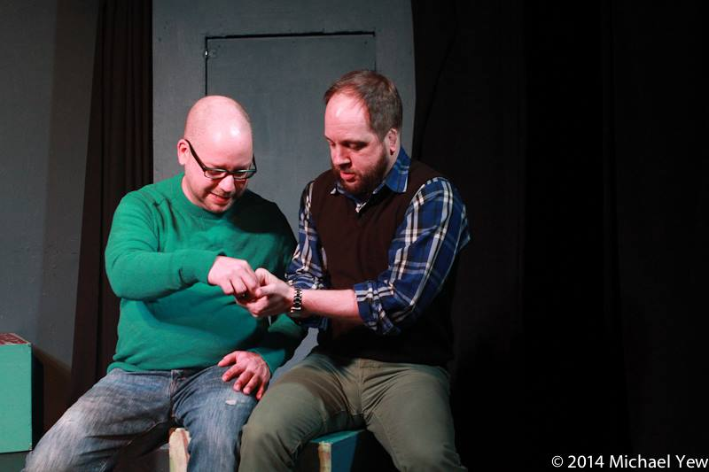

	<table class="infobox infobox-troupe">
		<tr>
			<th class="infobox-header" colspan="2">Jastin</th>
		</tr>
		<tr class="">
			<td colspan="2" class="infobox-picture">
				
			</td>
		</tr>
		<tr class="">
			<th class="category-header" scope="row">Years Active</th>
			<td class="category">2013-Present</td>
		</tr>
		<tr class="">
			<th class="category-header" scope="row">Cast</th>
			<td class="category">
<ul style=""><!--
  --><li style=""><a class="internal-link" href="Performers/Jason Vines">Jason Vines</a></li><!--
  --><li style=""><a class="internal-link" href="Performers/Justin Davis">Justin Davis</a></li><!--
  --><!--
  --><!--
  --><!--
  --><!--
  --><!--
  --><!--
  --><!--
  --><!--
  --><!--
  --><!--
  --><!--
  --><!--
  --><!--
  --><!--
  --><!--
  --><!--
  --><!--
  --><!--
  --><!--
  --><!--
  --><!--
  --><!--
  --><!--
  --><!--
  --><!--
  --><!--
  --><!--
  --><!--
  --><!--
  --><!--
  --><!--
  --><!--
  --><!--
  --><!--
  --><!--
  --><!--
  --><!--
  --><!--
  --><!--
  --><!--
  --><!--
  --><!--
  --><!--
  --><!--
  --><!--
  --><!--
  --><!--
  --><!--
--></ul>
</td>
		</tr>
	</table>

**Jastin** is an improv duo.

## Summary
### Press Blurb
Their press blurb, taken from a 2014 application to perform at [[Theatres/The Hideout Theatre|The Hideout Theatre]]:
> Do people ever call you by the wrong name? It happens to Jason Vines and Justin Davis all of the time. So, the two have decided that since they can't beat 'em, they'll join'em by creating the improv troupe called Jastin! Even though they've come together to make this one troupe, they're still two distinctly different people and so Jastin embodies this dynamic by presenting varied worlds on stage with the idea of duality at the forefront.
>  
> 
> Sometimes, that means creating two different stories, one comedic and one dramatic, based off of the same opening line. Other times, that may mean playing around with parallel timelines by seeing how someone's life would've been different with different choice made. No matter what, Jastin seeks make the dramatic comedic and the comedic dramatic, showing that one often works best when it has a bit of the other.

### "What's Your Deal?"
Their answer to the "What's Your Deal?" question on a 2013 application to perform at [[Theatres/The Hideout Theatre|The Hideout Theatre]]:
> This is summed up pretty well in the press blurb section, but this too:
>  
> 
> We both enjoy doing both comedy-focused and drama-focused improv, so we want to perform scenes where we can show that virtually any topic an be done with an emphasis on one or the other. Maybe do a scene being serious and then redo it being funny. Take one suggestion and two wildly different scenes on it. Pair up opposite types of people in a small space. Play demon voice with one of us being the demon. Etc. Stuff like that.

## Media
### Photos
* [Photoset](http://www.facebook.com/michael.yew/media_set?set=a.10201235855481187.1073741878.1315383518&type=3) by [[Michael Yew]] that includes their 1/17/14 performance in *[[Shows/2x4|2x4]]*.

[[Category/Troupes|Category:Troupes]]
[[Category/Auto-Generated Troupe Pages|Category:Auto-Generated Troupe Pages]]
Category:Active
[[Category/Duos|Category:Duos]]