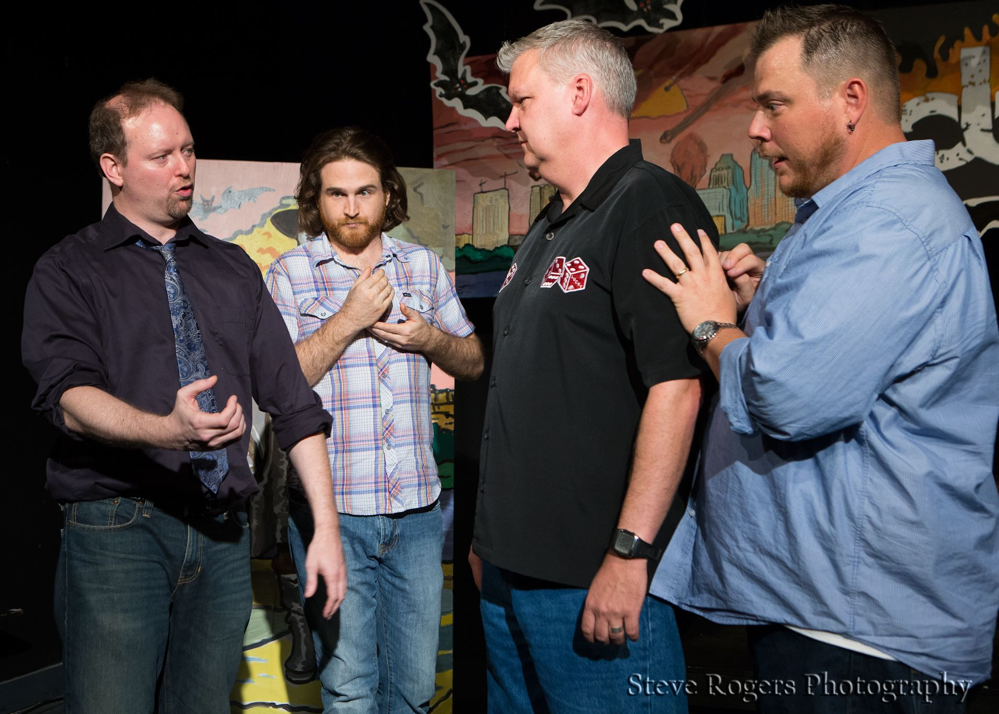

	<table class="infobox infobox-troupe">
		<tr>
			<th class="infobox-header" colspan="2">Junk</th>
		</tr>
		<tr class="">
			<td colspan="2" class="infobox-picture">
				
			</td>
		</tr>
		<tr class="">
			<th class="category-header" scope="row">Years Active</th>
			<td class="category">2007-Present</td>
		</tr>
		<tr class="">
			<th class="category-header" scope="row">Cast</th>
			<td class="category">
<ul style=""><!--
  --><li style=""><a class="internal-link" href="Performers/Andy Crouch">Andy Crouch</a></li><!--
  --><li style=""><a class="internal-link" href="Performers/Sean Hill">Sean Hill</a></li><!--
  --><li style=""><a class="internal-link" href="Performers/Ted Rutherford">Ted Rutherford</a></li><!--
  --><li style=""><a class="internal-link" href="Performers/Troy Miller">Troy Miller</a></li><!--
  --><!--
  --><!--
  --><!--
  --><!--
  --><!--
  --><!--
  --><!--
  --><!--
  --><!--
  --><!--
  --><!--
  --><!--
  --><!--
  --><!--
  --><!--
  --><!--
  --><!--
  --><!--
  --><!--
  --><!--
  --><!--
  --><!--
  --><!--
  --><!--
  --><!--
  --><!--
  --><!--
  --><!--
  --><!--
  --><!--
  --><!--
  --><!--
  --><!--
  --><!--
  --><!--
  --><!--
  --><!--
  --><!--
  --><!--
  --><!--
  --><!--
  --><!--
  --><!--
  --><!--
  --><!--
  --><!--
--></ul>
</td>
		</tr>
	</table>

**Junk** is a troupe that specializes in Johnstonian improv.

## Summary
### Press Blurb
Here is their bio from [[Festivals/The 2012 Out of Bounds Comedy Festival|The 2012 Out of Bounds Comedy Festival]] web site:

> "Junk presents their signature format, in which they combine everything they love about improv into one show - a wild tapestry of: scenes with games, scenes with audience members, and even a mini-narrative in a particular genre. Junk features a who's-who of the improv comedy scene in Austin in the last 10 years, including Hideout Theatre founder Sean Hill, Hideout Theatre education director Andy Crouch, Start Trekkin producer Troy A. Miller, GNAP! Theatre show director Audrey Sansom, and MerlinWorks teacher Ted Rutherford. Together, they have nearly 60 years of improv experience, and they're not afraid to use it."

## History
Junk formed from after the breakup of [[Troupes/Foolish Mortals|Foolish Mortals]] in 2007, with only [[Performers/Ted Rutherford|Ted Rutherford]], Andrea Young, and [[Performers/Troy Miller|Troy Miller]] moving from the one troupe to the other.

Junk performed its 100th show on 12/22/12.

### Former Members
* Andrea Young
* [[Performers/Audrey Rachel Sansom|Audrey Rachel Sansom]] (2007-2012)
* [[Performers/Kacey Samiee|Kacey Samiee]]

## Media
### Videos
* [Video](http://blip.tv/out-of-bounds-comedy-festival/junk-fri-10pm-svt-oranges-stage-1246660) of their 8/29/08 show at [[Festivals/The 2008 Out of Bounds Comedy Festival|The 2008 Out of Bounds Comedy Festival]].
* Video of their 4/25/09 show: [part 1](http://www.viddler.com/v/fae5617e), [part 2](http://www.viddler.com/v/f27a016d).
* Video of their 11/14/09 show: [part 1](http://www.viddler.com/v/53f51a81), [part 2](http://www.viddler.com/v/80f8da34).
* [Video of their 3/27/10 show.](http://www.viddler.com/v/522e182e)
* [Video](http://vimeo.com/19637134) by [[Performers/Peter Rogers|Peter Rogers]] of the 2/3/11 show.
* [Video of their 3/26/11 show.](http://www.viddler.com/v/785e5a8e)
* [Video of their 11/9/12 show](http://www.viddler.com/v/8b20d9f0) at [[Festivals/WaffleFest 2012|WaffleFest 2012]].
* [Video of their 8/30/12 show](http://www.viddler.com/v/976320e1) at [[Festivals/The 2012 Out of Bounds Comedy Festival|The 2012 Out of Bounds Comedy Festival]].

### Photos
* [Photoset](http://www.facebook.com/hujhax/media_set?set=a.129983882264.120571.588952264&type=3) by [[Performers/Peter Rogers|Peter Rogers]] of their 6/28/09 performance in [[Festivals/The 40-Hour Improv Marathon|The 40-Hour Improv Marathon]].
* [Photoset](http://www.facebook.com/roy.moore/media_set?set=a.1137160881099.2019048.1589679282&type=3) by [[Roy Moore]] of their 12/4/09 show.
* [Photoset](http://www.facebook.com/MadelineChauvin/media_set?set=a.10100190598071810.2855599.7944448&type=3) by [[Performers/Jo Chauvin|Jo Chauvin]] of their 3/26/10 show.
* [Photoset](http://www.facebook.com/media/set/?set=a.1280492264294.2033519.1589679282&type=1) by [[Roy Moore]] that includes their 6/12/10 performance in *[[Shows/The Saturday Night Special|The Saturday Night Special]]*.
* [Photoset](http://www.facebook.com/roy.moore/media_set?set=a.1313301724510.2038344.1589679282&type=3) by [[Roy Moore]] that includes their 7/24/10 performance in *[[Shows/The Saturday Night Special|The Saturday Night Special]]*.
* [Photoset](http://www.facebook.com/hujhax/media_set?set=a.482836252264.261191.588952264&type=3) by [[Performers/Peter Rogers|Peter Rogers]] of the 9/2/10 show from [[Festivals/The 2010 Out of Bounds Comedy Festival|The 2010 Out of Bounds Comedy Festival]].
* [Photoset](http://www.facebook.com/hujhax/media_set?set=a.10150150639897265.328168.588952264&type=3) by [[Performers/Peter Rogers|Peter Rogers]] of their 2/3/11 performance in *[[Shows/The Threefer|The Threefer]]*.
* [Photoset](http://www.facebook.com/SteveRogers1212/media_set?set=a.107229196024779.16125.100002130980897&type=3) by [[Steve Rogers]] of their 2/26/11 show.
* [Photoset](http://www.facebook.com/SteveRogers1212/media_set?set=a.113369138744118.21579.100002130980897&type=3) by [[Steve Rogers]] of their 3/26/11 show.
* [Photoset](http://www.facebook.com/michael.yew/media_set?set=a.1602508305351.75968.1315383518&type=3) by [[Michael Yew]] that includes their 6/3/11 show in [[Festivals/The 42-Hour Improv Marathon|The 42-Hour Improv Marathon]].
* [Photoset](http://www.facebook.com/media/set/?set=a.212738282128192.50688.118587218209966&type=3) by [[Roy Moore]] of their 10/22/11 performance in *[[Shows/The Saturday Night Special|The Saturday Night Special]]*.
  * [Another photoset](http://www.facebook.com/michael.yew/media_set?set=a.1904181927003.93571.1315383518&type=3) by [[Michael Yew]] that includes the 10/22/11 performance.
* [Photoset](http://www.facebook.com/media/set/?set=a.414257111971144.100514.221927764537414&type=3) by [[Steve Rogers]] that includes their 8/29/12 show at [[Festivals/The 2012 Out of Bounds Comedy Festival|The 2012 Out of Bounds Comedy Festival]].
* [Photoset](http://www.facebook.com/michael.yew/media_set?set=a.3811816376672.136825.1315383518&type=3) by [[Michael Yew]] which includes their 11/10/12 performance at [[Festivals/Wafflefest|Wafflefest]].
* [Photoset](http://www.facebook.com/media/set/?set=a.465998583463663.112885.221927764537414&type=3) by [[Steve Rogers]] of their 100th show, on 12/22/12.
* [Photoset](http://www.facebook.com/claudio.fox.5/media_set?set=a.664214413600057.1073741869.100000345135257&type=3) by [[Performers/Claudio Fox|Claudio Fox]] that includes their performance in *[[Festivals/WaffleFest 2013|WaffleFest 2013]]*.
* [Photoset](http://www.facebook.com/michael.yew/media_set?set=a.10202528881326025.1073741900.1315383518&type=3) by [[Michael Yew]] that includes their 8/26/14 show at [[Festivals/The 2014 Out of Bounds Comedy Festival|The 2014 Out of Bounds Comedy Festival]].
* [Photoset](http://www.facebook.com/michael.yew/media_set?set=a.10203012933787034.1073741915.1315383518&type=3) by [[Michael Yew]] that includes their 11/21/14 performance in [[Festivals/WaffleFest 2014|WaffleFest 2014]].
* [Photoset](http://www.facebook.com/media/set/?set=a.1031272646936251.1073742237.221927764537414&type=3) by [[Steve Rogers]] which includes their 9/1/15 performance in [[Festivals/The 2015 Out of Bounds Comedy Festival|The 2015 Out of Bounds Comedy Festival]].

## More Information
* [The troupe's web site.](http://junkimprov.com)
* [The troupe's facebook page.](https://www.facebook.com/pages/Junk-Improv-Comedy/23559012849)

[[Category/Troupes|Category:Troupes]]
Category:Active