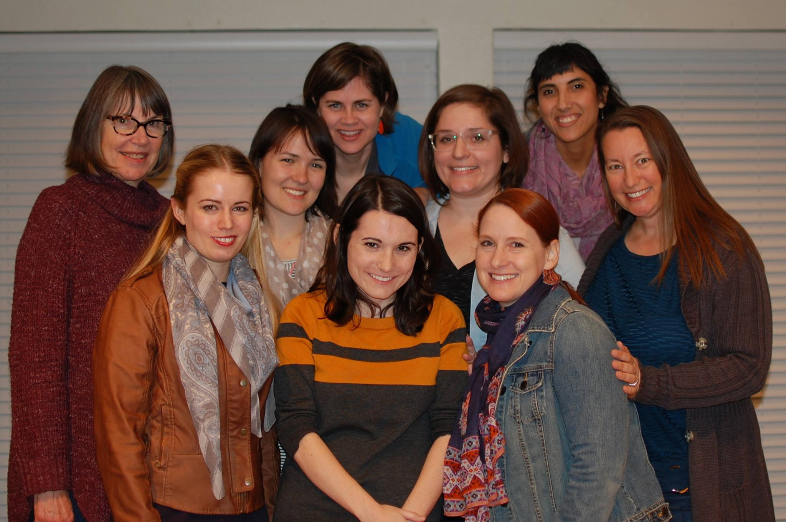

	<table class="infobox infobox-troupe">
		<tr>
			<th class="infobox-header" colspan="2">WIG</th>
		</tr>
		<tr class="">
			<td colspan="2" class="infobox-picture">
				
			</td>
		</tr>
		<tr class="">
			<th class="category-header" scope="row">Years Active</th>
			<td class="category">2015-Present</td>
		</tr>
		<tr class="">
			<th class="category-header" scope="row">Cast</th>
			<td class="category">
<ul style=""><!--
  --><li style="">Wendy Eickstaedt</li><!--
  --><li style="">Caroline Gorman</li><!--
  --><li style="">Christina Keller</li><!--
  --><li style="">Karlie Lemos</li><!--
  --><li style="">Tamara Warton</li><!--
  --><li style="">Monica Wells</li><!--
  --><li style="">Amanda Wischkaemper</li><!--
  --><!--
  --><!--
  --><!--
  --><!--
  --><!--
  --><!--
  --><!--
  --><!--
  --><!--
  --><!--
  --><!--
  --><!--
  --><!--
  --><!--
  --><!--
  --><!--
  --><!--
  --><!--
  --><!--
  --><!--
  --><!--
  --><!--
  --><!--
  --><!--
  --><!--
  --><!--
  --><!--
  --><!--
  --><!--
  --><!--
  --><!--
  --><!--
  --><!--
  --><!--
  --><!--
  --><!--
  --><!--
  --><!--
  --><!--
  --><!--
  --><!--
  --><!--
  --><!--
--></ul>
</td>
		</tr>
	</table>

**WIG** (also stylized W.I.G. or #WIG) is a group of female improvisers performing in Austin. The group was fully formed near the end of 2015, and had its first performance in the [[Shows/Threefer|Threefer]] on February 18, 2016 with [[Troupes/Kinkade|Kinkade]] and [[Troupes/Golden|Golden]]. WIG's members are all current or former students of [[Theatres/The Hideout Theatre|The Hideout Theatre]].

The group is regularly coached by [[Performers/Nicole Oliver|Nicole Oliver]], with additional coaching from [[Performers/Jessica Arjet|Jessica Arjet]] and [[Performers/Kaci Beeler|Kaci Beeler]].

## Format
**WIG** currently performs a montage narrative format inspired by the performer's connections to audience suggestions. 

### Press Blurb
"We use narrative intertwined with audience suggestions (secrets, real or created.) Our range of careers, experience and imagination sparks both depth and breadth into each character. A combination of both playful and realistic, audiences will delight in the form and the stories we create. Snuggle up with a tasty snack and drink, and get comfy! It’s storytime!"

Category:Active
[[Category/Troupes|Category:Troupes]]
[[Category/All-Female Troupes|Category:All-Female Troupes]]