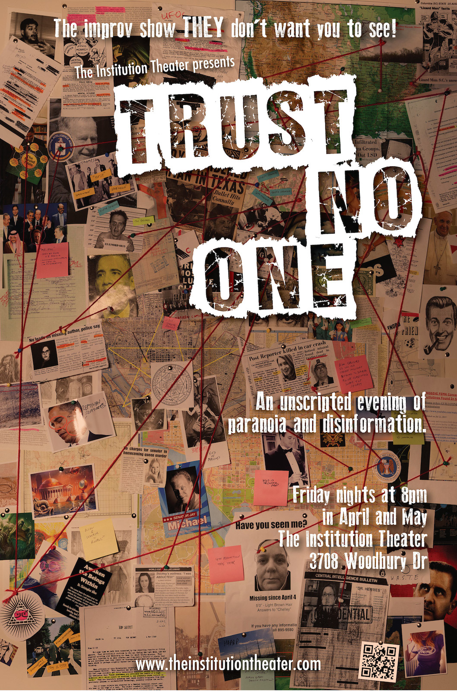

	<table class="infobox infobox-show">
		<tr>
			<th colspan="2" class="infobox-header">Trust No One</th>
		</tr>
		<tr class="">
			<td colspan="2" class="infobox-picture">
				
			</td>
		</tr>

		<tr class="">
			<th scope="row" class="category-header">Theater</th>
			<td class="category"><a class="internal-link" href="The Institution Theater">The Institution Theater</a></td>
		</tr>

		<tr class="">
			<th scope="row" class="category-header">Directed by</th>
			<td class="category"><a class="internal-link" href="Brad Hawkins">Brad Hawkins</a></td>
		</tr>

		<tr class="">
			<th scope="row" class="category-header">Assistant Director(s)</th>
			<td class="category"><a class="internal-link" href="Ryan Hill">Ryan Hill</a></td>
		</tr>

		<tr class="">
			<th scope="row" class="category-header">Cast</th>
			<td class="category">
<ul style=""><!--
  --><li style=""><a class="internal-link" href="Alexandria Ayala">Alexandria Ayala</a></li><!--
  --><li style=""><a class="internal-link" href="Andreas Fabis">Andreas Fabis</a></li><!--
  --><li style=""><a class="internal-link" href="Andy Hush">Andy Hush</a></li><!--
  --><li style=""><a class="internal-link" href="Ceej Allen">Ceej Allen</a></li><!--
  --><li style=""><a class="internal-link" href="Chelley Pyatt">Chelley Pyatt</a></li><!--
  --><li style=""><a class="internal-link" href="Clint Harris">Clint Harris</a></li><!--
  --><li style=""><a class="internal-link" href="Jay Michael">Jay Michael</a></li><!--
  --><li style=""><a class="internal-link" href="Jen Kaplan">Jen Kaplan</a></li><!--
  --><li style="" ><a class="internal-link" href="Luis Salinas">Luis Salinas</a></li><!--
  --><li style=""><a class="internal-link" href="Maitland Lederer">Maitland Lederer</a></li><!--
  --><li style=""><a class="internal-link" href="Nicole Beckley">Nicole Beckley</a></li><!--
  --><li style=""><a class="internal-link" href="Tess Hermes">Tess Hermes</a></li><!--
  --><!--
  --><!--
  --><!--
  --><!--
  --><!--
  --><!--
  --><!--
  --><!--
  --><!--
  --><!--
  --><!--
  --><!--
  --><!--
  --><!--
  --><!--
  --><!--
  --><!--
  --><!--
  --><!--
  --><!--
  --><!--
  --><!--
  --><!--
  --><!--
  --><!--
  --><!--
  --><!--
  --><!--
  --><!--
  --><!--
  --><!--
  --><!--
  --><!--
  --><!--
  --><!--
  --><!--
  --><!--
  --><!--
--></ul>
</td>
		</tr>

		<tr class="">
			<th scope="row" class="category-header">Crew</th>
			<td class="category">
<ul style=""><!--
  --><li style=""><a class="internal-link" href="Cindy Page">Cindy Page</a></li><!--
  --><li style=""><a class="internal-link" href="Michael Yew">Michael Yew</a></li><!--
  --><!--
  --><!--
  --><!--
  --><!--
  --><!--
  --><!--
  --><!--
  --><!--
  --><!--
  --><!--
  --><!--
  --><!--
  --><!--
  --><!--
  --><!--
  --><!--
  --><!--
  --><!--
  --><!--
  --><!--
  --><!--
  --><!--
  --><!--
  --><!--
  --><!--
  --><!--
  --><!--
  --><!--
  --><!--
  --><!--
  --><!--
  --><!--
  --><!--
  --><!--
  --><!--
  --><!--
  --><!--
  --><!--
  --><!--
  --><!--
  --><!--
  --><!--
  --><!--
  --><!--
  --><!--
  --><!--
  --><!--
  --><!--
--></ul>
</td>
		</tr>

		<tr class="">

			<th scope="row" class="category-header">Run</th>

			<td class="category">Apr/May 2014</td>
		</tr>

		
	</table>

***Trust No One*** was a mainstage show at [[The Institution Theater]].

## Summary
The show was a longform narrative, dealing with conspiracies and paranoia. An audience suggestion of a single organization that secretly controls everything (usually, an entity not generally held to be sinister in nature) was used to craft an improvised play in which the shadowy dealings of this organization are discovered.

### The View-Master of Providence
In materials promoting this show, the Institution Theater's [[Wikipedia - View-Master|View-Master]] logo was incorporated into the [[Wikipedia - Eye of Providence|Eye of Providence]], a common [[Wikipedia - Freemasonry|Masonic]] symbol and one often associated with the [[Wikipedia - Illuminati|Illuminati]]. 

![[Eye-of-institution-1.gif|The View-Master of Providence, designed by [[Brad Hawkins]]]]

## Media
### Videos
* [Video](http://vimeo.com/91137418) by [[Brad Hawkins]] of the 4/4/14 show ("The Keebler Elves").
* [Video](http://vimeo.com/92235221) by [[Brad Hawkins]] of the 4/11/14 show ("Orthodontists").
* [Video](http://vimeo.com/93384305) by [[Brad Hawkins]] of the 4/18/14 show ("Milton Bradley").
* [Video](http://vimeo.com/93541011) by [[Brad Hawkins]] of the 4/25/14 show ("Animal Shelters").
* [Video](http://vimeo.com/94790723) by [[Brad Hawkins]] of the 5/2/14 show ("Clowns").
* [Video](http://vimeo.com/96163000) by [[Brad Hawkins]] of the 5/9/14 show ("Oprah").
* [Video](http://vimeo.com/97423820) by [[Brad Hawkins]] of the 5/16/14 show ("McDonald's").
* [Video](http://vimeo.com/99802772) by [[Brad Hawkins]] of the 5/23/14 show ("The WWF").
* [Video](http://vimeo.com/103899880) by [[Brad Hawkins]] of the 5/30/14 show ("Yoga").
* [Video](http://vimeo.com/108304056) of their performance in [[The 2014 Out of Bounds Comedy Festival]].

### Photos
* [Photoset](http://www.facebook.com/warren.henderson.946/media_set?set=a.821067607923726.1073741871.100000614831752&type=3) by [[Warren Henderson]] of a show.
* [Photoset](http://www.facebook.com/media/set/?set=a.631796130222403.1073741875.118587218209966&type=3) by [[Roy Moore]] of the 4/14/14 show.
* [Photoset](http://www.facebook.com/media/set/?set=a.730270493703136.1073741996.221927764537414&type=3) by [[Steve Rogers]] of the 5/9/14 show.
* [Photoset](http://www.facebook.com/warren.henderson.946/media_set?set=a.800187246678429.1073741866.100000614831752&type=3) by [[Warren Henderson]] that includes the 5/30/14 finale.
** [Photoset](http://www.facebook.com/Heidi.N.Rogers/media_set?set=a.10104756360422460.1073741867.7909117&type=3) by [[Heidi Rogers]] of the same show.
* [Photoset](http://www.facebook.com/media/set/?set=a.792648634131988.1073742047.221927764537414&type=3) by [[Steve Rogers]] of their performance at [[The 2014 Out of Bounds Comedy Festival]]

### Publicity
* [Show promo.](http://vimeo.com/83458031)

## Links
[Cast photos](https://www.flickr.com/photos/58011781@N00/sets/72157642005128263/) taken by [[Roy Moore]]

[[Category/Shows|Trust]]