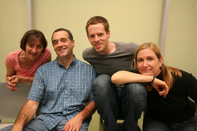

	<table class="infobox infobox-troupe">
		<tr>
			<th class="infobox-header" colspan="2">Umami</th>
		</tr>
		<tr class="">
			<td colspan="2" class="infobox-picture">
				
			</td>
		</tr>
		<tr class="">
			<th class="category-header" scope="row">Years Active</th>
			<td class="category">2011-2012</td>
		</tr>
		<tr class="">
			<th class="category-header" scope="row">Cast</th>
			<td class="category">
<ul style=""><!--
  --><li style=""><a class="internal-link" href="Dave Rosenbaum">Dave Rosenbaum</a></li><!--
  --><li style=""><a class="internal-link" href="Matt Craighead">Matt Craighead</a></li><!--
  --><li style=""><a class="internal-link" href="Nancy Lyon">Nancy Lyon</a></li><!--
  --><li style=""><a class="internal-link" href="Regina Soto">Regina Soto</a></li><!--
  --><li style=""><a class="internal-link" href="Susannah Raulino">Susannah Raulino</a></li><!--
  --><!--
  --><!--
  --><!--
  --><!--
  --><!--
  --><!--
  --><!--
  --><!--
  --><!--
  --><!--
  --><!--
  --><!--
  --><!--
  --><!--
  --><!--
  --><!--
  --><!--
  --><!--
  --><!--
  --><!--
  --><!--
  --><!--
  --><!--
  --><!--
  --><!--
  --><!--
  --><!--
  --><!--
  --><!--
  --><!--
  --><!--
  --><!--
  --><!--
  --><!--
  --><!--
  --><!--
  --><!--
  --><!--
  --><!--
  --><!--
  --><!--
  --><!--
  --><!--
  --><!--
  --><!--
--></ul>
</td>
		</tr>
	</table>

**Umami** was an improv troupe.

## Summary
### Press Blurb
Their press blurb, taken from a 2011 application to perform at [[The Hideout Theatre]]:<blockquote>Umami is a troupe that performs improvised character based theater.  Umami is meaty, brothy fun for your comedy taste. We are united by our love for building worlds and characters, for silly fun, for ridiculous words, for savory foods, and for beverages fermented from grains and fruits.</blockquote>

### "What's Your Deal?"
Their answer to the "What's Your Deal?" question on a 2011 application to perform at [[The Hideout Theatre]]:<blockquote>We use monologues to open our show and establish characters that are then highlighted in the show. We like to create colorful characters and then follow them through the show.</blockquote>

## History
The troupe debuted at [[ColdTowne Theater]] with three shows in June 2011.

## More Information
* [The troupe's web site.](http://sites.google.com/site/umamiimprov/)

[[Category/Troupes|Category:Troupes]]
[[Category/Auto-Generated Troupe Pages|Category:Auto-Generated Troupe Pages]]