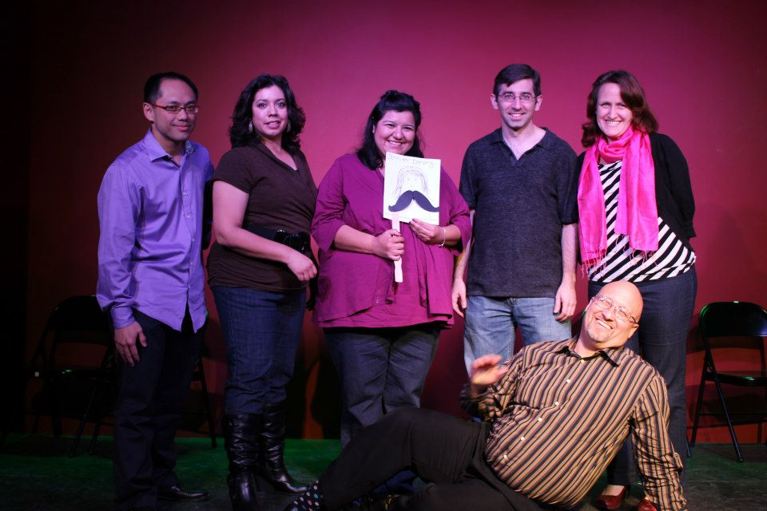

	<table class="infobox infobox-troupe">
		<tr>
			<th class="infobox-header" colspan="2">We're Here to Date Your Daughter</th>
		</tr>
		<tr class="">
			<td colspan="2" class="infobox-picture">
				
			</td>
		</tr>
		<tr class="">
			<th class="category-header" scope="row">Years Active</th>
			<td class="category">2012-Present</td>
		</tr>
		<tr class="">
			<th class="category-header" scope="row">Cast</th>
			<td class="category">
<ul style=""><!--
  --><li style=""><a class="internal-link" href="Gene Zhou">Gene Zhou</a></li><!--
  --><li style=""><a class="internal-link" href="Jennifer Dorsey">Jennifer Dorsey</a></li><!--
  --><li style=""><a class="internal-link" href="Katherine Greco">Katherine Greco</a></li><!--
  --><li style=""><a class="internal-link" href="Paul Normandin">Paul Normandin</a></li><!--
  --><li style=""><a class="internal-link" href="Regina Soto">Regina Soto</a></li><!--
  --><li style=""><a class="internal-link" href="Sandra Ybarra">Sandra Ybarra</a></li><!--
  --><li style=""><a class="internal-link" href="Todd Geldon">Todd Geldon</a></li><!--
  --><!--
  --><!--
  --><!--
  --><!--
  --><!--
  --><!--
  --><!--
  --><!--
  --><!--
  --><!--
  --><!--
  --><!--
  --><!--
  --><!--
  --><!--
  --><!--
  --><!--
  --><!--
  --><!--
  --><!--
  --><!--
  --><!--
  --><!--
  --><!--
  --><!--
  --><!--
  --><!--
  --><!--
  --><!--
  --><!--
  --><!--
  --><!--
  --><!--
  --><!--
  --><!--
  --><!--
  --><!--
  --><!--
  --><!--
  --><!--
  --><!--
  --><!--
  --><!--
--></ul>
</td>
		</tr>

	</table>

**We're Here to Date Your Daughter** (often referred to by its acronym, **WHTDYD**) is an ensemble improv troupe focusing on relationships.

The troupe has members who have taken classes from [[The Hideout Theatre]], [[ColdTowne Theater]], [[The Institution Theater]], and [[The Merlin Works Institute for Improvisation]].  

The troupe was briefly named "I'm Here to Date Your Daughter" until the name "We're Here to Date Your Daughter" was decided on.  WHTDYD performed their debut show as part of *[[The Triple Scoop]]* at the [[The Institution Theater]] on 12/8/12.  The original planned debut was [[ColdTowne Theater]] on 1/20/13.  

## History
*12/08/2012 - Debut @ [[The Institution Theater]] 
*01/20/2013 - [[ColdTowne Theater]] 
*02/10/2013 - [[The Hideout Theatre]]
*03/30/2013 - [[The Institution Theater]]

## Media
### Videos
* [Video](http://vimeo.com/55717158) by [[Paul Normandin]] of their 12/8/12 debut.
* [Video](http://vimeo.com/63069386) by [[Paul Normandin]] of their 3/30/13 show at [[The Institution Theater]].
* [Video](http://vimeo.com/65027838) by [[Paul Normandin]] of their 4/28/13 performance in *[[The Weekender]]*.

### Photos
* [Photoset](http://www.facebook.com/media/set/?set=a.499932860070235.117264.221927764537414&type=3) by [[Steve Rogers]] that includes their 2/10/13 performance in *[[The Weekender]]*.
* [Photoset](http://www.facebook.com/claudio.fox.5/media_set?set=a.555449511143215.1073741826.100000345135257&type=3) by [[Claudio Fox]] that includes their 3/30/13 performance in *[[The Triple Scoop]]*.
* [Photoset](http://www.facebook.com/media/set/?set=a.704040979659421.1073741972.221927764537414&type=3) by [[Steve Rogers]] that includes their 3/16/14 show at [[ColdTowne Theater]].

## More Information
*[We're Here to Date Your Daughter Facebook page](http://www.facebook.com/TalkinToStrangers)

[[Category/Active|Category:Active]]
[[Category/Troupes|Category:Troupes]]