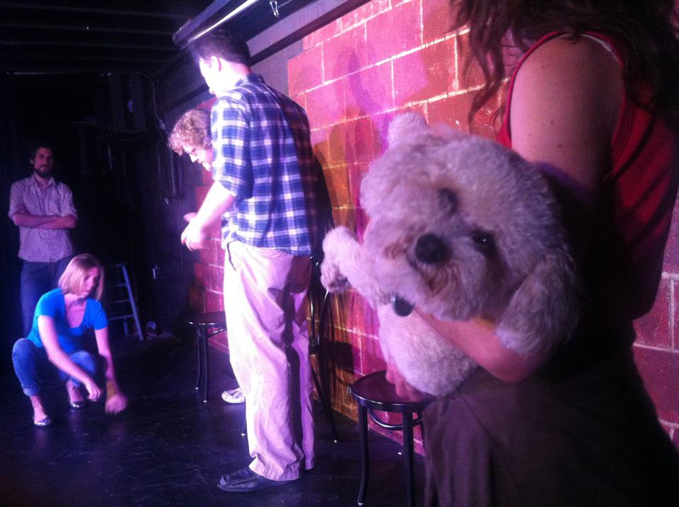

	<table class="infobox infobox-troupe">
		<tr>
			<th class="infobox-header" colspan="2">What's the Story, Steve?</th>
		</tr>
		<tr class="">
			<td colspan="2" class="infobox-picture">
				
			</td>
		</tr>
		<tr class="">
			<th class="category-header" scope="row">Years Active</th>
			<td class="category">2011-Present</td>
		</tr>

		<tr class="">
			<th class="category-header" scope="row">Cast</th>
			<td class="category">
<ul style=""><!--
  --><li style=""><a class="internal-link" href="Amy Carpenter">Amy Carpenter</a></li><!--
  --><li style=""><a class="internal-link" href="Arian Brumby">Arian Brumby</a></li><!--
  --><li style=""><a class="internal-link" href="Caitlin Baumgartner">Caitlin Baumgartner</a></li><!--
  --><li style=""><a class="internal-link" href="Chris Baldenhofer">Chris Baldenhofer</a></li><!--
  --><li style=""><a class="internal-link" href="Drew Wesely">Drew Wesely</a></li><!--
  --><li style=""><a class="internal-link" href="Frank Netscher">Frank Netscher</a></li><!--
  --><li style=""><a class="internal-link" href="Kristin Henn">Kristin Henn</a></li><!--
  --><li style=""><a class="internal-link" href="Luke Wallens">Luke Wallens</a></li><!--
  --><!--
  --><!--
  --><!--
  --><!--
  --><!--
  --><!--
  --><!--
  --><!--
  --><!--
  --><!--
  --><!--
  --><!--
  --><!--
  --><!--
  --><!--
  --><!--
  --><!--
  --><!--
  --><!--
  --><!--
  --><!--
  --><!--
  --><!--
  --><!--
  --><!--
  --><!--
  --><!--
  --><!--
  --><!--
  --><!--
  --><!--
  --><!--
  --><!--
  --><!--
  --><!--
  --><!--
  --><!--
  --><!--
  --><!--
  --><!--
  --><!--
  --><!--
--></ul>
</td>
		</tr>

	</table>

**What's the Story Steve?** is a troupe that specializes in children's theater and features a poodle.

## Summary
What's the Story Steve? produces a weekly improvised children's show at [[ColdTowne Theater]]. Additionally, the troupe occasionally performs an adult version of the show at various theaters in Austin.

Featuring Steve the Improvising Poodle, WTSS shows introduce Steve as both the host of the show and as a performer. The Voice of Steve (V.o.S.) is played by an actor offstage, using a microphone.

## History
The troupe was founded in August of 2011, and first performed the following month as "What's the Story?: Improvised Wishbone" in *[[The Cagematch]]*.

It has performed a weekly show at ColdTowne Theater since November of 2011 and in [[The 2012 Out of Bounds Comedy Festival]], [[The 2013 Out of Bounds Comedy Festival]], [[The 43-Hour Improv Marathon]], [[The 44-Hour Improv Marathon]] and [[The 45-Hour Improv Marathon]].

## Media
### Videos
* [Video of their 6/22/13 show](http://vimeo.com/7610079) in [[The 44-Hour Improv Marathon]].

### Photos
* [Photoset](http://www.facebook.com/michael.yew/media_set?set=a.2407907399825.106734.1315383518&type=3) by [[Michael Yew]] that includes their 2/16/12 performance in *[[The Threefer]]*.
* [Photoset](http://www.facebook.com/michael.yew/media_set?set=a.3204548675359.122323.1315383518&type=3) by [[Michael Yew]] that includes their 6/2/12 performance in [[The 43-Hour Improv Marathon]].
* [Photoset](http://www.facebook.com/media/set/?set=a.591956450867875.1073741927.221927764537414&type=3) by [[Steve Rogers]] of their 8/30/13 performance at [[The ColdTowne Marathon]].
* [Photoset](http://www.facebook.com/michael.yew/media_set?set=a.10202129404379351.1073741893.1315383518&type=3) by [[Michael Yew]] that includes their 6/21/14 performance in [[The 45-Hour Improv Marathon]].
* [Photoset](http://www.facebook.com/michael.yew/media_set?set=a.10204338867854557.1073741953.1315383518&type=3) by [[Michael Yew]] that includes their 6/20/15 show in [[The 46-Hour Improv Marathon]].

[[Category/Active|Category:Active]]
[[Category/Troupes|Category:Troupes]]